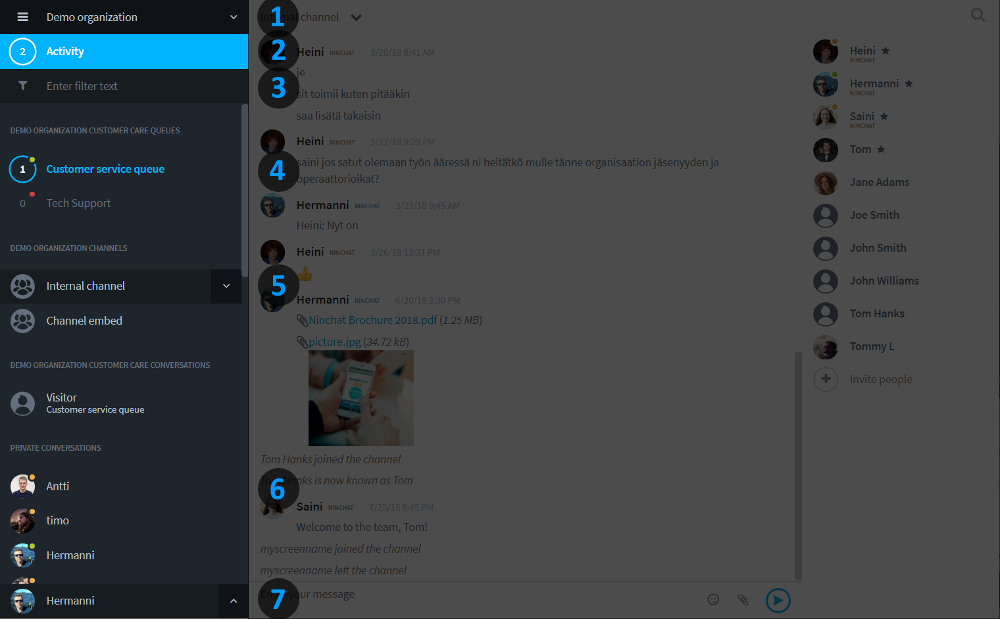

# Agentin näkymät

## Yleisnäkymä

Ninchatin perusnäkymä koostuu kolmesta osiosta; sidebar, keskustelu ja keskustelun toiminnot

| Sidebar | Keskustelunäkymä | Jäsenlista |
| :--- | :--- | :--- |
| Organisaatio, kanavat ja keskustelut | Keskustelu ja viestin lähetys | Kanavan jäsenet ja keskustelutoiminnot |

## Tiimikanava

<table>
  <thead>
    <tr>
      <th style="text-align:left">Jäsenlistan merkintä</th>
      <th style="text-align:left">Merkitys</th>
    </tr>
  </thead>
  <tbody>
    <tr>
      <td style="text-align:left">
        Tähti, umpinainen</td>
      <td style="text-align:left">
        
Kanavan operaattorikäyttäjä (eri kuin organisaation operaattori):

        
voi hallita kanavan asetuksia ja kutsua jäseniä

      </td>
    </tr>
    <tr>
      <td style="text-align:left">
        Tähti, reunustettu</td>
      <td style="text-align:left">
        
Kanavan moderaattorikäyttäjä:

        
voi moderoida viestejä ja poistaa jäseniä

      </td>
    </tr>
    <tr>
      <td style="text-align:left">
        Vihreä pallo</td>
      <td style="text-align:left">Käyttäjä on kirjautunut ja aktiivinen</td>
    </tr>
    <tr>
      <td style="text-align:left">
        Oranssi pallo</td>
      <td style="text-align:left">Käyttäjä on kirjautunut mutta ei aktiivinen</td>
    </tr>
    <tr>
      <td style="text-align:left">
        Ei palloa</td>
      <td style="text-align:left">Käyttäjä ei ole paikalla; näkee hänelle tulleet viestit myöhemmin</td>
    </tr>
  </tbody>
</table>## Sidebar \(sivupalkki\)

Sivupalkin kautta siirryt keskustelujen välillä ja näet myös helposti ilmoitukset uusista tapahtumissa eri keskusteluissa.

| Osio | Toiminta |
| :--- | :--- |
| 1\) Organisaatio-valinta | Täältä pääset organisaatiosetuksiin, sekä vaihtamaan oragnisaatiota \(jos kuulut useampaan\). |
| 2\) Tapahtumat | Tapahtumat-palkissa näet kootusti kaikki uudet sinua koskevat tapahtumat Ninchatissa |
| 3\) Suodatus | Suodatus/haku-palkissa voi rajata keskusteluja nimen perusteella |
| 4\) Jonot | Asiakasjonot, joista asiakkaat poimitaan |
| 5\) Kanavat | Sisäiset tiimikanavat \(ja julkiset, upotettavat ryhmäkeskustelut\) |
| 6\) Asiakas-keskutelut | Avoimet asiakaskeskustelut, jotka on poimittu jonoista |
| 7\) Yksityis-keskustelut | Sisäiset kahdenväliset yksityiskeskustelut tiimiläisten kanssa |

## Keskustelutoiminnot

## Käyttäjäasetukset



## Organisaation asetukset



