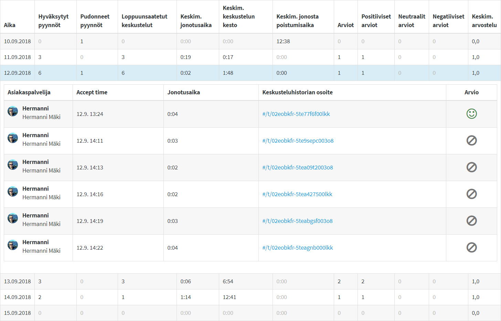

# Jonon tilastot

Siirry asiakasjonon tilastoihin klikkaamalla jonon nimeä ja valitse Jonon tilastot / Queue statistics.   
\(Vaatii organisaation operaattori -oikeudet\)

Tilastosivu koostuu osioista:

* Valinnat
* Kuvaajat
* Asiakaspalvelijakohtaiset tilastot
* Päiväkohtaiset tilastot ja keskustelujen tarkastelu

## Valinnat

<table>
  <thead>
    <tr>
      <th style="text-align:left">Ajankohta</th>
      <th style="text-align:left">Vienti</th>
      <th style="text-align:left">Tarkastelu</th>
    </tr>
  </thead>
  <tbody>
    <tr>
      <td style="text-align:left">
        
Valitse aikaväli, jolta haluat
           katsoa tilastoja

        
Valitse haluamasi aikavyöhyke

      </td>
      <td style="text-align:left">
        
Lataa tilastot CSV-tiedostona

        
Lataa keskusteluhistoria

        
Lataa kyselyvastaukset

      </td>
      <td style="text-align:left">
        
Valitse tarkastelujakson tarkkuus:

        
kk / päivä / tunti

        

      </td>
    </tr>
  </tbody>
</table>Poistuaksesi tilastoista, klikkaa Jonon tilastot -otsikkoa ja valitse Sulje.

## Kuvaajat

Graafeista saat nopeasti yleissilmäyksen tapahtumiin. Voit tarkastella:

* Keskustelujen määrää
* Poimittujen ja hylättyjen keskustelijoiden määrää
* Keskustelujen, jonotuksen ja poistumisaikojen keskimääräisiä  aikoja
* Palautteita ja niiden määrää

Asiakkaan saapumista jonoon kutsutaan pyynnöksi:

* Hyväksytty pyyntö: Asiakapalvelija poimii asiakkaan jonosta.
* Pudonnut pyyntö: Asiakasta ei poimita jonosta

## Asiakaspalvelijakohtaiset tilastot

Näet asiakaspalvelijoiden henkilökohtaiset yleistilastot valitulta ajanjaksolta.  
Keskimääräinen arvosana liikkuu välillä 0,0 - 1,0.

## Päiväkohtaiset tilastot

Päiväkohtaisista tilastoista näet käydyt keskustelut ja voit katsoa keskustelulogeja.

Klikkaa päiväriviä avataksesi näkymään kyseisen päivän keskustelut. Keskusteluhistoria-linkkiä klikkaamalla pääset lukemaan kyseisen keskustelun.

##  Keskusteluhistoria

Keskusteluhistorian tarkastelu

1. Agentin lisäämät merkinnät \(tägit\) keskustelulle
2. Tietoa istunnosta ja asiakkaasta; Metadata, Alkukysely
3. Viestin lähetysaika
4. Viestin sisältö

