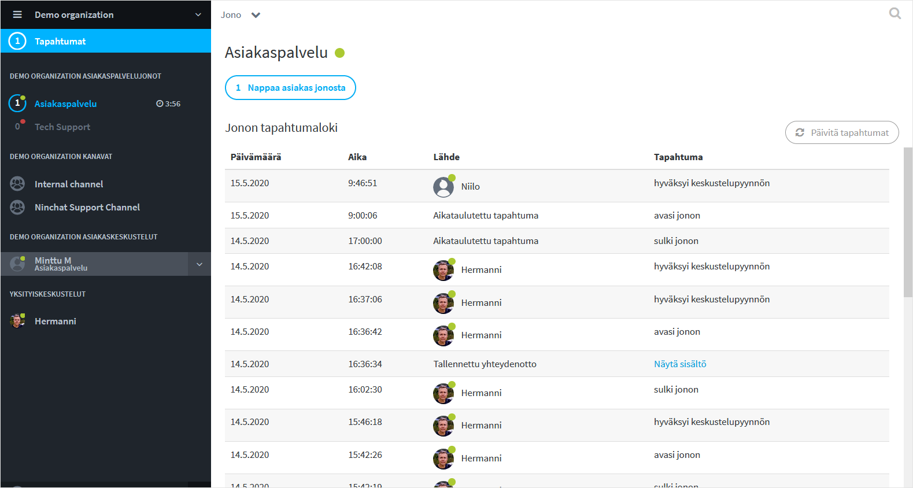
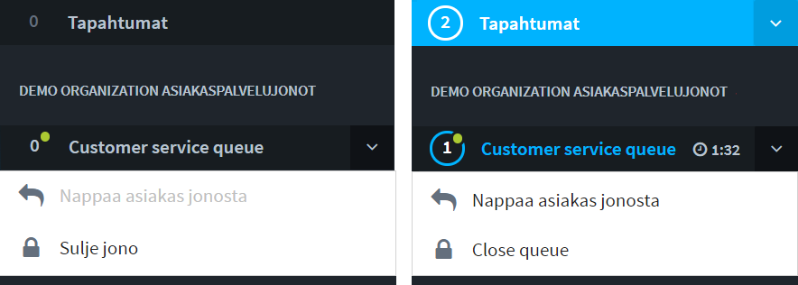
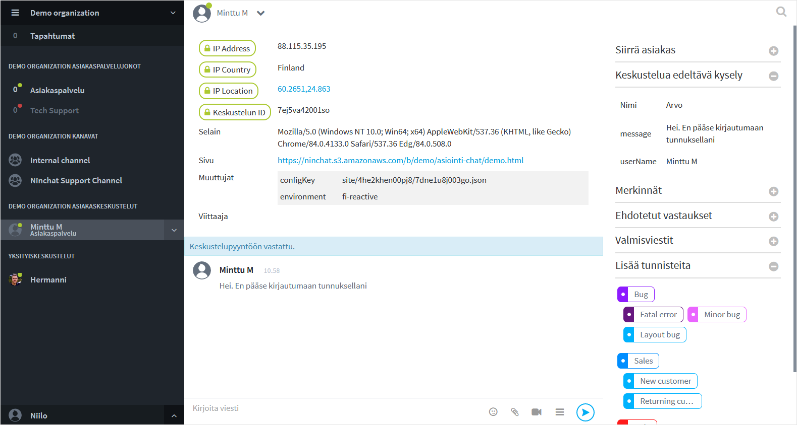

# Asiakasjonot ja -keskustelut

Asiakaskeskustelut ovat agentin ja asiakkaan kahdenvälisiä keskusteluja. Asiakas poimitaan jonosta, jonka jälkeen keskustelua käydään tekstin, liitetiedostojen ja tarvittaessa videopuhelun välityksellä.

Asiakaskeskusteluissa voi olla alkukyselyn vastauksia sekä metatietoja asiakkaasta ja tämän laitteistosta. Keskusteluihin voidaan välittää vahvasti salattuna tunnistetietoja.

Keskusteluissa voidaan hyödyntää valmisvastauksia ja keskusteluihin voi lisätä tunnisteita sekä muistiinpanoja.

## Asiakasjonopalkki ja Jono-sivu

Asiakasjonot näkyvät vasemman laidan sivupalkissa. Klikkaamalla jonon nimeä saat auki asiakasjononäkymän, josta voidaan napata jonoon tulevat asiakkaat, sekä tarkastella jonon tapahtumia: milloin jono on avattu ja suljettu, sekä kuka on poiminut asiakkaita.



## Asiakasjonon tilat

Asiakasjono näkyy sivupalkissa joko: 

* Punainen pallo - jono on suljettu
* Vihreä pallo - jono on avattu 
* Sininen huomioväri - jonossa on asiakas odottamassa

Sivupalkissa, jono nimen vieressä näet kellon, joka kertoo miten kauan \(ensimmäinen\) jonottaja on odottanut jonossa. Mikäli odotusaika on venynyt yli yhden tunnin, aika muuttuu ∞ ääretön-kuvakkeeksi.

## Asiakasjonon valikko

Sivupalkissa, jonon nimen vieressä olevaa nuoli-ikonia klikkaamalla voit avata pudotusvalikon, josta asiakkaan nappaaminen onnistuu ilman jononäkymään siirtymistä. Pudotusvalikosta voit myös mm. sulkea jonon.

### **Jono-valikon toiminnot**

* Avaa Tapahtumaloki _\(klikkaa jonon nimeä\)_
* Poimi asiakas jonosta
* Avaa / sulje jono
* Siirry jonon asetuksiin _\(vaatii organisaation operaattorioikeudet\)_
* Siirry jonon tilastoihin _\(vaatii organisaation operaattorioikeudet\)_

### Asiakasjonon avaaminen ja sulkeminen





## Asiakaskeskustelu-näkymä 

<table>
  <thead>
    <tr>
      <th style="text-align:left">Sidebar</th>
      <th style="text-align:left">Keskustelun&#xE4;kym&#xE4;</th>
      <th style="text-align:left">Ty&#xF6;kalut</th>
    </tr>
  </thead>
  <tbody>
    <tr>
      <td style="text-align:left">
        
Asiakasjonot

        
Asiakaskeskustelut-lista

        

        

      </td>
      <td style="text-align:left">
        
Tietoja asiakkaasta

        
Keskustelu

        
Viestinkirjoitus

        
Liitetiedostot, hymi&#xF6;t, videopuhelu, sivupalkin n&#xE4;ytt&#xF6;/piilotus

      </td>
      <td style="text-align:left">
        
Asiakkaan siirto

        
Kyselyvastaukset

        
Merkinn&#xE4;t

        
Valmisvastaukset

        
Tunnisteet (tagit)

      </td>
    </tr>
  </tbody>
</table>Osa kerrotuista toiminnoista näkyy vain jos ne otettu käyttöön.





## Jonon käsittelijöiden hallinta 

Jonon käsittelijöiden lisäämisestä ja hallinnoinnista kerrotaan Organisaatio-osiossa.



