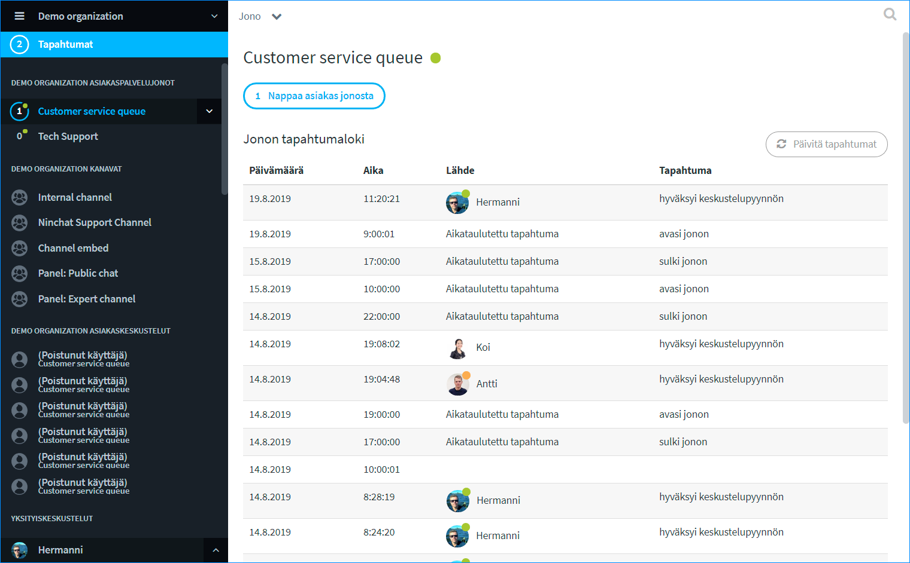
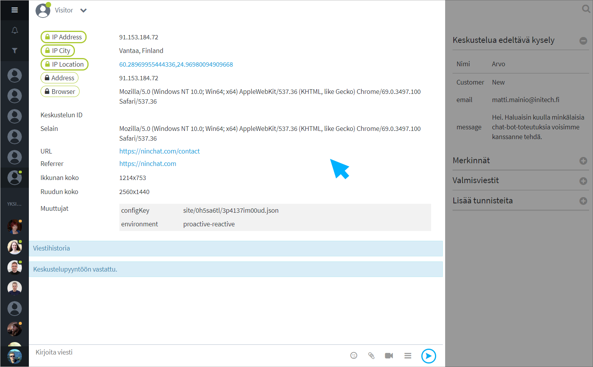
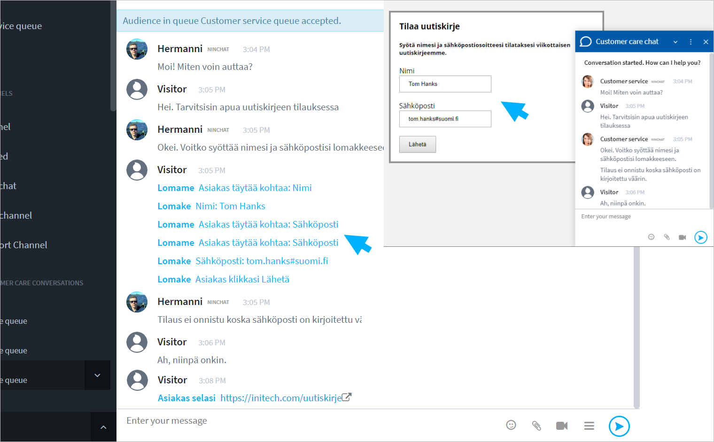
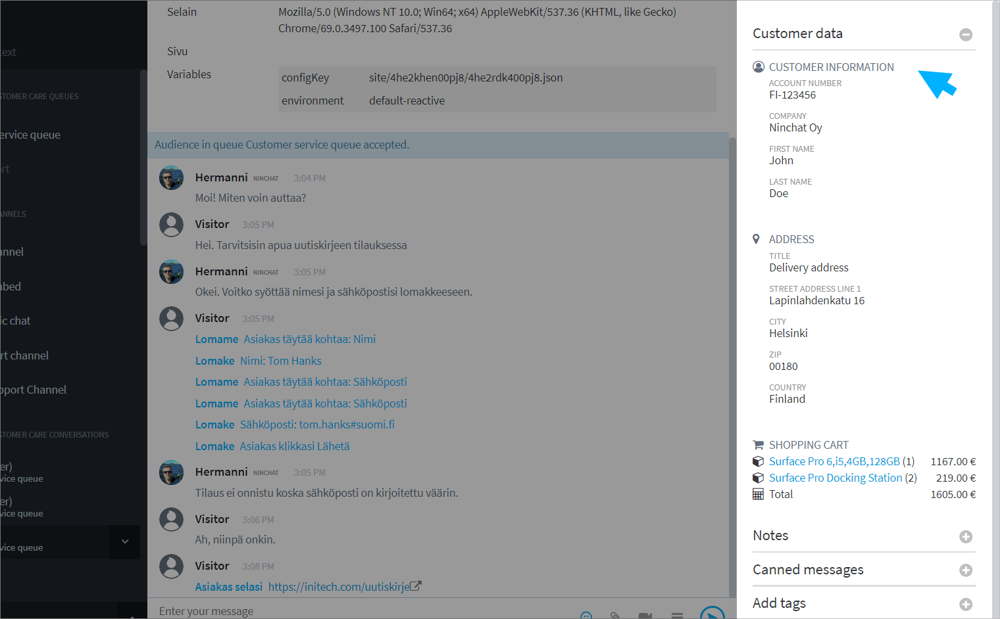

# Asiakasjonot ja -keskustelut

## Jonon käsittelijät

Jonon käsittelijöiden lisäämisestä ja hallinnoinnista kerrotaan Organisaatio-osiossa.



## Asiakasjonopalkki ja -näkymä <a id="asiakasjonopalkki-ja-nakyma"></a>



Asiakasjonot näkyvät vasemman laidan sivupalkissa. Klikkaamalla jonon nimeä saat auki asiakasjononäkymän, josta voidaan napata jonoon tulevat asiakkaat, sekä tarkastella jonon tapahtumia: milloin jono on avattu ja suljettu, sekä kuka on poiminut asiakkaita.  
Sivupalkin jonon nimen vieressä olevaa nuoli-ikonia klikkaamalla voit avata pudotusvalikon, josta asiakkaan nappaaminen onnistuu ilman jononäkymään siirtymistä. Pudotusvalikosta voit myös mm. sulkea jonon.

## Asiakasjonon avaaminen ja sulkeminen

Jono voidaan avata ja sulkea manuaalisesti tai ajastaa toimimaan automaattisesti. Avattu jono on merkattu sivupalkissa ja jononäkymässä vihreällä pallolla, suljettu jono punaisella.

#### Jonon avaaminen

Klikkaa jonon nimen viereistä nuoli-ikonia ja valitse valikosta "Avaa jono / Open queue".  
Asiakkaat voivat liittyä nyt jonoon.

#### Jonon sulkeminen

Klikkaa jonon nimen viereistä nuoli-ikonia ja valitse valikosta "Sulje jono / Close queue".  
Asiakkaat eivät tämän jälkeen voi aloittaa chattia. Sulkemishetkellä jonossa olevat asiakkaat jäävät jonoon, kunnes heidät poimitaan tai he päättävät sulkea chatin/ikkunan.

#### Asiakasjonon ajastaminen

Lue automaattisesta ajastamisesta:



## Asiakkaan nappaaminen jonosta


Ilmoitus asiakkaasta jonossa näkyy aina Jono-palkin lisäksi myös _Tapahtumat/Activity_ -palkissa. Palkki ilmoittaa tapahtumista muuttumalla siniseksi, ja näet ilmoituksen, vaikka sinulla olisi ilmoituksen tullessa avattuna toisen organisaation näkymä.


Asiakas voidaan poimia joko sivupalkista tai isommasta jononäkymästä. Alla ohjeet molempiin tapoihin.

### A\) Jono-näkymän kautta asiakkaan nappaaminen 

1. Klikkaa sivupalkissa jonon nimeä \(kuvassa Customer service queue\) muusta kuin nuoli-kohdasta.
2. Jono-näkymässä klikkaa nappia "Nappaa asiakas jonosta".
3. Asiakaskeskustelu alkaa.


### B\) Pudotusvalikon kautta asiakkaan nappaaminen

1. Klikkaa sivupalkissa jonon nimen vieressä nuoli-ikonia \(kuvassa Customer service queue\).
2. Palkin alle avautuu pudotusvalikko, josta voit valita "Nappaa asiakas jonosta".
3. Asiakaskeskustelu alkaa.


### **Jono-valikon toiminnot**

* Poimi asiakas jonosta
* Avaa / sulje jono
* Siirry jonon asetuksiin \(vaatii organisaation operaattorioikeudet\)
* Siirry jonon tilastoihin \(vaatii organisaation operaattorioikeudet\)



## Asiakaskeskustelunäkymä


<table>
  <thead>
    <tr>
      <th style="text-align:left">1) Sidebar</th>
      <th style="text-align:left">2) Keskustelun&#xE4;kym&#xE4;</th>
      <th style="text-align:left">3) Chat-sivupalkki</th>
    </tr>
  </thead>
  <tbody>
    <tr>
      <td style="text-align:left">
        <ol>
          <li>Organisaatio</li>
          <li>Asiakasjonot</li>
          <li>Tiimi- ja tukikanavat</li>
          <li>Asiakaskeskustelut</li>
          <li>Yksityiskeskustelut tiimil&#xE4;isten kanssa</li>
        </ol>
      </td>
      <td style="text-align:left">
        <ol>
          <li>Tietoja asiakkaasta</li>
          <li>Keskustelu</li>
          <li>Tekstikentt&#xE4;, hymi&#xF6;t, liitetiedostot, videokeskustelu, sivupalkin
            n&#xE4;ytt&#xF6;/piilotus</li>
        </ol>
        <p></p>
        <p></p>
      </td>
      <td style="text-align:left">
        <ol>
          <li>Muistiinpanot</li>
          <li>Valmisvastaukset</li>
          <li>Tagit (merkit) keskustelun luokitteluun</li>
        </ol>
        <p></p>
      </td>
    </tr>
  </tbody>
</table>## Asiakaskeskustelu

Poimittuasi asiakkaan jonosta keskustelu alkaa. 

1. Asiakkaalle näytetään "Keskustelu aloitettu" -viesti, mutta on hyvä lähettää asiakkaalle heti tervehdys-, tms. kommentti.
2. Näet keskustelun yläpuolella teknisiä tietoja asiakkaasta, kuten käytetyn selaimen, sivun jolla chat on aloitettu, sekä muita tietoja, mikäli ne on päätetty ottaa käyttöön.
3. Mikäli chatissa on alkukysely, näet asiakkaan tekemät kyselyvalinnat ja -vastaukset oikealla palstalla, ja voit niiden perusteella paremmin neuvoa asiakasta.

## Kuvat ja tiedostot

Asiakasneuvoja voi lähettää asiakkaalle kuvia ja tiedostoja, ja hän neuvojalle, mikäli tämä on sallittu chatin asetuksissa.

Lähetettävien tiedostojen kokoa tai formaattia ei ole rajattu.

## Asiakas-metatiedot

Asiakkaasta voidaan välittää erilaista metatietoa jouduttamaan ja helpottamaan asiakasneuvojan työtä. Tietoa voidaan välittää: 

* Salatusti sopimuskumppanin palvelimelta \(secure metadata\)
* Webbisivulta keskustelun alussa ja reaaliaikaisesti keskustelun aikana
* Ninchatin alku- ja loppukyselyvastaukset
* Koottu metatieto esim. ostoskorin sisällöstä

Keskustelun alkuun voidaan välittää asiakkaasta perustiedot, jotka ovat hyödyllisiä mm. ongelmatilanteita selvitettäessä. Alkutietoihin voi lisätä esim. selaintiedon, ruudun koon, chatin aloitussivun ja sinne linkanneen sivun, sekä IP-osoitteen ja sijaintitiedot.




Kysy metatietojen lähettämisestä lisää Ninchatin henkilöstöltä.


### Vahvasti salattu metatieto \(secure metadata\)

Asiakaspalvelijalle on mahdollista välittää sopimuskumppanin sivustolle kirjautuneen käyttäjän tiedot salatusti sopimuskumppanin palvelimelta. Myöhemmin chat-keskustelu tietoineen voidaan välittää takaisin esim. sopimuskumppanin CRM-järjestelmään ja yhdistää oikeaan käyttäjään tietojen perusteella.

Kysy meiltä lisää, tai tutustu API-dokumentaatioon: 

* [API - https://ninchat.com/api ](https://ninchat.com/api%20)
* [Master keys & secure metadata - https://github.com/ninchat/ninchat-api/blob/v2/master.md](https://github.com/ninchat/ninchat-api/blob/v2/master.md)

### Kyselytiedot

Keskustelua edeltävän alkukyselyn tiedot välitetään asiakaspalvelijan keskustelunäkymän sivupalkkiin. Näin asiakkaan neuvominen nopeutuu ja helpottuu.

Alkukyselyssä voidaan pyytää myös asiakkaan nimi ja viesti, jotka tulevat mukaan myös keskusteluun.

Myös keskustelun jälkeen esitettävän loppukyselyn vastaukset ilmestyvät samaan paikkaan asiakkaan suljettua chatin.


### Live-metatiedot

Asiakkaan toimista sivustolla on mahdollista välittää reaaliaikaista tietoa asiakaspalvelijalle  neuvomisen helpottamiseksi. Esimerkiksi asiakkaan täyttäessä lomaketta, tiedot voidaan kertoa suoraan asiakaspalvelijalle, kuten mm. jos asiakas vaihtaa sivua keskustelun aikana. 



### Koottu metatieto

Live-metadataa voidaan välittää asiakaspalvelijalle myös kootusti. Esim. ostoskorin sisältö ja toimitustiedot voidaan välittää salatusti kaikki kerralla, jolloin ne näytetään kootusti keskustelun sivupalkissa.



## Valmisviestit

Valmisviestit nopeuttavat ja helpottavat asiakaspalvelijan työtä. Voit hoitaa usein kysytyt kysymykset valitsemalla vastauksen suoraan listalta.

Lisäksi asioissa, jotka vaativat tarkasti oikein annettua vastausta, kuten juridiset tai hoitotoimenpiteisiin liittyvät asiat, voi olla hyvä käyttää valmisvastauksia.

### Valmisviestin käyttäminen

#### **Asiakaskeskustelun sivupalkki**

Valmisviestit näkyvät asiakaskeskustelun sivupalkissa. Voit valita viestin klikkaamalla, jolloin se ilmestyy kirjoituskenttään. Muokkaa tekstiä tarvittaessa tai lähetä suoraan.

#### **Näppäimistö**

Valmisviestejä voi käyttää myös näppäimistöltä hyväksikäyttäen niiden avainsanoja. Valmisviestit toimivat näppäimistöltä myös tiimikanavilla ja yksityiskeskusteluissa.

Kirjoittamalla tekstikenttään vinoviivan \[ / \] ja valmisviestin avainsanan ja klikkaamalla \[Välilyönti\]-näppäintä, kyseinen valmisviesti ilmestyy tekstikentään. 

Esimerkki: Olet asettanut valmisviestin: _avoinna_ \(avain\): _Palvelemme arkipäivisin klo 9 - 17._ \(viesti\). 

| Avainsana | Valmisviesti |
| :--- | :--- |
| avoinna | Palvelemme arkipäivisin klo 9 - 17. |

```text
/avoinna[välilyönti]  --> Palvelemme arkipäivisin klo 9 - 17.
```

### Valmisviestin luominen ja muokkaus



## Videopuhelut

Asiakaskeskusteluissa on mahdollista hyödyntää videopuhelua tilanteissa, joissa tekstin ja kuvaliitteiden lähettäminen ei riitä. Kysy lisää ominaisuudesta.

Jonon asetusten mukaan videopuhelun voi aloittaa agentti, asiakas, molemmat, tai ei kumpikaan.

### Videpuhelun aloitus

1. Aloittaaksesi videopuhelun, klikkaa kommenttikentän vieressä videokamera-kuvaketta.
2. Mikäli asiakkaan selain tukee videopuhelua, hänelle näytetään videopuhelupyyntö, jonka hän hyväksyy tai hylkää.

### Videopuhelu

Videopuhelu näkyy tekstikeskustelun yläpuolella. Sekä agentti että asiakas voi halutessaan laajentaa videon koko ruudun kokoiseksi, jolloin tekstikeskustelu näkyy videon oikealla puolella. \(Anna selaimelle lupa näyttää Ninchatin video koko ruudussa.\)

### Videotoiminnot

| Valinta | Toiminta |
| :--- | :--- |
|   | Näytä videokeskustelu koko ruudun kokoisena / pienennä kuva normaaliin ikkunaan. |
|   | Äänet päällä / pois - mykistää keskustelukumppanin äänet |
|   | Mikrofoni päällä / pois - mykistää oman mikrofonisi, jolloin vastapuoli ei kuule sinua. |
|    | Video päällä / pois - Piilottaa oman videokuvasi, jolloin vastapuoli ei näe sinua. |
|   | Lopeta videopuhelu. \(Ei lopeta chat-keskustelua\) |

### Videotuki eri selaimilla

<table>
  <thead>
    <tr>
      <th style="text-align:left">Alusta/k&#xE4;ytt&#xF6;j&#xE4;rjestelm&#xE4;</th>
      <th style="text-align:left">Tuetut selaimet</th>
    </tr>
  </thead>
  <tbody>
    <tr>
      <td style="text-align:left">
        <p>Windows</p>
        <p></p>
      </td>
      <td style="text-align:left">Google Chrome, Mozilla Firefox
        <br />(Microsoft Edgell&#xE4; toimintaa ei taata)</td>
    </tr>
    <tr>
      <td style="text-align:left">Mac OS</td>
      <td style="text-align:left">Google Chrome, Mozilla Firefox, Apple Safari</td>
    </tr>
    <tr>
      <td style="text-align:left">Android</td>
      <td style="text-align:left">Google Chrome, Mozilla Firefox</td>
    </tr>
    <tr>
      <td style="text-align:left">iOS</td>
      <td style="text-align:left">Mozilla Firefox, Apple Safari</td>
    </tr>
  </tbody>
</table>

## Tunnisteet \(tägit\)

Asiakaspalvelija voi merkata asiakaskeskusteluita tunnisteilla eli ns. tägeillä keskustelun aiheen tai luonteen mukaan, esin. "myynti", "uusi asiakas", "ongelma", "bugi", ... Tägäys helpottaa myöhemmin keskutelujen tilastointia sekä tarkastelua.

#### Keskustelun merkitseminen

Agentti voi lisätä merkinnän klikkaamalla tägejä keskustelun sivupalkissa. Lisätyt tägit ilmestyvät ja tallentuvat keskustelun metatietoihin keskustelun alkuun.

#### Tagien luonti ja muokkaus

Tunnisteet ovat organisaatiokohtaisia ja niitä voivat lisätä ja muokata organisaation operaattorit.  
Tunnisteiden luonnista ja muokkauksesta kerrotaan kohdassa [Asiakasjonot ja -keskutelut &gt; Jonon asetukset &gt; Tagit](https://ninchat.gitbook.io/ninchat-support/organisaatio/asiakasjonojen-hallinta#keskustelumerkintojen-hallinta-tagit)

## Muistiinpanot \(merkinnät\)

Merkinnät \(Notes\) on lisäasetus, jolla voidaan luoda erilaisia muistiinpanovaihtoehtoja asiakaskeskusteluun. Asiakaspalvelijan tekemät muistiinpanot tallentuvat keskusteluhistorian yhteyteen.  
Merkintöjä voidaan hyödyntää myös tietojen viennissä asiakkaan omaan tietojärjestelmään. Pyydä lisätietoa Ninchatin henkilöstöltä.

