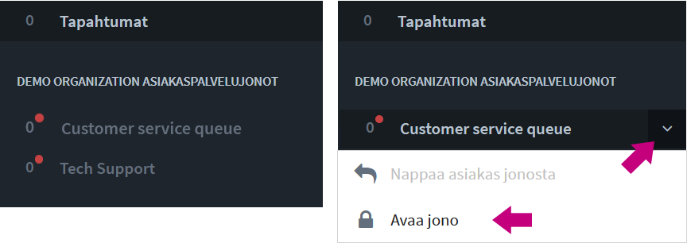
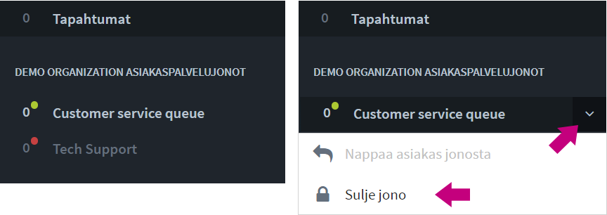

# Asiakasjonot ja -keskustelut

## Asiakasjonopalkki ja -näkymä <a id="asiakasjonopalkki-ja-nakyma"></a>


Asiakasjonot näkyvät vasemman laidan sivupalkissa. Klikkaamalla jonon nimeä saat auki asiakasjononäkymän, josta voidaan napata jonoon tulevat asiakkaat, sekä tarkastella jonon tapahtumia: milloin jono on avattu ja suljettu, sekä kuka on poiminut asiakkaita.

Sivupalkin jonon nimen vieressä olevaa nuoli-ikonia klikkaamalla voit avata pudotusvalikon, josta asiakkaan nappaaminen onnistuu ilman jononäkymään siirtymistä. Pudotusvalikosta voit myös mm. sulkea jonon.

Sivupalkissa, jono nimen vieressä näet kellon, joka kertoo miten kauan \(ensimmäinen\) jonottaja on odottanut jonossa. Mikäli odotusaika on venynyt yli yhden tunnin, aika muuttuu ∞-kuvakkeeksi \(ääretön\).


## Asiakkaan nappaaminen jonosta


Ilmoitus asiakkaasta jonossa näkyy aina Jono-palkin lisäksi myös _Tapahtumat/Activity_ -palkissa. Palkki ilmoittaa tapahtumista muuttumalla siniseksi, ja näet ilmoituksen, vaikka sinulla olisi ilmoituksen tullessa avattuna toisen organisaation näkymä.


Asiakas voidaan poimia joko sivupalkista tai isommasta jononäkymästä. Alla ohjeet molempiin tapoihin.

### A\) Jonon Tapahtumalokin kautta asiakkaan nappaaminen 

1. Klikkaa sivupalkissa jonon nimeä \(kuvassa Customer service queue\) muualta kuin nuoli-ikonin kohdalta.
2. Jonon Tapahtumaloki-näkymässä klikkaa nappia "Nappaa asiakas jonosta".
3. Asiakaskeskustelu alkaa.


### B\) Pudotusvalikon kautta asiakkaan nappaaminen

1. Klikkaa sivupalkissa jonon nimen vieressä nuoli-ikonia \(kuvassa Customer service queue\).
2. Palkin alle avautuu pudotusvalikko, josta voit valita "Nappaa asiakas jonosta".
3. Asiakaskeskustelu alkaa.


### **Jono-valikon toiminnot**

* Avaa Tapahtumaloki _\(klikkaa jonon nimeä\)_
* Poimi asiakas jonosta
* Avaa / sulje jono
* Siirry jonon asetuksiin _\(vaatii organisaation operaattorioikeudet\)_
* Siirry jonon tilastoihin _\(vaatii organisaation operaattorioikeudet\)_



## Asiakaskeskustelunäkymä


<table>
  <thead>
    <tr>
      <th style="text-align:left">1) Sidebar</th>
      <th style="text-align:left">2) Keskustelun&#xE4;kym&#xE4;</th>
      <th style="text-align:left">3) Chat-sivupalkki</th>
    </tr>
  </thead>
  <tbody>
    <tr>
      <td style="text-align:left">
        <ol>
          <li>Organisaatio</li>
          <li>Asiakasjonot</li>
          <li>Tiimi- ja tukikanavat</li>
          <li>Asiakaskeskustelut</li>
          <li>Yksityiskeskustelut tiimil&#xE4;isten kanssa</li>
        </ol>
      </td>
      <td style="text-align:left">
        <ol>
          <li>Tietoja asiakkaasta</li>
          <li>Keskustelu</li>
          <li>Tekstikentt&#xE4;, hymi&#xF6;t, liitetiedostot, videokeskustelu, sivupalkin
            n&#xE4;ytt&#xF6;/piilotus</li>
        </ol>
        <p></p>
        <p></p>
      </td>
      <td style="text-align:left">
        <ol>
          <li>Muistiinpanot</li>
          <li>Valmisvastaukset</li>
          <li>Tagit (merkit) keskustelun luokitteluun</li>
        </ol>
        <p></p>
      </td>
    </tr>
  </tbody>
</table>## Asiakaskeskustelu

Poimittuasi asiakkaan jonosta keskustelu alkaa. 

1. Asiakkaalle näytetään "Keskustelu aloitettu" -viesti, mutta on hyvä lähettää asiakkaalle heti tervehdys tai muu vastaava kommentti.
2. Näet keskustelun yläpuolella teknisiä tietoja asiakkaasta, kuten käytetyn selaimen, sivun jolla chat on aloitettu, sekä muita tietoja, mikäli ne on päätetty ottaa käyttöön.
3. Mikäli chatissa on alkukysely, näet asiakkaan tekemät kyselyvalinnat ja -vastaukset oikealla palstalla, ja voit niiden perusteella paremmin neuvoa asiakasta.

## Kuvat ja tiedostot

Asiakasneuvoja voi lähettää asiakkaalle kuvia ja tiedostoja, ja hän neuvojalle, mikäli tämä on sallittu chatin asetuksissa.

Lähetettävien tiedostojen kokoa tai formaattia ei ole rajattu.

## Videopuhelut

Asiakaskeskusteluissa on mahdollista hyödyntää videopuhelua ja ruudunjakoa tilanteissa, joissa tekstin ja kuvaliitteiden lähettäminen ei riitä. Lue lisää sivulla _Videopuhelut_ ja kysy meiltä lisää ominaisuudesta.



## Asiakas-metatiedot

Asiakkaasta voidaan välittää erilaista metatietoa jouduttamaan ja helpottamaan asiakasneuvojan työtä. Tietoa voidaan välittää: 

* Salatusti sopimuskumppanin palvelimelta \(secure metadata\)
* Webbisivulta keskustelun alussa ja reaaliaikaisesti keskustelun aikana
* Ninchatin alku- ja loppukyselyvastaukset
* Koottu metatieto esim. ostoskorin sisällöstä

Keskustelun alkuun voidaan välittää asiakkaasta perustiedot, jotka ovat hyödyllisiä mm. ongelmatilanteita selvitettäessä. Alkutietoihin voi lisätä esim. selaintiedon, ruudun koon, chatin aloitussivun ja sinne linkanneen sivun, sekä IP-osoitteen ja sijaintitiedot.



Kysy metatietojen lähettämisestä lisää Ninchatin henkilöstöltä.


### Vahvasti salattu metatieto \(secure metadata\)

Asiakaspalvelijalle on mahdollista välittää sopimuskumppanin sivustolle kirjautuneen käyttäjän tiedot salatusti sopimuskumppanin palvelimelta. Myöhemmin chat-keskustelu tietoineen voidaan välittää takaisin esim. sopimuskumppanin CRM-järjestelmään ja yhdistää oikeaan käyttäjään tietojen perusteella.

Kysy meiltä lisää, tai tutustu API-dokumentaatioon: 

* [API - https://ninchat.com/api ](https://ninchat.com/api%20)
* [Master keys & secure metadata - https://github.com/ninchat/ninchat-api/blob/v2/master.md](https://github.com/ninchat/ninchat-api/blob/v2/master.md)

### Kyselytiedot

Keskustelua edeltävän alkukyselyn tiedot välitetään asiakaspalvelijan keskustelunäkymän sivupalkkiin. Näin asiakkaan neuvominen nopeutuu ja helpottuu.

Alkukyselyssä voidaan pyytää myös asiakkaan nimi ja viesti, jotka tulevat mukaan myös keskusteluun.

Myös keskustelun jälkeen esitettävän loppukyselyn vastaukset ilmestyvät samaan paikkaan asiakkaan suljettua chatin.


### Live-metatiedot

Asiakkaan toimista sivustolla on mahdollista välittää reaaliaikaista tietoa asiakaspalvelijalle  neuvomisen helpottamiseksi. Esimerkiksi asiakkaan täyttäessä lomaketta, tiedot voidaan kertoa suoraan asiakaspalvelijalle, kuten mm. jos asiakas vaihtaa sivua keskustelun aikana. 


### Koottu metatieto

Live-metadataa voidaan välittää asiakaspalvelijalle myös kootusti. Esim. ostoskorin sisältö ja toimitustiedot voidaan välittää salatusti kaikki kerralla, jolloin ne näytetään kootusti keskustelun sivupalkissa.


## Valmisviestit

Valmisviestit nopeuttavat ja helpottavat asiakaspalvelijan työtä. Voit hoitaa usein kysytyt kysymykset valitsemalla vastauksen suoraan listalta.

Lisäksi asioissa, jotka vaativat tarkasti oikein annettua vastausta, kuten juridiset tai hoitotoimenpiteisiin liittyvät asiat, voi olla hyvä käyttää valmisvastauksia.

### Valmisviestin luominen ja muokkaus

Valmisviestit ovat henkilökohtaisia ja ne luodaan omissa käyttäjäasetuksissa. Katso ohjeet linkin takaa:



### Valmisviestin käyttäminen

#### **Asiakaskeskustelun sivupalkki**

Valmisviestit näkyvät asiakaskeskustelun sivupalkissa. Voit valita viestin klikkaamalla, jolloin se ilmestyy kirjoituskenttään. Muokkaa tekstiä tarvittaessa tai lähetä suoraan.

#### **Näppäimistö**

Valmisviestejä voi käyttää myös näppäimistöltä hyväksikäyttäen niiden avainsanoja. Valmisviestit toimivat näppäimistöltä myös tiimikanavilla ja yksityiskeskusteluissa.

Kirjoittamalla tekstikenttään vinoviivan \[ / \] ja valmisviestin avainsanan ja klikkaamalla \[Välilyönti\]-näppäintä, kyseinen valmisviesti ilmestyy tekstikentään. 

Esimerkki: Olet asettanut valmisviestin: _avoinna_ \(avain\): _Palvelemme arkipäivisin klo 9 - 17._ \(viesti\). 

| Avainsana | Valmisviesti |
| :--- | :--- |
| avoinna | Palvelemme arkipäivisin klo 9 - 17. |

```text
/avoinna[välilyönti]  --> Palvelemme arkipäivisin klo 9 - 17.
```

## Asiakkaan siirtäminen <a id="asiakkaan-siirtaminen"></a>

Asiakas voidaan keskustelun alettua siirtää toiseen jonoon, jolloin toinen agentti voi poimia tämän keskusteluun. Esimerkiksi ensiksi vastannut hoitaja voi tarvittaessa siirtää asiakkaan lääkärijonoon.

Siirtojonot määritellään jonon asetuksissa. Kun siirtojonoja on määritelty, siirtomahdollisuus näkyy asiakaskeskustelun oikealla palstalla.


## Tunnisteet \(tägit\)

Asiakaskeskustelut on mahdollista merkitä tunnisteilla eli ns. tägeillä keskustelun aiheen tai luonteen mukaan, esim. "myynti", "asiakkuudet", "tekninen ongelma", ... Tägäys helpottaa myöhemmin keskustelujen tilastointia sekä tarkastelua.

Keskusteluja on voidaan myös merkitä automaattisesti esim. alkukyselyvastausten perusteella, joten on mahdollista, että heti keskustelun alettua siinä on jo lisättyjä tunnisteita.

Käytettävät tunnisteet määritellään organisaation operaattorien toimesta. 

### Keskustelun merkitseminen

Agentti voi lisätä merkinnän klikkaamalla tunnisteita keskustelun sivupalkissa. Lisätyt tunnisteet ilmestyvät ja tallentuvat keskustelun metatietoihin keskustelun alkuun.


### Tagien luonti ja muokkaus

Tunnisteet ovat organisaatiokohtaisia ja niitä voivat lisätä ja muokata organisaation operaattorit.  
Tunnisteiden luonnista ja muokkauksesta kerrotaan kohdassa _Tunnisteet_.



## Muistiinpanot \(merkinnät\)

Merkinnät \(Notes\) on lisäasetus, jolla voidaan luoda erilaisia muistiinpanovaihtoehtoja asiakaskeskusteluun. Merkintöjä voidaan hyödyntää myös tietojen viennissä asiakkaan omaan tietojärjestelmään. 

Merkintöjen lisäysnäkymä löytyy asiakaskeskustelun sivupalkista \(mikäli merkinnät on otettu käyttöön\). Tallennetut muistiinpanot näkyvät metatietojen lomassa keskustelun alussa.


## Asiakasjonon avaaminen ja sulkeminen

Jono voidaan avata ja sulkea manuaalisesti tai ajastaa toimimaan automaattisesti. Avattu jono on merkattu sivupalkissa vihreällä pallolla, suljettu jono punaisella.

### Jonon avaaminen

Klikkaa jonon nimen viereistä nuoli-ikonia ja valitse valikosta "Avaa jono / Open queue".  
Asiakkaat voivat liittyä nyt jonoon.



### Jonon sulkeminen

Klikkaa jonon nimen viereistä nuoli-ikonia ja valitse valikosta "Sulje jono / Close queue". Hyväksy vielä varmistus sulkemisesta ponnahdusikkunassa.

Asiakkaat eivät sulkemisen jälkeen pääse jonoon, eivätkä aloittamaan chattia. Sulkemishetkellä jonossa olevat asiakkaat jäävät jonoon, kunnes heidät poimitaan tai he päättävät sulkea chatin/ikkunan.



### Asiakasjonon ajastaminen

Lue jonon automaattisesta ajastamisesta:



## Jonon käsittelijöiden hallinta <a id="jonon-kasittelijoiden-hallinta"></a>

Jonon käsittelijöiden lisäämisestä ja hallinnoinnista kerrotaan Organisaatio-osiossa.



