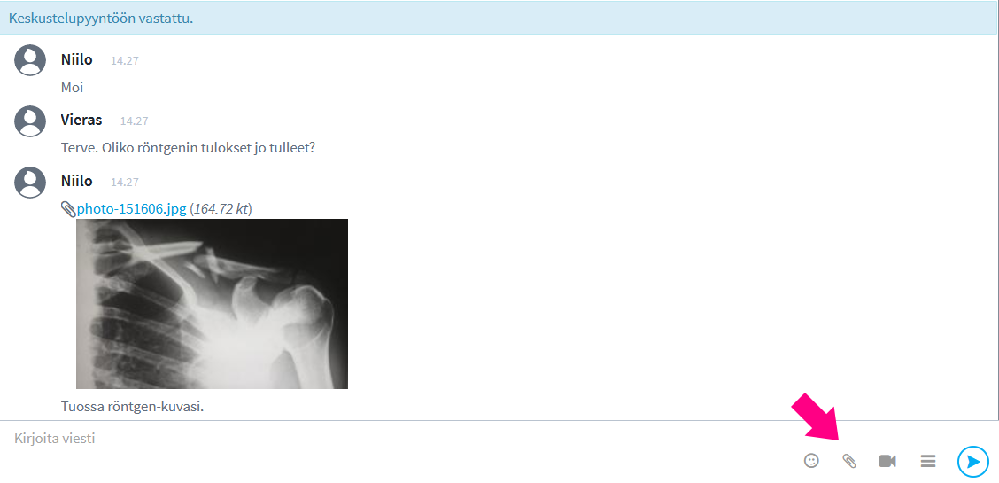
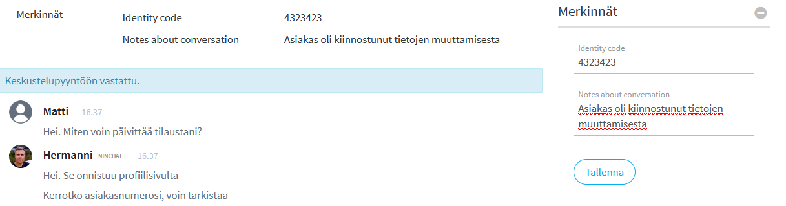

# Asiakaskeskustelun käyminen

## Keskustelun alku <a id="asiakaskeskustelun-kayminen"></a>

Poimittuasi asiakkaan jonosta keskustelu alkaa. 

Asiakkaalle näytetään "Keskustelu aloitettu" -viesti. Tämä viesti ei näy agentin keskustelunäkymässä. On hyvä joka tapauksessa lähettää asiakkaalle heti tervehdys tai muu vastaava kommentti.

Näet keskustelun yläpuolella teknisiä tietoja asiakkaasta, kuten käytetyn selaimen, sivun jolla chat on aloitettu, sekä muita tietoja, mikäli ne on organisaatiossanne päätetty ottaa käyttöön.

Mikäli chatissa on alkukysely, näet asiakkaan tekemät kyselyvalinnat ja -vastaukset oikealla palstalla, ja voit niiden perusteella paremmin neuvoa asiakasta.

Mahdollinen esikyselyn aloitusviesti \(message\) näkyy suoraan myös keskustelussa, kuten myös asetettu käyttäjänimi \(userName\)


## Viestin kirjoittaminen

Kirjoita viestisi viestikenttään. Lähettäminen tapahtuu joko painamalla \[ENTER\]-näppäintä tai klikkaamalla lähetä-kuvaketta.

Jos haluat tehdä rivinvaihdon viestiisi, se onnistuu painamalla yhtä aikaa \[SHIFT\]+\[ENTER\] -näppäimiä. Viestinkirjoituslaatikko venyy automaattisesti isommaksi kirjoittaessasi pidempiä viestejä.

## Videopuhelut

Asiakaskeskusteluissa on mahdollista hyödyntää videopuhelua ja ruudunjakoa tilanteissa, joissa tekstin ja kuvaliitteiden lähettäminen ei riitä. Lue lisää sivulla _Videopuhelut_ ja kysy meiltä lisää ominaisuudesta.



## Kuvat ja tiedostot

Asiakasneuvoja voi lähettää asiakkaalle kuvia ja tiedostoja, ja hän neuvojalle, mikäli tämä on sallittu chatin asetuksissa.

Lähetettävien tiedostojen kokoa tai formaattia ei ole rajattu.



## Asiakas-metatiedot

Asiakkaasta voidaan välittää erilaista metatietoa jouduttamaan ja helpottamaan asiakasneuvojan työtä. Tietoa voidaan välittää: 

* Salatusti sopimuskumppanin palvelimelta \(secure metadata\)
* Webbisivulta keskustelun alussa ja reaaliaikaisesti keskustelun aikana
* Ninchatin alku- ja loppukyselyvastaukset
* Koottu metatieto esim. ostoskorin sisällöstä

Keskustelun alkuun voidaan välittää asiakkaasta perustiedot, jotka ovat hyödyllisiä mm. ongelmatilanteita selvitettäessä. Alkutietoihin voi lisätä esim. selaintiedon, ruudun koon, chatin aloitussivun ja sinne linkanneen sivun, sekä IP-osoitteen ja sijaintitiedot.



Kysy metatietojen lähettämisestä lisää Ninchatin henkilöstöltä.


### Vahvasti salattu metatieto \(secure metadata\)

Vahvasti salattua metatietoa käytetään mm. asiakkaan tunnistautumistietojen välittämiseen.

Asiakaspalvelijalle on mahdollista välittää sopimuskumppanin sivustolle kirjautuneen käyttäjän tiedot salatusti sopimuskumppanin palvelimelta. Myöhemmin chat-keskustelu tietoineen voidaan välittää takaisin esim. sopimuskumppanin CRM-järjestelmään ja yhdistää oikeaan käyttäjään tietojen perusteella.

Kysy meiltä lisää, tai tutustu API-dokumentaatioon: 

* [API - https://ninchat.com/api ](https://ninchat.com/api%20)
* [Master keys & secure metadata - https://github.com/ninchat/ninchat-api/blob/v2/master.md](https://github.com/ninchat/ninchat-api/blob/v2/master.md)

### Live-metatiedot

Asiakkaan toimista sivustolla on mahdollista välittää reaaliaikaista tietoa asiakaspalvelijalle  neuvomisen helpottamiseksi. Esimerkiksi asiakkaan täyttäessä lomaketta, tiedot voidaan kertoa suoraan asiakaspalvelijalle, kuten mm. jos asiakas vaihtaa sivua keskustelun aikana. 


### Koottu metatieto

Live-metadataa voidaan välittää asiakaspalvelijalle myös kootusti. 

Esim. ostoskorin sisältö ja asiakkaan toimitustiedot voidaan välittää kaikki kerralla \(myös salatusti\), jolloin ne näytetään kootusti keskustelun sivupalkissa.


## Kyselytiedot

Keskustelua edeltävän alkukyselyn tiedot välitetään asiakaspalvelijan keskustelunäkymän sivupalkkiin. Näin asiakkaan neuvominen nopeutuu ja helpottuu.

Myös keskustelun jälkeen esitettävän loppukyselyn vastaukset ilmestyvät metatietoihin asiakkaan suljettua chatin.

Alkukyselyssä voidaan kysyä asiakkaan nimi \(userName\) ja viesti \(message\), jotka tulevat mukaan myös itse keskusteluun sivupalkin vastausnäkymän lisäksi. 


## Valmisviestit

Valmisviestit nopeuttavat ja helpottavat asiakaspalvelijan työtä. Voit hoitaa usein kysytyt kysymykset valitsemalla vastauksen suoraan listalta.

Lisäksi asioissa, jotka vaativat tarkasti oikein annettua vastausta, kuten juridiset tai hoitotoimenpiteisiin liittyvät asiat, voi olla hyvä käyttää valmisvastauksia.

### Valmisviestin käyttäminen

#### **Asiakaskeskustelun sivupalkki**

Valmisviestit näkyvät asiakaskeskustelun sivupalkissa. Voit valita viestin klikkaamalla, jolloin se ilmestyy kirjoituskenttään. Muokkaa tekstiä tarvittaessa tai lähetä suoraan.

#### **Näppäimistö**

Valmisviestejä voi käyttää myös näppäimistöltä hyväksikäyttäen niiden avainsanoja. Valmisviestit toimivat näppäimistöltä myös tiimikanavilla ja yksityiskeskusteluissa.

Kirjoittamalla tekstikenttään vinoviivan \[ / \] ja valmisviestin avainsanan ja klikkaamalla \[Välilyönti\]-näppäintä, kyseinen valmisviesti ilmestyy tekstikentään. 

Esimerkki: Olet asettanut valmisviestin: _avoinna_ \(avain\): _Palvelemme arkipäivisin klo 9 - 17._ \(viesti\). 

| Avainsana | Valmisviesti |
| :--- | :--- |
| avoinna | Palvelemme arkipäivisin klo 9 - 17. |

```text
/avoinna[välilyönti]  --> Palvelemme arkipäivisin klo 9 - 17.
```

### Valmisviestin luominen ja muokkaus

Valmisviestit ovat henkilökohtaisia ja ne luodaan omissa käyttäjäasetuksissa. Katso ohjeet linkin takaa:



## Tunnisteet \(tägit\)

Asiakaskeskustelut on mahdollista merkitä tunnisteilla eli ns. tägeillä keskustelun aiheen tai luonteen mukaan, esim. "myynti", "asiakkuudet", "tekninen ongelma", ... Tägäys helpottaa myöhemmin keskustelujen tilastointia sekä tarkastelua.

Keskusteluja on voidaan myös merkitä automaattisesti esim. alkukyselyvastausten perusteella, joten on mahdollista, että heti keskustelun alettua siinä on jo lisättyjä tunnisteita.

Käytettävät tunnisteet määritellään organisaation operaattorien toimesta. 

### Keskustelun merkitseminen

Agentti voi lisätä merkinnän klikkaamalla tunnisteita keskustelun sivupalkissa. Lisätyt tunnisteet ilmestyvät ja tallentuvat keskustelun metatietoihin keskustelun alkuun.


### Tagien luonti ja muokkaus

Tunnisteet ovat organisaatiokohtaisia ja niitä voivat lisätä ja muokata organisaation operaattorit.  
Tunnisteiden luonnista ja muokkauksesta kerrotaan kohdassa _Tunnisteet_.



## Muistiinpanot \(merkinnät\)

Merkinnät \(Notes\) on lisäasetus, jolla voidaan luoda erilaisia muistiinpanovaihtoehtoja asiakaskeskusteluun. Merkintöjä voidaan hyödyntää myös tietojen viennissä asiakkaan omaan tietojärjestelmään. 

Merkintöjen lisäysnäkymä löytyy asiakaskeskustelun sivupalkista \(mikäli merkinnät on otettu käyttöön\). Tallennetut muistiinpanot näkyvät metatietojen lomassa keskustelun alussa.




