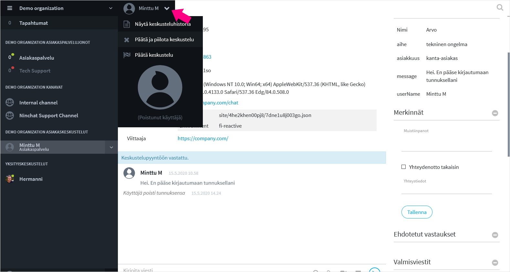
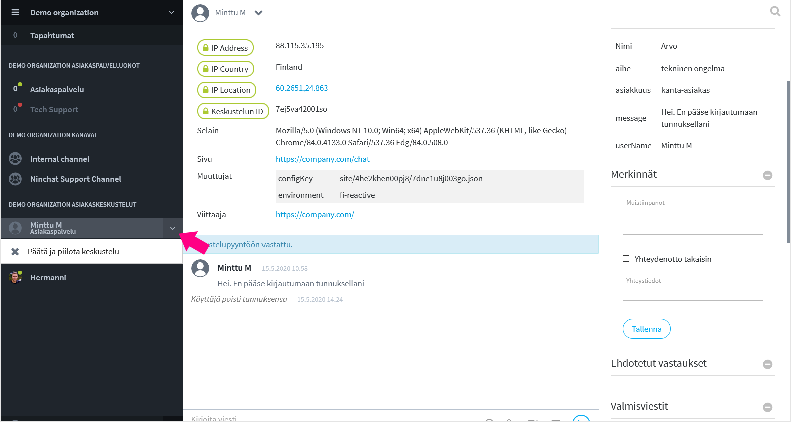

# Asiakaskeskustelun lopettaminen

## Asiakaskeskustelun lopettaminen

Asiakaskeskustelu päättyy joko asiakkaan tai agentin toimesta. Asiakas voi sulkea chatin, jolloin agentti saa ilmoituksen keskustelun päättymisestä, tai päinvastoin. Keskustelun päättymisen jälkeen toinen osapuoli ei voi enää kirjoittaa viestejä.

Agentti voi päättää keskustelun joko keskustelunäkymän ylävalikon kautta tai sivupalkista.

#### Sulkeminen keskusteluvalikon kautta

Klikkaa käyttäjän nimeä ylävalikossa. Valitse sulkemistapa:

* _Päätä ja piilota keskustelu_
  * Keskustelu loppuu ja keskustelu piilotetaan sinulta näkyvistä. Et voi enää lisätä tunnisteita tai merkintöjä. 
* _Päätä keskustelu_
  * Keskustelu loppuu, uusia viestejä ei voi lähettää. Keskustelu jää kuitenkin sinulle näkyviin, sekä sivupalkin listaan. Voit tämän jälkeen lisätä tunnisteita ja merkintöjä keskusteluun, kunnes piilotat keskustelun, viimeistään kuuden \(6\) tunnin sisällä.  Voit piilottaa keskustelu näkyvistä myöhemmin sivupalkin kautta. Keskustelu näkyy myöhemmin nimettynä "Poistunut käyttäjä".

#### Sulkeminen sivupalkin kautta

Voit lopettaa keskustelun myös sivupalkin kautta, klikkaamalla nuoli-kuvaketta asiaskeskustelun vieressä. Täältä käsin sulkiessa kyseinen keskustelu piilotetaan samalla, etkä voi sen jälkeen lisätä keskusteluun tunnisteita tai muistiinpanoja.

## 

