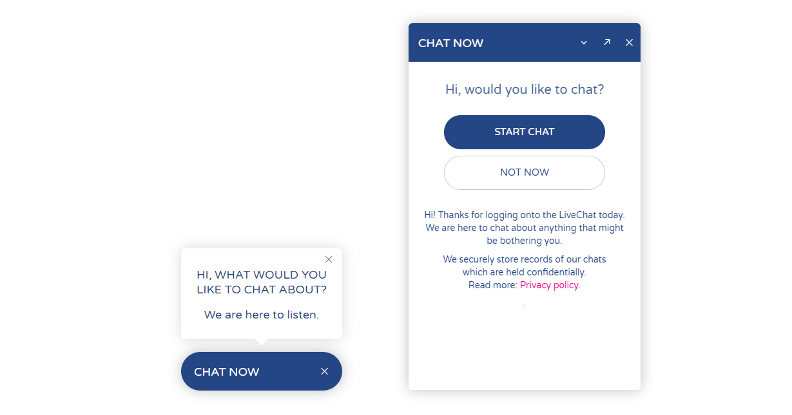
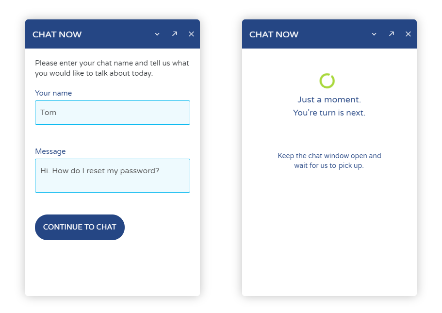
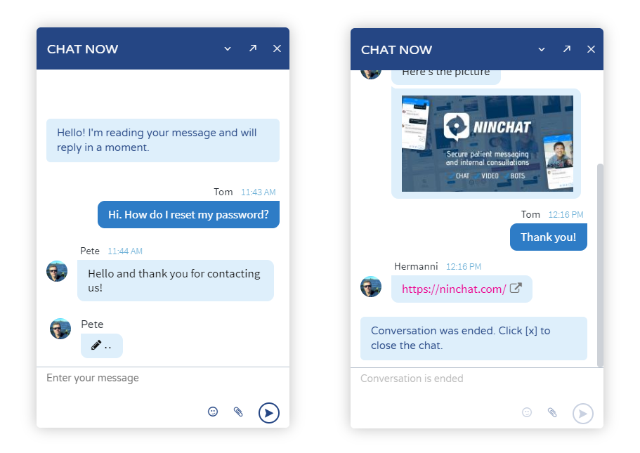
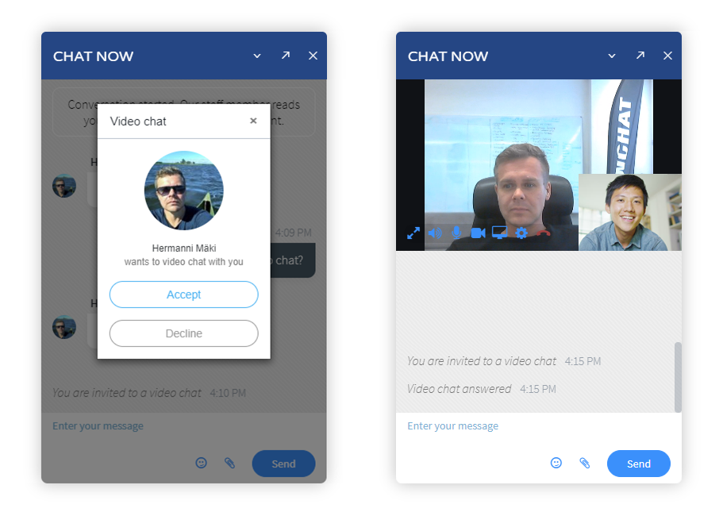
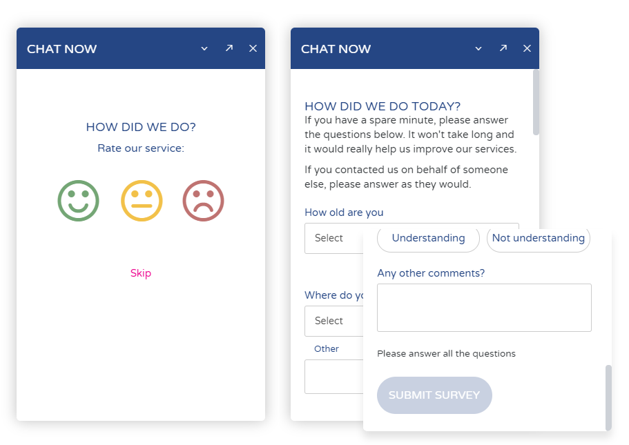
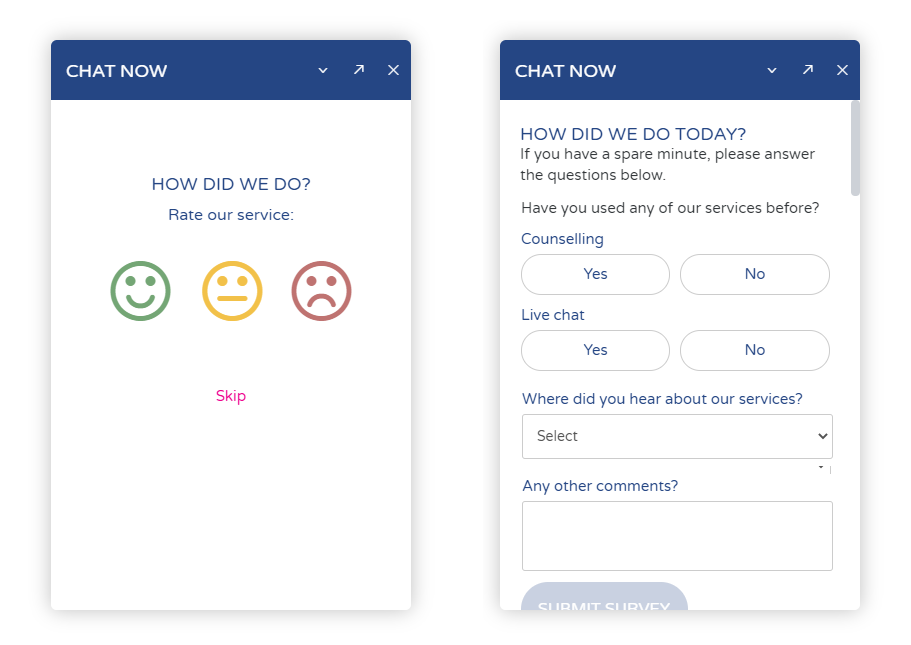

# Asiakkaan chat-näkymä

Tässä dokumentissa esitellään asiakaspalvelu-chatin toimintaa ja näkymiä asiakkaan päässä. Ohessa yksi esimerkki chat-toteutuksen näkymistä. Ninchatin kaikki näkymät ja toiminnot ovat muokattavissa brändinne ja toivomustenne mukaisesti.

Kysy lisää ja pyydä demo-toteutusta: [http://ninchat.com/demo](http://ninchat.com/demo)

## Chatin aloitusnäkymät 

### Minimoitu näkymä

Chat näkyy tavanomaisesti aluksi pienennettynä palkkina ruudun oikeassa alakulmassa. Palkin yläpuolella on mahdollista näyttää mainoskupla, jossa palvelusta on mahdollisuus viestittää enemmän.

### Aloitusruutu

Chat-ikkunan aukaistuaan asiakas näkee aloitusruudun, josta on mahdollisuus siirtyä chattiin. Aloitusruudussa voidaan kertoa lisätietoa palvelusta, tiedotteita, aukioloajat, yms.

Myös muut elementit, kuten kuvat, linkit ja taulukot ovat käytettävissä.

Aloitusruudun sijaan vieras voidaan myös ohjata suoraan alkukyselyyn tai jonoon, tai chat-bot-keskusteluun.

Chat-ikkuna voidaan otsikkopalkin valinnaisista napeista pienentää, sulkea ja avata isompaan näkymään tai erilliseen popup-ikkunaan.

## Alkukysely ja jonotus

### Jonotusnäkymä 

Valittuaan chatin aloituksen vieras siirtyy jonotusnäkymään. Jonotusnäkymä kertoo asiakkaan jonotusnumeron, eli onko hänen edellään muita asiakkaita. Agentin poimiessa asiakkaan jonosta, avautuu ikkunaan keskustelunäkymä.

### Alkukysely

Ennen jonoon siirtymistä voidaan asiakkaalle näyttää esitietoja kartoittava alkukysely. Alkukyselyssä voidaan kysyä nimi/nimimerkki ja kysymys, tai kartoittaa muuten asiakkaan tarpeita ja näyttää sen perusteella ohjeita tai valita oikea asiakapalvelujono.

## Keskustelunäkymä

Jonotusnäkymästä siirrytään itse keskusteluun. Keskustelussa voidaan hyödyntää tekstin lisäksi linkkejä ja liitetiedostoja. Liitetiedostojen lähettäminen voidaan sallia tai estää jonon asetuksissa.

### Videokeskustelu

Tekstipohjaisen keskustelun ja kuvien ohella voit jutella asiakkaan kanssa videon välityksellä. Kameran lisäksi voitte jakaa myös kuvaruutunne. Video ja ruudunjako eivät vaadi lisäohjelmistoja vaan toimivat uudemmilla nykyselaimilla.

### Asiakasarviointi ja loppykysely

Keskustelun päätyttyä asiakkaalle voidaan näyttää arviointinäkymä. Hymiö-palautteenannolla kerätään nopeasti arvokasta palautetta palvelun toimivuudesta.

Hymiöiden ohella voidaan käyttää loppukyselyä, jolla asiakkaalta saadaan kerättyä tarkempaa tietoa ja palautetta. Palautteet tallentuvat keskusteluhistorian oheen tilastoihin.

### Chat suljettu

Kun asiakaspalvelu-chattia on suljettu, voidaan chat piilottaa tai näyttää heille suljettu-näkymä. Näkymään voidaan sijoittaa yhteydenottolomake, kertoa palvelusta ja aukioloajoista ja linkata muualle.

Voitte myös auttaa vierasta yleisissä asioissa tarjoamalla ohjeita Ninchatin kysely-työkalulla tai chat-botilla.

