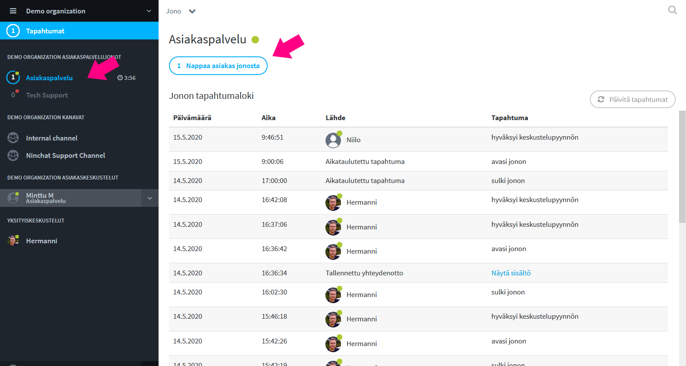
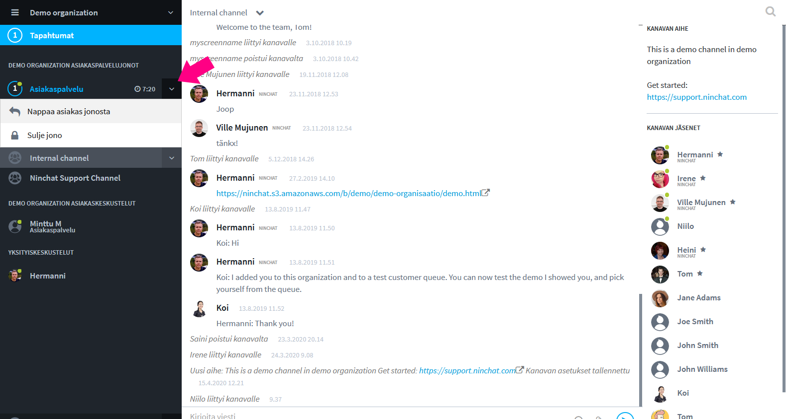

# Asiakkaan nappaaminen jonosta

## Ilmoitus asiakkaasta

Mikäli olet käyttäjäasetuksissasi sallinut, saat asiakasjonon tapahtumista ilmoituksen:

* Tapahtumat-palkki sekä Asiakasjono-palkki: sininen huomioväri
* Äänihuomautuksena
* Työpöytä-ilmoituksena \(laatikko näytön nurkassa\)
* \(Halutessasi myös sähköposti-ilmoitus\)

Asiakas voidaan poimia joko sivupalkista tai isommasta jononäkymästä. Alla ohjeet molempiin tapoihin.


Ilmoitus asiakkaasta näkyy aina Jono-palkin lisäksi myös _Tapahtumat/Activity_ -palkissa. Palkki ilmoittaa tapahtumista muuttumalla siniseksi, ja näet ilmoituksen, vaikka sinulla olisi ilmoituksen tullessa avattuna toinen organisaatio.


## Asiakkaan nappaaminen jonosta

### Nappaaminen Jono-näkymän kautta 

1. Klikkaa sivupalkissa jonon nimeä muualta kuin nuoli-ikonin kohdalta.
2. Jono-sivulla klikkaa nappia "Nappaa asiakas jonosta".
3. Asiakaskeskustelu alkaa.

### Nappaaminen pudotusvalikon kautta

1. Klikkaa sivupalkissa jonon nimen vieressä nuoli-ikonia \(kuvassa Customer service queue\).
2. Palkin alle avautuu pudotusvalikko, josta voit valita "Nappaa asiakas jonosta".
3. Asiakaskeskustelu alkaa.

##  

