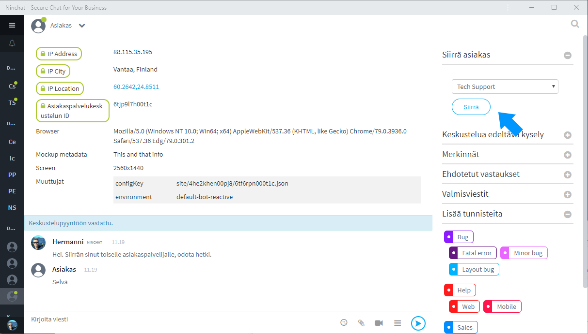

# Asiakkaan siirtäminen

Asiakas voidaan keskustelun alettua siirtää toiseen jonoon, jolloin toinen agentti voi poimia tämän keskusteluun. Esimerkiksi ensiksi vastannut hoitaja voi tarvittaessa siirtää asiakkaan lääkärijonoon.

Kun asiakas siirretään, hänelle itselleen ilmestyy väliaikaisesti jonotusnäkymä. Kun siirtojonon agentti vastaa, aiempi keskustelu palaa näkyviin hänelle.

Siirtojonot määritellään jonon asetuksissa. Kun siirtojonoja on määritelty, siirtomahdollisuus näkyy asiakaskeskustelun oikealla palstalla.

## 

