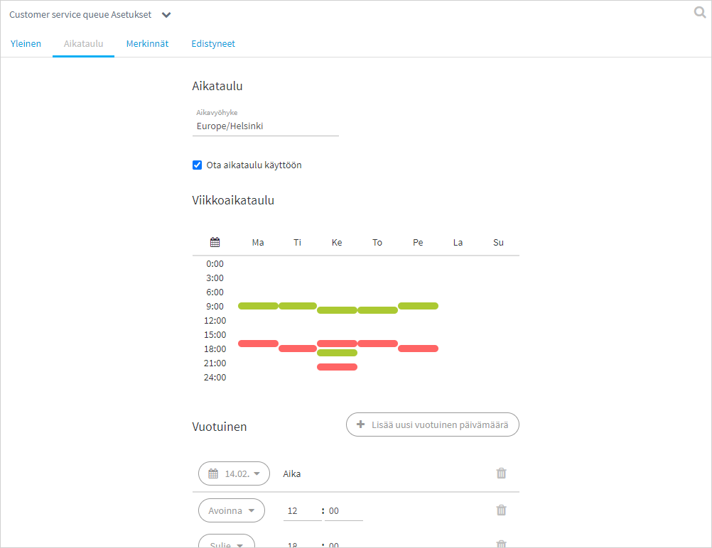
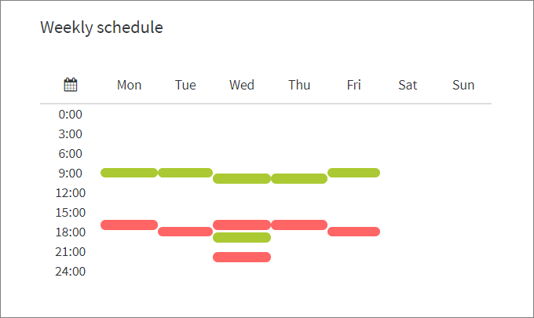
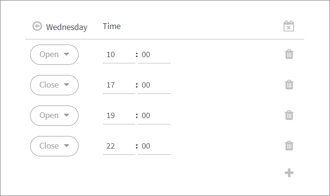
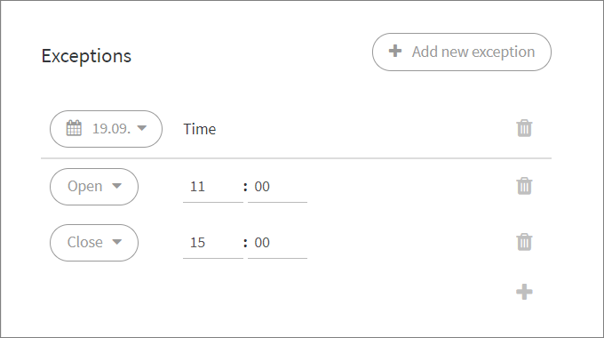

# Jonon ajastaminen

## Yleistä

Voit ajastaa asiakasjonon avautumaan ja sulkeutumaan automaattisesti, jolloin jonon tilaa ei tarvitse muuttaa käsin. Lisäksi voit asettaa poikkeuskäytäntöjä halutuille päiville.


Huom. Ajastustoiminnot tapahtuvat asetettuina hetkinä. Asiakasjono ei siis itsestään avaudu jos ajastus avautumiselle asetetaan nykyhetkeä aikaisemmin. \
Voit avata jonon aina manuaalisesti sivupalkin jono-valikosta.



Muista tallentaa muutokset.


## Luo aikataulu jonolle

Luo toistuva viikkoaikataulu chat-jonollesi. Viikonpäivää klikkaamalla pääset luomaan ja muokkaamaan jonon avaamis- ja sulkemisaikoja. Alla keskiviikon (Wednesday) ajastusten muokkausnäkymä.

Muista aina tallentaa muutokset!

### Toistuva viikkoajastus

Kullekin päivälle voi luoda useita avaamis- ja sulkemishetkiä:

* Lisää uusi tapahtumakohta klikkaamalla +-ikonia. Valitse aika ja avataanko vai suljetaanko chat tällöin.
* Esim. kuvassa keskiviikkona chat avataan klo 10:00 ja suljetaan klo 17:00 ja avataan jälleen 19:00 - 22:00.
* Palaa viikkonäkymään klikkaamalla nuoli- tai x-kuvaketta.

### Luo vuosittaisia poikkeusaikatauluja (Annual exceptions) 

Voit luoda chat-jonolle vuosittain (annual) samoilla päivämäärillä tapahtuvia poikkeuksia esim. juhlapyhille ja muille vapaapäiville.

1. Vuosittainen poikkeusaikataulu vaatii sekä avaamis- että sulkemisajan asettamisen
2. Jos haluat, ettei chat avaudu tiettynä päivänä lainkaan, lisää poikkeuspäivä ilman avaamis- tai sulkemistietoja, eli tyhjä päivä.

Ao. kuvassa on joka vuosi toistuva poikkeusaikataulu ystävänpäivälle 14.2.  Lisäksi jouluaattona ja -päivänä chat on kokonaan suljettuna. Nämä korvaavat normaalit viikkoajastukset.

.png>)

### Luo yksittäisiä, kerran tapahtuvia poikkeuksia (Exceptions) 

Voit luoda yksittäisen, kerran tapahtuvan poikkeuksen (exception) chat-jonolle.

1. Yksittäisen poikkeuspäivän luominen ohittaa asetetut aikataulut ja vuosittaiset poikkeukset. Poikkeus tapahtuu ainoastaan kerran, yhtenä tiettynä päivänä, eikä toistu tulevina vuosina. 
2. Jos haluat, ettei chat avaudu tiettynä päivänä lainkaan, lisää poikkeuspäivä ilman avaamis- tai sulkemistietoja, eli tyhjä päivä.

Ao. kuvan esimerkissä on 19.9.2019 tapahtuva poikkeusajastus, joka ohittaa normaalin viikkoajastuksen.

### Lomatauko - Ajastukset päälle/pois 

"Ota aikataulu käyttöön" -kohdasta voit nopeasti asettaa ajastukset käyttöön tai pois.

Mikäli pidätte chatin suljettuna esim. kesäloman tai joulun pyhien ajan, on helpompi kytkeä ajastukset pois, poikkeusten luomisen sijaan. Kun henkilöstö palaa lomalta, voidaan ajastus kytkeä nopeasti takaisin päälle ruksaamalla "Ota aikataulu käyttöön" -kohta uudestaan.

Muistakaa tarvittaessa asettaa haluamanne suljettu-viesti lomien ajaksi ja mielellään jo etukäteen.

## Ongelmatilanteita

#### Asetetut aikataulut eivät tulleet käyttöön

> Muista tallentaa muutokset ennen kuin poistut asetuksista.

#### Asetetut aikataulut tai poikkeukset eivät suostu tallentumaan tai näkyvät väärin

> Käytä ajastuksia tehdessä Chrome- tai Edge-selainta. Mozilla Firexilla ajastusten tallentamisessa voi esiintyä virheitä.

#### Muutin aikataulua samalle päivälle mutta chat ei siitä huolimatta avaudu/sulkeudu

> Ajastustoiminnot tapahtuvat asetettuina hetkinä. Asiakasjono ei siis itsestään avaudu jos ajastus avautumiselle on asetetaan nykyhetkeä aikaisemmin. Voit avata jonon aina manuaalisesti sivupalkin jono-valikosta.
