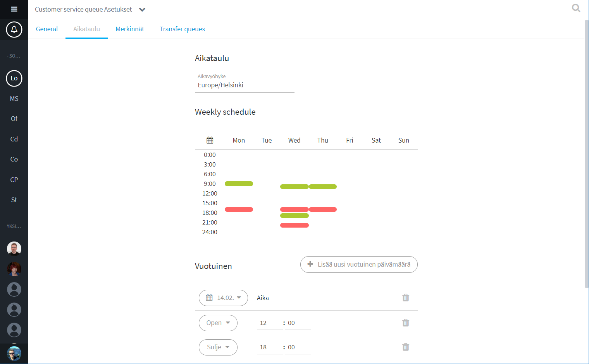

# Jonon ajastaminen

## Yleistä

Voit ajastaa asiakasjonon avautumaan ja sulkeutumaan automaattisesti. Lisäksi voit asettaa poikkeuskäytäntöjä.

## Luo aikataulu jonolle

Viikonpäivää klikkaamalla pääset luomaan ja muokkaamaan jonon avaamis- ja sulkemisaikoja. Kullekin päivälle voi luoda useita avaamis- ja sulkemishetkiä:

* Esim. kuvassa maanantaina chat avataan klo 9:00 ja suljetaan klo 17:00. Keskiviikkona chat on avoinna klo 9:30 - 17:00 sekä klo 18:00 - 21:30.
* Palaa viikkonäkymään klikkaamalla nuoli- tai x-kuvaketta.

"Ota aikataulu käyttöön" -kohdasta voit nopeasti asettaa ajastukset käyttöön tai pois.

Valitse tarvittaessa oikea aikavyöhyke.

Muista tallentaa muutokset.


Huom. Ajastustoiminnot tapahtuvat asetettuina hetkinä. Asiakasjono ei siis itsestään avaudu jos ajastus avautumiselle on asetetaan nykyhetkeä aikaisemmin. Voit avata jonon aina manuaalisesti sivupalkin jono-valikosta.


### Luo vuosittaisia poikkeusaikatauluja esim. juhlapyhille ja muille vapaapäiville:

* Vuosittainen poikkeusaikataulu vaatii sekä avaamis- että sulkemisajan asettamisen
* Jos haluat ettei chat avaudu tiettynä päivänä lainkaan, luo päivämäärä tyhjänä ilman avaamis- tai sulkemistietoja

### Luo yksittäisiä, kerran tapahtuvia poikkeuspäiviä:

* Yksittäisen poikkeuspäivän luominen ohittaa asetetut aikataulut ja vuosittaiset poikkeukset
* Tyhjän päivämäärän luominen pitää chatin suljettuna koko päivän.


Muista tallentaa muutokset.


