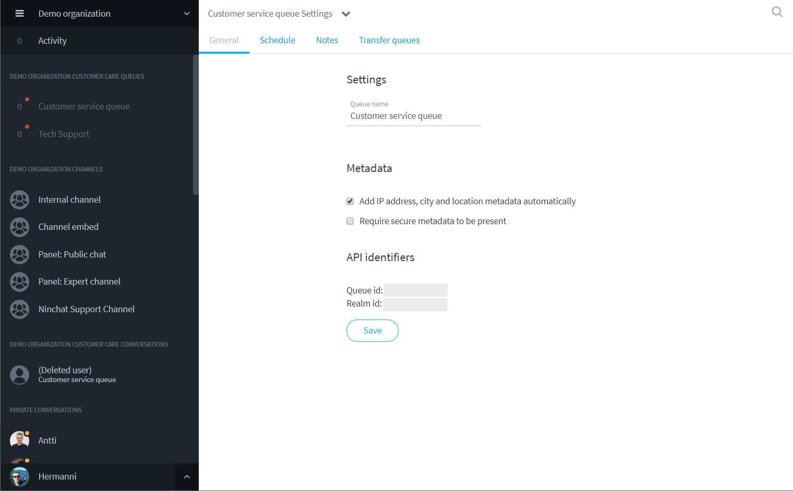
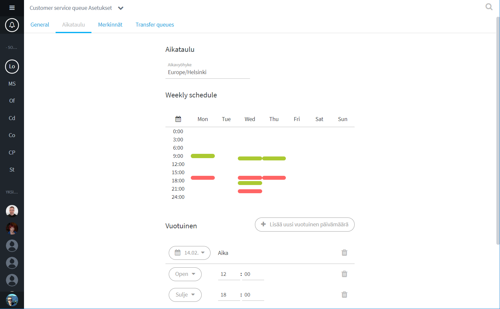
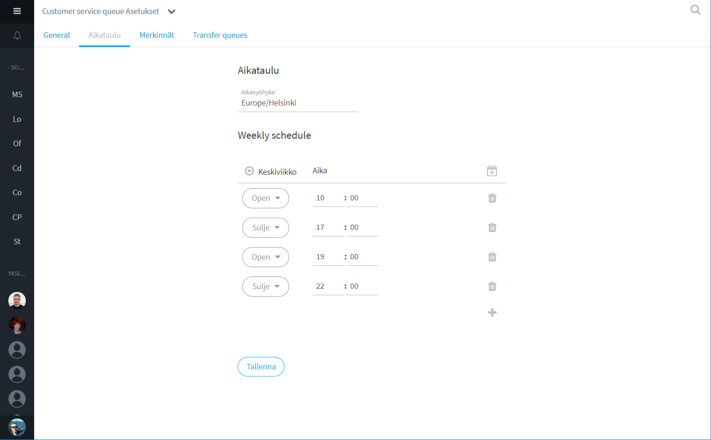

# Jonon asetukset

Siirry asiakasjonon asetuksiin klikkaamalla jonon nimeä ja valitse Jonon asetukset / Queue settings.  
\(Vaatii organisaation operaattori -oikeudet\)

## Yleiset jonon asetukset

Jonon yleisissä asetuksissa voit muokata seuraavia asioita:

* Jonon nimi
* Aseta, liitetäänkö keskustelun alkuun automaattisesti asiakkaasta metadataa, kuten sijainti ja IP-osoite. Muiden metatietojen lisäämisestä pyydä lisätietoa Ninchatin henkilöstöltä.
* Määritä Salattu metadata pakolliseksi \(lisätietietoa kohdassa: Asiakasjonot ja -keskustelut\)

Muista tallentaa tekemäsi muutokset.

### Liitetiedostojen ja videon tuki

Mikäli haluatte jonoon liitetiedostojen lisäämisen tai videopuhelun käytön, ottakaa yhteyttä Ninchatin henkilöstöön.

## Jonon ajastaminen

Voit ajastaa asiakasjonon avautumaan ja sulkeutumaan automaattisesti. Lisäksi voit asettaa poikkeuskäytäntöjä.

### Luo aikataulu jonolle

Valitse tarvittaessa oikea aikavyöhyke

Viikonpäivää klikkaamalla pääset luomaan ja muokkaamaan jonon avaamis- ja sulkemisaikoja. Kullekin päivälle voi luoda useita avaamis- ja sulkemishetkiä:

* Esim. kuvassa maanantaina chat avataan klo 9:00 ja suljetaan klo 17:00. Keskiviikkona chat on avoinna klo 9:30 - 17:00 sekä klo 18:00 - 21:30.
* Palaa viikkonäkymään klikkaamalla nuoli- tai x-kuvaketta.

Luo vuosittaisia poikkeusaikatauluja esim. juhlapyhille ja muille vapaapäiville:

* Vuosittainen poikkeusaikataulu vaatii sekä avaamis- että sulkemisajan asettamisen
* Jos haluat ettei chat avaudu tiettynä päivänä lainkaan, luo päivämäärä tyhjänä ilman avaamis- tai sulkemistietoja

Luo yksittäisiä, kerran tapahtuvia poikkeuspäiviä:

* Yksittäisen poikkeuspäivän luominen ohittaa asetetut aikataulut ja vuosittaiset poikkeukset
* Tyhjän päivämäärän luominen pitää chatin suljettuna koko päivän.

Muista tallentaa muutokset.

## Merkinnät \(Muistiinpanot\)

Muistiinpanot \(Notes\) on lisäasetus, jolla voidaan luoda erilaisia muistiinpanovaihtoehtoja asiakaskeskusteluun. Asiakaspalvelijan tekemät muistiinpanot tallentuvat keskusteluhistorian yhteyteen.  
Pyydä lisätietoa Ninchatin henkilöstöltä.

## Jonon tilastot



## Jonojen ja jononkäsittelijöiden hallinta



