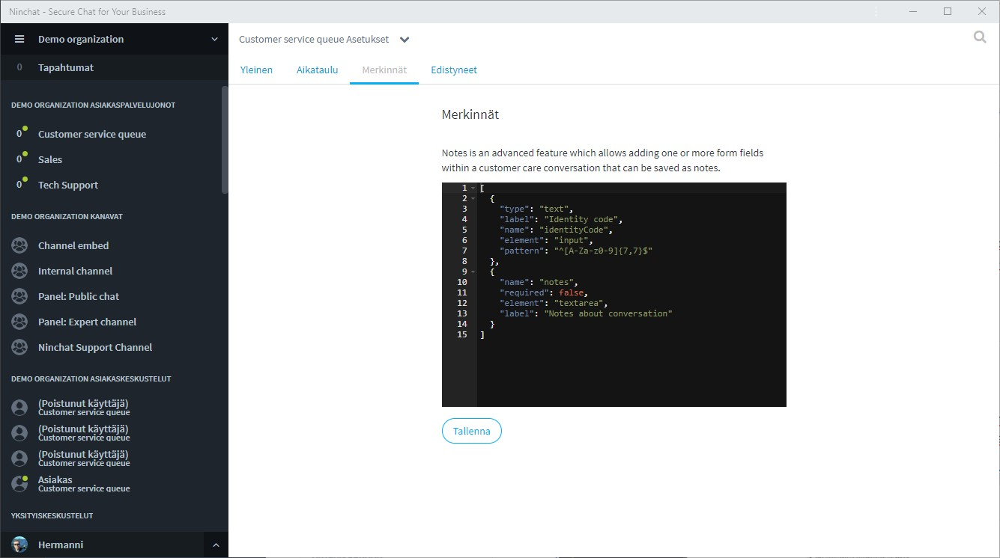
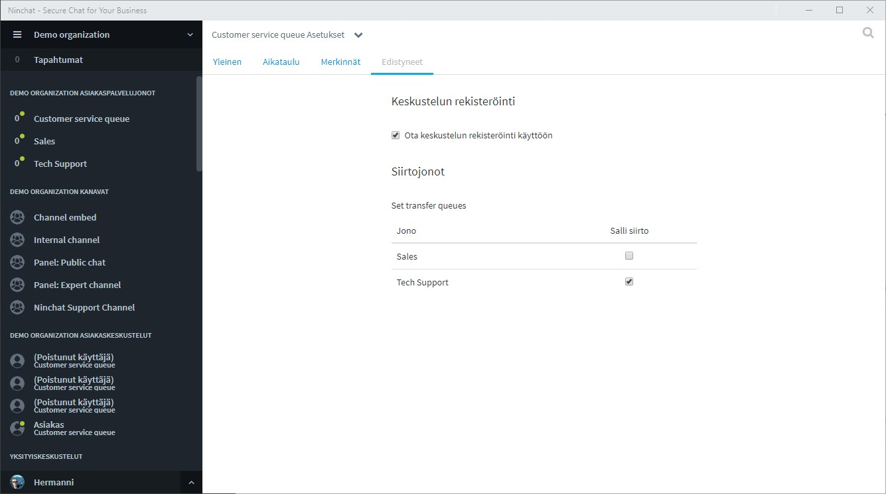

# Jonon asetukset

Siirry asiakasjonon asetuksiin klikkaamalla jonon nimeä ja valitse Jonon asetukset / Queue settings.\
(Vaatii organisaation operaattori -oikeudet)

## Yleiset jonon asetukset

.png>)

Jonon yleisissä asetuksissa voit muokata seuraavia asioita:

* Jonon nimi
* Aseta, liitetäänkö keskustelun alkuun automaattisesti asiakkaasta metadataa, kuten sijainti ja IP-osoite. Muiden metatietojen lisäämisestä pyydä lisätietoa Ninchatin henkilöstöltä.
* Määritä Salattu metadata pakolliseksi (lisätietietoa kohdassa: Asiakasjonot ja -keskustelut)

Muista tallentaa tekemäsi muutokset.

### Liitetiedostojen ja videon tuki

Mikäli haluatte jonoon liitetiedostojen lisäämisen tai videopuhelun ja ruudunjaon käytön, ottakaa yhteyttä Ninchatin henkilöstöön.

## Jonon ajastaminen

Katso jonon aikataulutuksen ohjeistus seuraavalta sivulta:


[jonon-ajastaminen.md](jonon-ajastaminen.md)


## Merkinnät (Muistiinpanot)

Muistiinpanot (Notes) on lisäasetus, jolla voidaan luoda erilaisia muistiinpanovaihtoehtoja asiakaskeskusteluun. Asiakaspalvelijan tekemät muistiinpanot tallentuvat keskusteluhistorian yhteyteen.

Pyydä lisätietoa Ninchatin henkilöstöltä.

## Siirtojonot

Asiakaskeskustelu on mahdollista ohjata toiseen jonoon ja tätä kautta toiselle ammattilaiselle. Jonon asetuksissa määritellään sallitut siirtojonot. Pyydä lisätietoa Ninchatin henkilöstöltä.

## Jonon tilastot


[jonon-tilastot.md](jonon-tilastot.md)


## Jonojen ja jononkäsittelijöiden hallinta


[asiakasjonojen-hallinta.md](../organisaatio/asiakasjonojen-hallinta.md)


