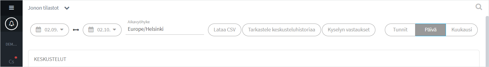
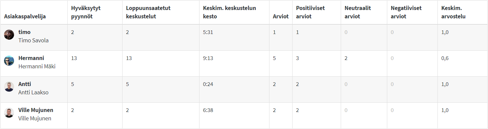

# Jonon tilastot

## Tilasto-näkymä 

Siirry asiakasjonon tilastoihin klikkaamalla jonon nimeä vasemmassa sivupalkissa ja valitse _Jonon tilastot / Queue statistics_. (Vaatii organisaation operaattori -oikeudet.)\
Organisaation jonojen tilastoihin pääsee käsiksi myös organisaatioasetuksista, _Jonot_-välilehdeltä.

Voit tarkastella keskusteluhistoriaa, tunnisteita (tägit), käyttäjätyytyväisyyttä, kyselyvastauksia ja metatietoja. Tilastot toimivat miltei reaaliajassa, ne päivittyvät viimeistään tunnin sisällä. Asiakaspalvelijoiden on mahdollista lisätä tunnisteita kuuden tunnin ajan keskustelun päättymisestä, joten ne päivittyvät tämän ajan sisällä.

Tilastot ja keskusteluhistoriat voidaan ladata ja tallentaa CSV-tiedostona käsin, tai ne voidaan automaattisesti viedä asiakkaan CRM-järjestelmään (kysy meiltä lisätietoa).

Poistuaksesi tilastoista, klikkaa Jonon tilastot -otsikkoa ja valitse Sulje.

Tilastosivu koostuu osioista:

* Aikaväli-, ja tarkastelujaksovalinnat sekä historia- ja kyselyvalinnat
* Graafiset kuvaajat
* Tunnistekohtaiset tilastot
* Asiakaspalvelijakohtaiset tilastot
* Päiväkohtaiset tilastot ja keskustelujen tarkastelu

### Valinnat

| Ajankohta                                                                                      | Vienti                                                                                            | Tarkastelu                                                                |
| ---------------------------------------------------------------------------------------------- | ------------------------------------------------------------------------------------------------- | ------------------------------------------------------------------------- |
| 
Valitse aikaväli, jolta haluat  katsoa tilastoja

Valitse haluamasi aikavyöhyke
 | 
Lataa tilastot CSV-tiedostona

Katso keskusteluhistoriat

Katso kyselyvastaukset
 | 
Valitse tarkastelujakson tarkkuus:

kk / päivä / tunti

 |

## Graafiset kuvaajat

.png>)

Graafeista saat nopeasti yleissilmäyksen tapahtumiin. Voit tarkastella:

* Keskustelujen määrää
* Poimittujen ja hylättyjen keskustelijoiden määrää
* Tallennettujen yhteydenottojen määrää
* Keskustelujen, jonotuksen ja poistumisaikojen keskimääräisiä  aikoja
* Palautteita ja niiden määrää

Asiakkaan saapumista jonoon kutsutaan pyynnöksi:

* Hyväksytty pyyntö: Asiakapalvelija poimii asiakkaan jonosta.
* Pudonnut pyyntö: Asiakasta ei poimita jonosta

## Merkintäkohtaiset tilastot 

.png>)

Voit tarkistella tilastoja merkintöjen (tägit) perusteella. Saat näin tietoon, mitkä asiat tai palvelut ovat suosittuja ja vievät aikaa asiakaspalvelusta, sekä minkälaista palautetta aihe kerää.

## Asiakaspalvelijakohtaiset tilastot

Näet asiakaspalvelijoiden henkilökohtaiset yleistilastot valitulta ajanjaksolta.\
Keskimääräinen arvosana liikkuu välillä 0,0 - 1,0.

## Päiväkohtaiset tilastot

Päiväkohtaisista tilastoista näet käydyt keskustelut ja voit katsoa keskustelulogeja.

Klikkaa päiväriviä avataksesi näkymään kyseisen päivän keskustelut. Keskusteluhistoria-linkkiä klikkaamalla pääset lukemaan kyseisen keskustelun.


 Negatiivinen palaute ei aina tunnu mukavalta mutta on monesti kaikkein arvokkain. Lukemalla negatiivisen palautteen aiheuttaneen keskustelun pääset helposti ongelman jäljille.


##  Keskusteluhistoria

Keskusteluhistorian tarkastelu

1. Agentin lisäämät merkinnät (tägit) keskustelulle
2. Tietoa istunnosta ja asiakkaasta; Metadata, Alkukysely
3. Viestin lähetysaika
4. Viestin sisältö

Keskusteluhistoriat sisältävät myös asiakasarvion sekä kyselyvastaukset mikäli ominaisuus on käytössä ja asiakas on antanut arvion.

Voit tallentaa keskustelun koneellesi painamalla "Lataa CSV"-nappia. Ladatun tiedoston voit avata esim. Excelissä. Huomioi tietojen viennissä tietoturva.

### Keskusteluhistorian tarkastelun syyn kirjaaminen

Keskusteluhistorian tarkasteluun voidaan asettaa syyn ilmoittaminen seurantaa varten. Näin keskusteluhistorian voi avata ainoastaan lisäämällä tallennettava viesti.

Ominaisuus voidaan ottaa käyttöön organisaatioasetuksissa. 

1. Valitse ensin “Organisaation asetukset” (Organization settings), ja sen jälkeen välilehti “Edistyneet” (Advanced). 
2. Klikkaa ruutua “vaadi syytä keskusteluhistorian katseluun” (Require reason for viewing transcript).
3. Tallenna.

.jpg>)

## Kyselyvastaukset

Kyselyvastauksia (chatin alku- ja loppukyselyt, sekä Ninchat-kevytbottikyselyt) voidaan tarkastella erikseen klikkaamalla linkkiä valintariviltä halutun tarkistelujakson valittuasi.

Vastaukset ladataan lajiteltuna alku- ja loppukyselyvastauksiin. Voit myös suodattaa vastauksista ainoastaan rekisteröidyt kyselyvastaukset (Alkukyselyvastaukset, jotka eivät johda keskusteluun, kuten offline-ajan yhteydenottopyynnöt ja kevytbottivastaukset ja -kyselypolut).

## Näin tarkastelet tilastoja 

### Kuukausikohtaiset tilastot

Haluatko selvittää tilastot kootusti kuukausittain? Tee näin:

1. Valitse ajanjaksoksi yksi tai useampi kuukausi
2. Valitse tarkastelujakson tarkkuudeksi _kuukausi_ 

Näet nyt kuvaajat kuukausittain ryhmiteltynä ja kuukauden tarkkuudella. Näet, paljonko tunnisteita kuukauden aikana on lisätty ja paljonko keskusteluja agentit ovat käyneet kuukaudessa. 

Lisäksi näet kootusti kaikkien asiakaskeskustelujen määrät, pituudet ja arviot kuukauden ajalta. Laajentamalla kuukauden keskustelut näkyviin (klikkaa kuukausiriviä), saat listan kaikista kuukauden ajalta käydyistä keskusteluista ja voit esim. nopeasti tarkistaa kaikki negatiivisen arvosanan saaneet keskustelut.\
Tällä tavoin löydät helposti ongelmatapaukset ja voit puuttua niihin tarvittaessa, ja näin parantaa palveluasi.

### Päiväkohtaiset tilastot

Haluatko selvittää tilastot päiväkohtaisesti, esim. tarkastella eilisen tapahtumia tunneittain? Tee näin:

1. Valitse ajanjaksoksi yksi päivä (esim. 15.9. - 15.9.)
2. Valitse tarkastelujakson tarkkuudeksi _Tunnit_

Näet nyt kuvaajat tunnin tarkkuudella. Voit selvittää nopeasti, mihin aikaan päivästä on ollut vilkasta, mihin aikaan asiakkaille on jäänyt vastaamatta ja milloin asiakkaat ovat esim. jättäneet yhteydenottopyyntöjä. Näin pääset selvittämään ongelmien syitä ja kehittämään palveluasi.

Päiväkohtaisten tunniste(tagi)- ja agenttikohtaisten tilastojen lisäksi näet tunneittain jaoteltuna kaikki asiakaskeskustelut: määrät, pituudet ja arviot kunkin tunnin osalta. Laajentamalla tunnin keskustelut näkyviin (klikkaa tuntiriviä), saat listan kaikista ko. tunnin keskusteluista. Pylväskaavion tietojen perusteella voit esim. nopeasti etsiä negatiivisen arvosanan saaneet keskustelut ja näin tutkia ja puuttua ongelmiin.
