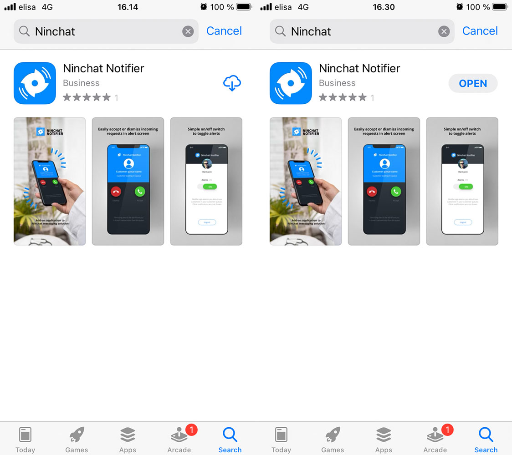
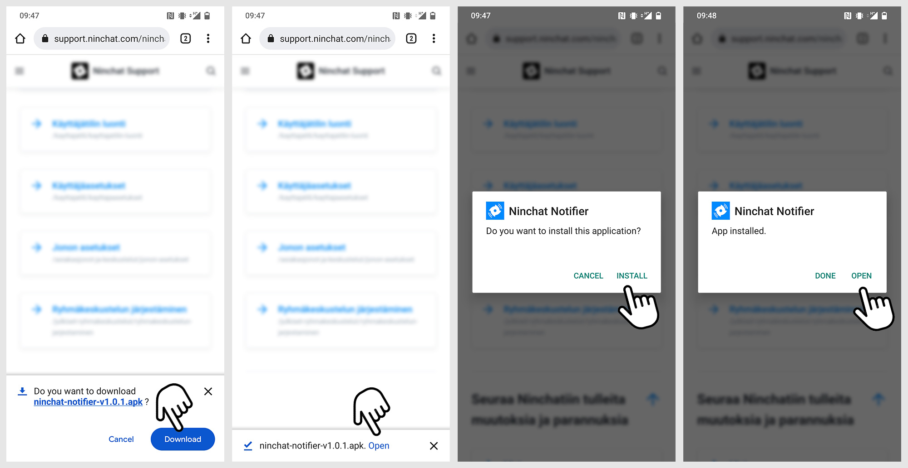
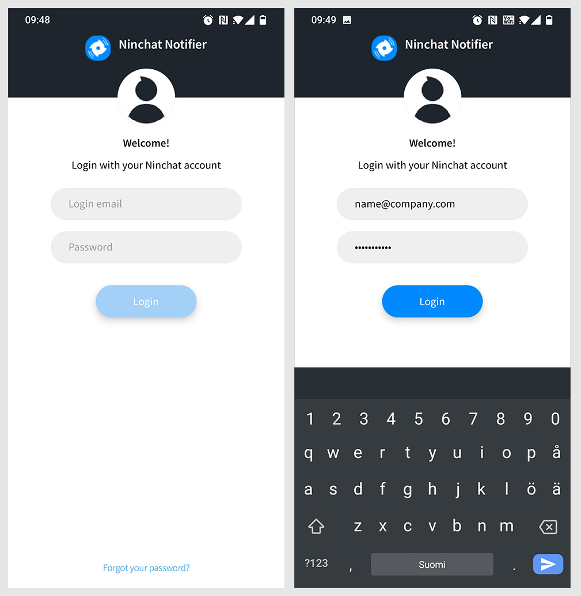
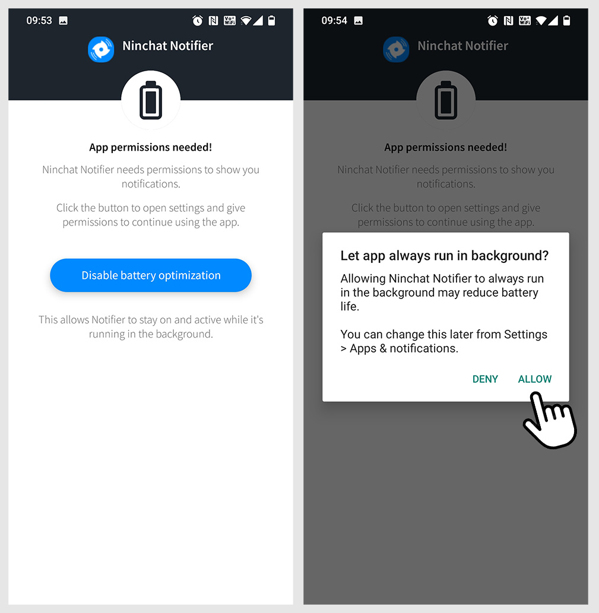
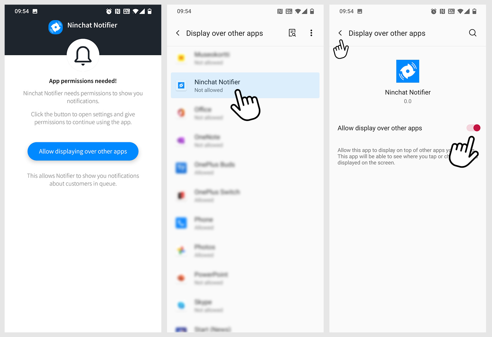
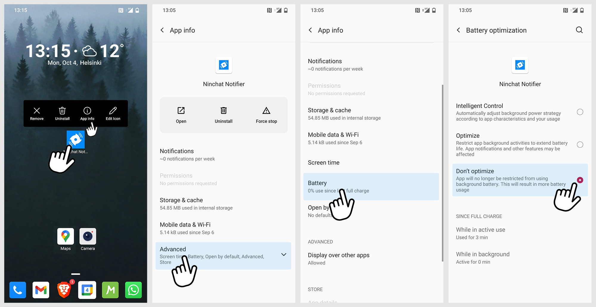
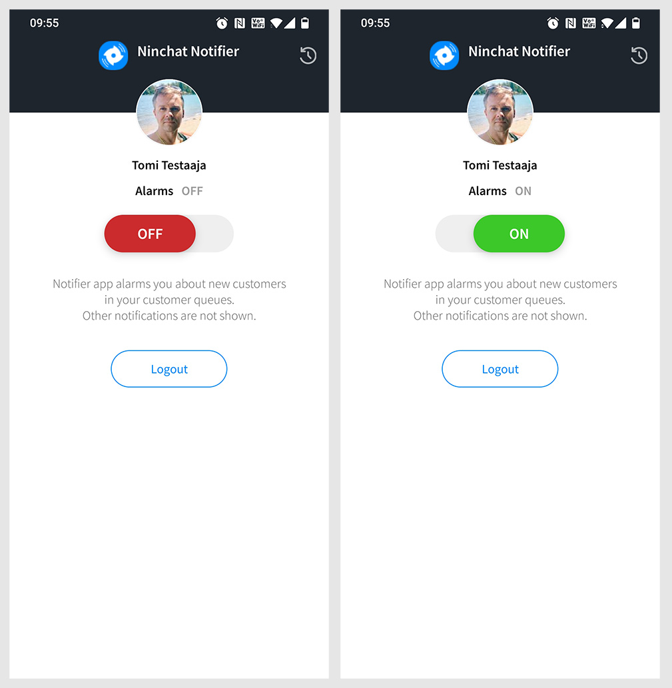
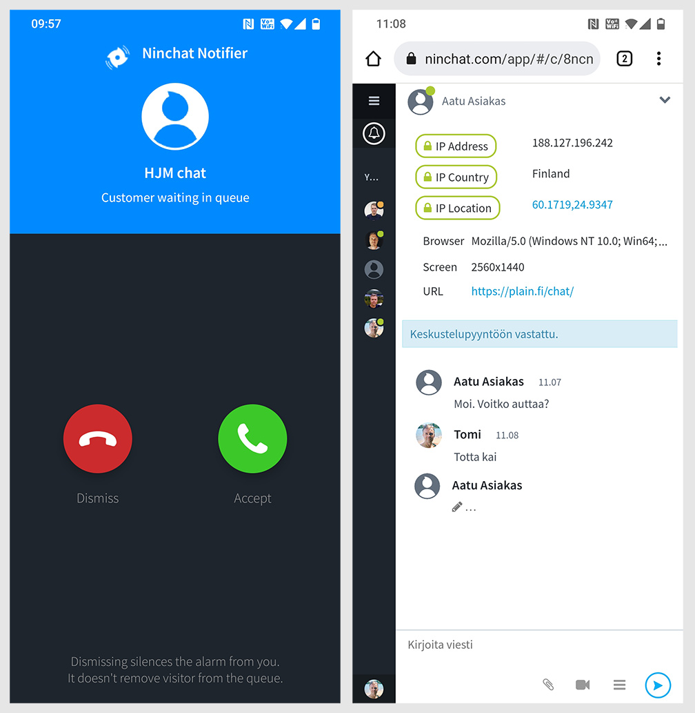

# Notifier-hälytyssovellus

Ninchat Notifier on mobiililaitteissa toimiva hälytyssovellus, jolla saat ilmoituksen asiakkaista chat-jonossa ja voit myös vastata chat-pyyntöihin. Notifierin avulla chattiin vastaaminen on helppoa ja nopeaa missä vain.

Ninchat Notifier-mobiilisovellus asennetaan Android- tai iOS-laitteelle, jonka jälkeen sovellukseen kirjaudutaan sisään Ninchat-tunnuksilla. Tämän jälkeen voit asettaa hälytykset aina tarvittaessa päälle.

## Asennus

### iOS-laitteet

iOS-laitteeseen, kuten iPhoneen, Notifier asennetaan App Storesta. Avaa App Store ja etsi “Ninchat Notifier”. Lataa Notifier painamalla lataa-painiketta (pilvi ja nuoli alas) ja avaa se painamalla open-painiketta.

### Android-laitteet

Lataa Ninchat Notifier oheisesta linkistä ja hyväksy mahdolliset varoitukset.

[https://ninchat.s3.amazonaws.com/b/ninchat/notifier/ninchat-notifier-v1.0.1.apk](https://ninchat.s3.amazonaws.com/b/ninchat/notifier/ninchat-notifier-v1.0.1.apk). 


Huom! puhelimessa tulee olla sallittuna aplikaatioiden asentaminen ulkoisista lähteistä!


Käynnistä asennus latauksen valmistuttua. Löydät asennusohjelman myös laitteen ladatuista tiedostoista. Etsi sovelluksista “Tiedostot” / “Files”, tms. tiedostojen selausohjelma. Avaa siellä “Lataukset” / “Downloads” -kansio ja klikkaa lataustiedostoa. Hyväksy mahdolliset varoitukset ja klikkaa “Asenna”.

Asennuksen valmistuttua löydät Ninchat Notifier -kuvakkeen puhelimen sovellusvalikosta ja/tai kotinäkymästä.

## Käyttö

### Kirjautuminen ja luvitukset

#### 1. Kirjautuminen

Sovellukseen kirjaudutaan käyttäen samaa sähköpostiosoitetta ja salasanaa kuin Ninchatiin kirjautuessa.

#### 2. Sovelluksen käyttöluvat

Jotta Ninchat Notifier voi toimia varmasti, sillä tulee olla lupa toimia taustalla sovelluksen ollessa epäaktiivinen sekä näyttää ilmoituksia silloinkin kun aktiivisena on toinen sovellus. 

Poista akun optimointi käytöstä painamalla "Disable battery optimization" -painiketta, ja seuraavassa ikkunassa valitsemalla "allow".

Seuraavassa vaiheessa, paina "Allow displaying over other apps" -painiketta. Avaa nappia klikkaamalla puhelimen asetusten (Settings) "Display over other apps" (Salli näyttö muiden appien päällä) -valikko. Klikkaa Ninchat Notifier -riviä. Avautuvassa näkymässä kytke käyttöön valinta "Allow display over other apps".

Siirry takaisin Notifier-sovellukseen painamalla paluu-nuolta tai -kuvaketta.

#### 3. Akun käytön lisäasetukset

Jotta Notifier pysyy varmasti käynnissä ja välittää hälytykset, akun optimointi tulee poistaa käytöstä sovelluksen kohdalla. 

Etsi Ninchat Notifier -kuvake puhelimesi näytöltä ja paina sitä pitkään niin, että valinnat tulevat näkyviin. Klikkaa "App info".  Sovellustietoruutudssa valitse "Lisäasetukset" / "Advanced" ja tämän jälkeen "Akku" / "Battery". Kytke päälle valinta "Älä optimoi" / "Don't optimize". Tämän jälkeen poistu asetuksista.

### Hälytysten kytkeminen

Avaa Notifier-sovellus. Kirjauduttuasi ensi kerralla näet suoraan hälytysten asetusvalinta-ruudun.

Hälytys on päällä, kun painike on vihreä; “ON”. Saat ilmoitukset kaikista Ninchatin asiakasjonoista, joissa olet käsittelijänä.

Voit poistaa hälytykset käytöstä klikkaamalla liukuvalintaa. Tällöin liuykuvalinta on punainen; “OFF”. Off-asennossa Notifier ei näytä hälytysilmoituksia.

Notifier on toiminnassa mikäli sovellus on päällä, myös taustalla. Mikäli suljet sovelluksen, hälytykset eivät toimi.


Huom. Hälytysvalinta koskee vain Notifier-sovellusten ilmoituksia. Valinta ei vaikuta Ninchat.comin ammattilais-käyttöliittymän ilmoituksiin.


### Vastaaminen

Notifier-hälytykseen vastataan samalla tavalla kuin normaaliin puheluun. Poimi asiakas jonosta klikkaamalla vihreää puhelinpainiketta. Voit hiljentää ilmoituksen klikkaamalla punaista puhelinpainiketta. Asiakas jää tällöin jonottamaan ja toinen ammattilainen voi vastata hänelle. Punainen painike ei siis poista asiakasta jonosta, vaan hiljentää ilmoituksen itseltäsi.

Vastaamisen jälkeen chat avautuu selainnäkymään.

Keskustelua on mahdollista jatkaa tietokoneella. Voit siis aloittaa chatin puhelimella Notifierin hälyttäessä ja avata sitten Ninchatin tietokoneen selaimessa ja jatkaa keskustelua siellä.

### Huomioitavaa

Notifier-sovelluksen sulkeminen ei kirjaa käyttäjää ulos. Jos haluat kirjautua ulos Notifierista, avaa sovellus ja paina “Logout” -painiketta.
