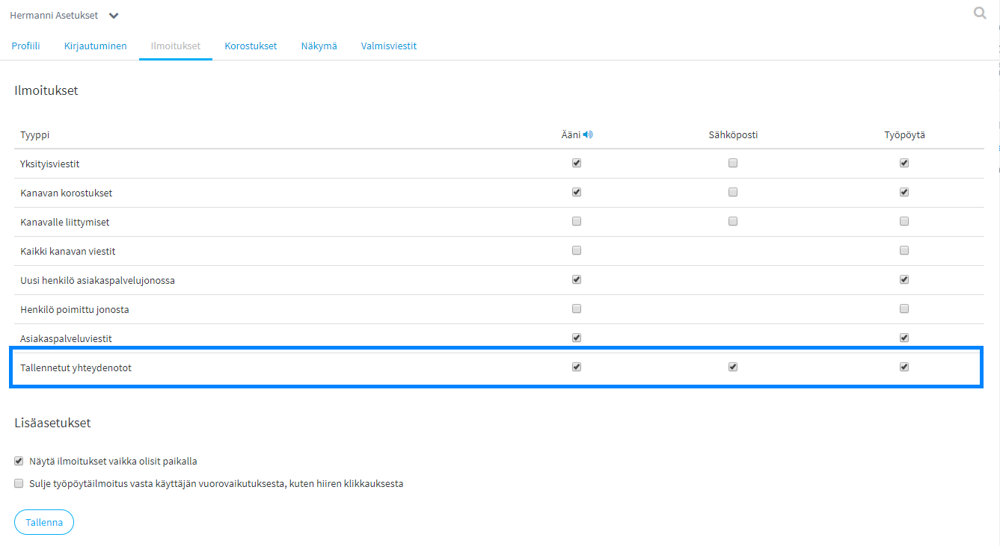
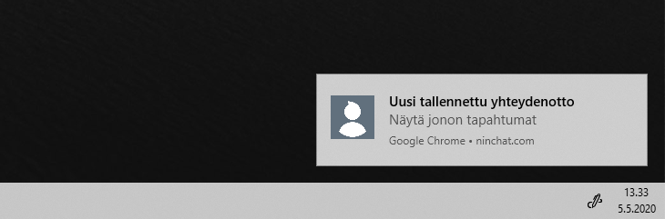
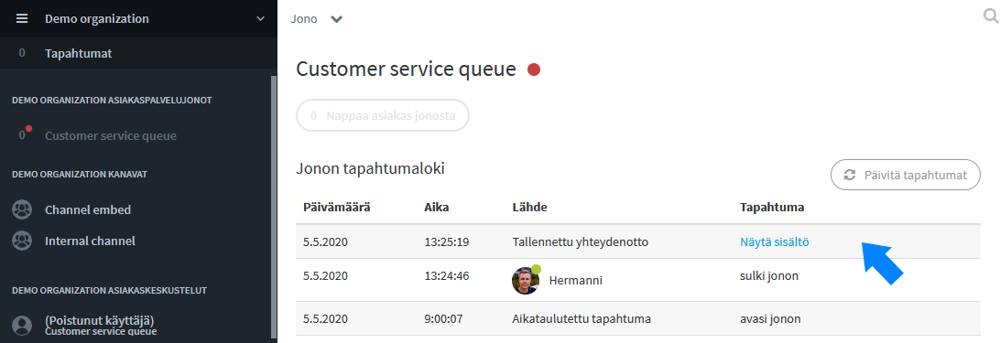
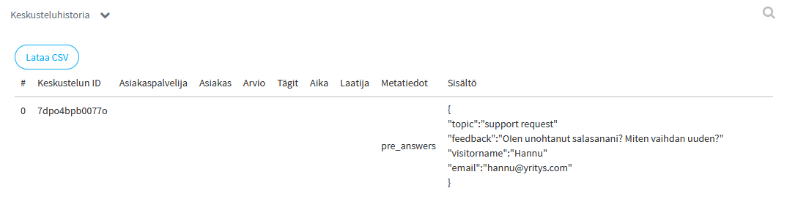

# Offline-yhteydenotot

## Yleistä offline-tilanteista

Kun asiakasjono on suljettu, voit hoitaa offline-ajan eri tavoin:

* Näytä offline-viesti, jossa kerrotaan aukioloajat ja vaihtoehtoiset yhteydenottotavat
* Näytä yhteydenottolomake, jolla asiakkaat voivat jättää sinulle viestin
* Käytä chat-bottia, tai Ninchatin kevytbottia ohjeistamaan käyttäjää yleisissä tilanteissa. Myös kevytbotti voi kerätä yhteydenottoviestin.

## Yhteydenottolomake

### Ilmoitusasetukset

Agenttien, jotka haluavat vastaanottaa ja hoitaa offline-yhteydenottoja, tulee asettaa käyttäjäasetuksissaan päälle ilmoitukset _Tallennetuista yhteydenotoista_.

Ilmoitukset yhteydenotoista voi asettaa näkymään itse Ninchatissa \(ääni ja työpöytä -ilmoitukset\), sekä sähköpostiin sen varalta ettet itse ole kirjautuneena.



### Ilmoitus uudesta yhteydenotosta

Esimerkkitilanne: Asiakas täyttää ja lähettää seuraavanlaisen viestin chat-ikkunasta.

Ninchatissa paikalla oleva agentti saa tästä ilmoituksen Ninchatissa ja esim. työpöytäilmoituksena. Ilmoitus tulee myös halutessasi sähköpostiin.

### Yhteydenottoviestin lukeminen

Ilmoituksen klikkaaminen avaa kyseisen asiakasjonon tapahtumalokin. Näkymästä voit avata itse yhteydenottoviestin.

Yhteydenottoviestin sisältö avautuu näkymään: 

Yhteydenottoviestit löytyvät myös jonon tilastoista _Kyselyvastaukset_-kohdasta.



