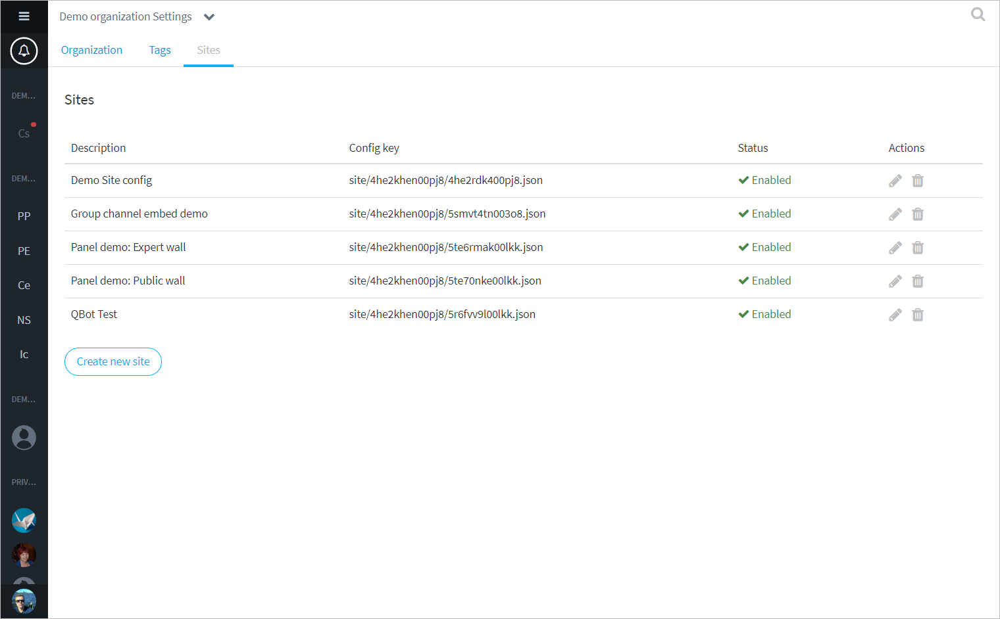
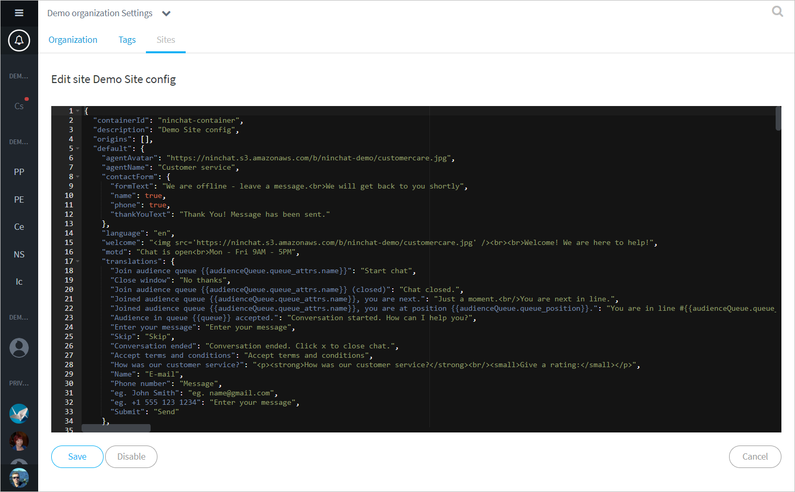

# Sivut-konfiguraatiot

## Yleistä <a id="yleista"></a>

Organisaatioasetusten _Sivut/Sites_-välilehdellä määritellään asiakaspalvelu-chattien ja julkisten ryhmäkeskustelujen asetukset, tekstit ja käännökset sekä tyylit.  
Pääset konfiguraatioihin menemällä organisaatioasetuksiin ja valitsemalla Sivut-välilehden.


Sites-konfiguraatiot ovat edistyneen käyttäjän ominaisuus. Pyydä Ninchatin henkilöstöä tekemään muutokset, tai kysy apua, mikäli koet sen hankalaksi.




## Chatin tekstien muokkaaminen

Avaa konfiguraatio klikkaamalla kynä-ikonia oikeassa laidassa.

Konfiguraatioeditorissa näet chatin asetukset, tekstit ja käännökset. Niitä voi muuttaa siitä haluamakseen. Tekstien seassa saattaa näkyä HTML-elementtejä. Monikielisessä toteutuksessa eri kielille on omat tekstielementtinsä.

#### Yleisimpiä muutettavia tekstejä

<table>
  <thead>
    <tr>
      <th style="text-align:left">Elementti</th>
      <th style="text-align:left">Kuvaus</th>
    </tr>
  </thead>
  <tbody>
    <tr>
      <td style="text-align:left">welcome</td>
      <td style="text-align:left">Chatin alkun&#xE4;kym&#xE4;n yl&#xE4;osan sis&#xE4;lt&#xF6;</td>
    </tr>
    <tr>
      <td style="text-align:left">motd</td>
      <td style="text-align:left">Chatin alkun&#xE4;kym&#xE4;n alaosan sis&#xE4;lt&#xF6;</td>
    </tr>
    <tr>
      <td style="text-align:left">noQueuesText</td>
      <td style="text-align:left">
        <p>N&#xE4;ytett&#xE4;v&#xE4; sis&#xE4;lt&#xF6; chatin ollessa suljettuna.</p>
        <p>(Mik&#xE4;li k&#xE4;yt&#xF6;ss&#xE4; ei ole yhteydenottolomaketta, tms)</p>
      </td>
    </tr>
    <tr>
      <td style="text-align:left">inQueueText</td>
      <td style="text-align:left">Jonotusn&#xE4;kym&#xE4;n opasteteksti</td>
    </tr>
    <tr>
      <td style="text-align:left">userName</td>
      <td style="text-align:left">Asiakkaan vakionimi keskutelussa</td>
    </tr>
    <tr>
      <td style="text-align:left">translations</td>
      <td style="text-align:left">Yleiset tekstim&#xE4;&#xE4;ritykset eli k&#xE4;&#xE4;nn&#xF6;kset k&#xE4;ytetylle
        kielelle</td>
    </tr>
    <tr>
      <td style="text-align:left">preAudienceQuestionnaire</td>
      <td style="text-align:left">Chatin alkukysely (tai offline-yhteydenottolomake)</td>
    </tr>
    <tr>
      <td style="text-align:left">postAudienceQuestionnaire</td>
      <td style="text-align:left">Chatin loppukysely</td>
    </tr>
    <tr>
      <td style="text-align:left">window - titlebar - title</td>
      <td style="text-align:left">Chat-ikkunan otsikko</td>
    </tr>
  </tbody>
</table>

#### Yleisiä käytettyjä HTML-elementtejä <a id="yleisia-kaytettyja-html-elementteja"></a>

| HTML-tagi | kuvaus |
| :--- | :--- |
| &lt;br&gt; | Rivinvaihto |
| &lt;p&gt;tekstiä&lt;/p&gt; | Kappale |
| &lt;h2&gt;Otsikko&lt;/h2&gt; | Otsikko \( h1, h2, h3, h4 \) |
|  &lt;a href="https://osoite.fi" target="\_blank" title="kuvaus"&gt;Linkkiteksti&lt;/a&gt; | Linkki |

Esimerkki: Kappale jossa tekstiä, rivinvaihto ja linkki

```markup
<p>Täältä löydät ohjeet:<br><a href="https://osoite.com" target="_blank" title="Linkki ohjeisiin">Ohjeisivusto</a></p>
```


Muista tallentaa muutokset. 




## Chatin ottaminen pois käytöstä <a id="chatin-ottaminen-pois-kaeytosta"></a>

Asiakaspalvelu-chatin voi nopeasti poistaa kokonaan käytöstä disabloimalla site-konfiguraatio. Klikkaa editorinäkymässä _Poista käytöstä/Disable_-nappia. Konfiguraatio näkyy tämän jälkeen listalla disabloituna.  
Voit palauttaa chatin taas käyttöön klikkaamalla editorissa "Enable"-nappia.


Älä poista konfiguraatiota käytöstä ellet varmasti tiedä, mitä teet.


