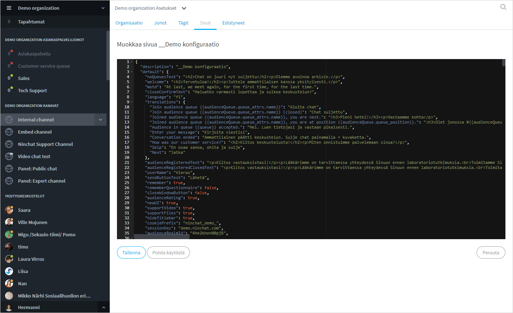
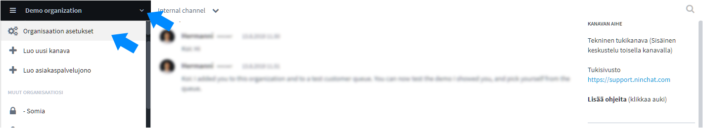
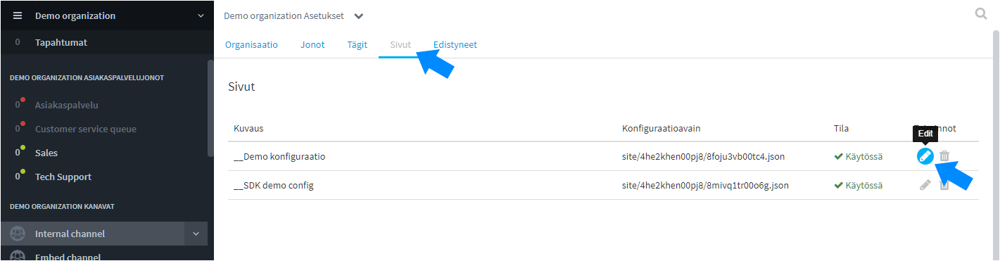
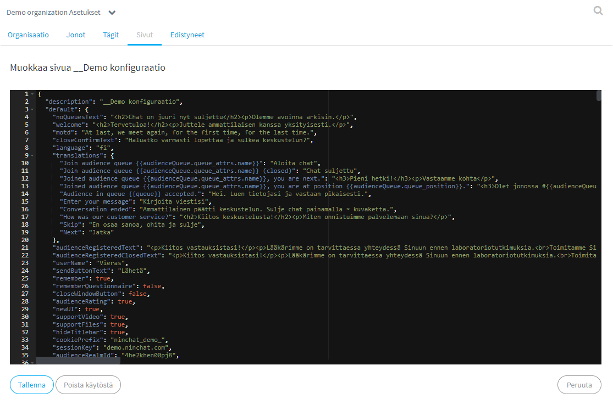
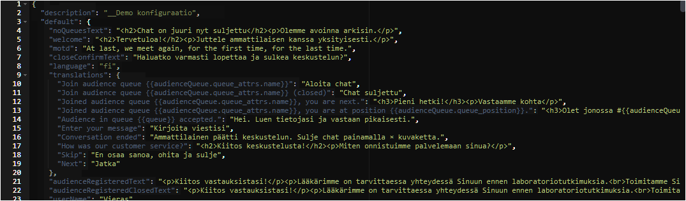

# Sivut-konfiguraatiot

## Yleistä <a href="yleista" id="yleista"></a>

Organisaatioasetusten _Sivut/Sites_-välilehdellä määritellään asiakaspalvelu-chattien ja julkisten ryhmäkeskustelujen asetukset, tekstit ja käännökset sekä tyylit.\
Pääset konfiguraatioihin menemällä organisaatioasetuksiin ja valitsemalla Sivut-välilehden.


Sites-konfiguraatiot ovat edistyneen käyttäjän ominaisuus. Pyydä Ninchatin henkilöstöä tekemään muutokset, tai kysy apua, mikäli koet sen hankalaksi.




## Chatin tekstien muokkaaminen

### Sivu-konfiguraatioiden avaaminen

#### Siirry organisaatioasetuksiin



#### Avaa Sivut/Sites-välilehti

Avaa konfiguraatio editoitavaksi klikkaamalla kynä-ikonia oikeassa laidassa.



### Sivu-editori

Konfiguraatioeditorissa näet tekstit ja käännökset (sekä chatin muita asetuksia). Vihreänä näkyviä selkokielisiä tekstejä voi muokata haluamakseen. Tekstin seassa saattaa näkyä HTML-elementtejä. Älä muokkaa sinisenä näkyviä avainsana-tekstejä vasemmalla.

Monikielisissä toteutuksissa eri kielille on omat osionsa ja käännöstekstinsä.



### Yleisimpiä muutettavia tekstejä <a href="yleisimpia-muutettavia-teksteja" id="yleisimpia-muutettavia-teksteja"></a>

Useimmin muutettuja kohtia ovat alkunäkymän tekstit: **"welcome" (online)** sekä **"noQueuesText" (offline)**. Alla on lueteltu muita muutettavia tekstejä.



| **Elementti**             | **Kuvaus**                                                                                                     |
| ------------------------- | -------------------------------------------------------------------------------------------------------------- |
| welcome                   | Chatin alkunäkymän yläosan sisältö                                                                             |
| motd                      | Chatin alkunäkymän alaosan sisältö                                                                             |
| noQueuesText              | <p>Näytettävä sisältö chatin ollessa suljettuna.</p><p>(Mikäli käytössä ei ole yhteydenottolomaketta, tms)</p> |
| inQueueText               | Jonotusnäkymän opasteteksti                                                                                    |
| userName                  | Asiakkaan vakionimi keskutelussa                                                                               |
| translations              | Sisältää yleiset tekstimääritykset eli käännökset käytetylle kielelle                                          |
| preAudienceQuestionnaire  | Chatin alkukysely (tai offline-yhteydenottolomake)                                                             |
| postAudienceQuestionnaire | Chatin loppukysely                                                                                             |
| window - titlebar - title | Chat-ikkunan otsikko                                                                                           |

#### Yleisiä käytettyjä HTML-elementtejä <a href="yleisia-kaytettyja-html-elementteja" id="yleisia-kaytettyja-html-elementteja"></a>

| **HTML-tagi**                                                                   | **Kuvaus**                                                                                         |
| ------------------------------------------------------------------------------- | -------------------------------------------------------------------------------------------------- |
| \<br>                                                                           | Rivinvaihto                                                                                        |
| \<p>tekstiä\</p>                                                                | Kappale                                                                                            |
| \<h2>Otsikko\</h2>                                                              | Otsikko ( h1, h2, h3, h4 )                                                                         |
|  \<a href="https://osoite.fi" target="\_blank" title="kuvaus">Linkkiteksti\</a> | Hyperlinkki. Linkille annetaan osoite, kohde (target), title-kuvausteksti sekä näkyvä linkkiteksti |

Esimerkki: Kappale jossa tekstiä, rivinvaihto ja linkki

```markup
<p>Täältä löydät ohjeet:<br><a href="https://osoite.com" target="_blank" title="Linkki ohjeisiin">Ohjeisivusto</a></p>
```

#### &#x20;Tallentaminen


Editoituasi tekstejä muista tallentaa muutokset.&#x20;


Tallentamisen yhteydessä editori tarkistaa, onko konfiguraation rakenne oikeellinen. Mikäli olet vahingossa tehnyt virheitä, muutoksia ei anneta tallentaa.

Tallennettuasi voi poistua organisaatiosetuksista.

## Chatin ottaminen pois käytöstä <a href="chatin-ottaminen-pois-kaeytosta" id="chatin-ottaminen-pois-kaeytosta"></a>

Asiakaspalvelu-chatin voi nopeasti poistaa kokonaan käytöstä disabloimalla site-konfiguraatio. Klikkaa editorinäkymässä _Poista käytöstä/Disable_-nappia. Konfiguraatio näkyy tämän jälkeen listalla disabloituna.\
Voit palauttaa chatin taas käyttöön klikkaamalla editorissa "Enable"-nappia.


Älä poista konfiguraatiota käytöstä ellet varmasti tiedä, mitä teet.

