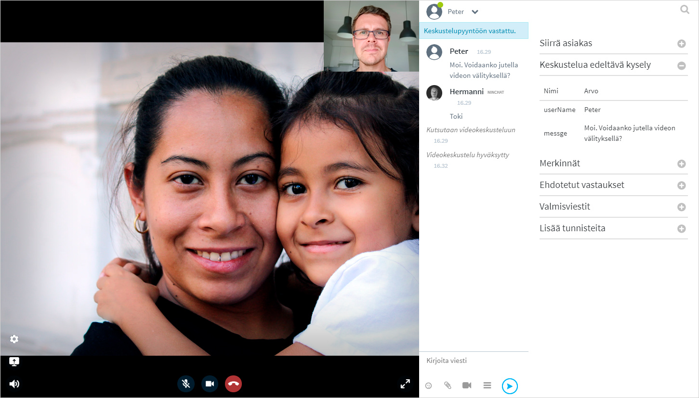
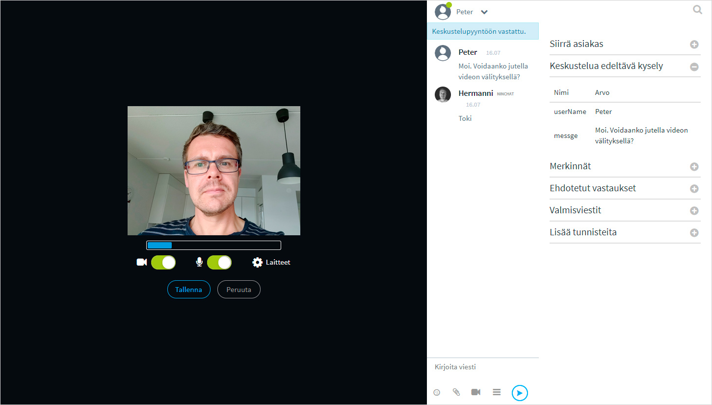

# Videopuhelut


Videopuhelutoiminto on päivitetty uuteen versioon 15.9.2020. Päivitys näkyy mm. ulkoasun muutoksena. Katso muutokset alta.


## Yleistä 

Asiakaskeskusteluissa on mahdollista hyödyntää videopuhelua tilanteissa, joissa tekstin ja kuvaliitteiden lähettäminen ei riitä. Videopuhelun aloittaminen voidaan sallia joko agentille, asiakkaalle, tai molemmille.

Ennen kuin alat järjestää videopuheluita, testaa toimivuus ja yhteensopivuus Ninchatin Videotestityökalulla, joka kertoo, onko laitteisto, selain ja verkkoyhteys kunnossa videopuheluita varten.   
  
[Avaa Videotestityökalu](https://ninchat.com/videotest)

## Videopuhelunäkymä 

Videopuhelu näkyy tekstikeskustelun yläpuolella. Sekä agentti että asiakas voi halutessaan laajentaa videon koko ruudun kokoiseksi, jolloin tekstikeskustelu näkyy videon oikealla puolella. \(Anna selaimelle lupa näyttää Ninchatin video koko ruudussa.\)

## Videopuhelun ottaminen

Aloitus lyhyesti, lue tarkemmat ohjeet alta.

1. Klikkaa videokamera-kuvaketta kirjoituskentän vieressä
2. Tarkista käytettävien laitteiden toiminta ja klikkaa _Tallenna_-painiketta.
3. Odota, että asiakas hyväksyy videopuhelukutsun ja tallentaa omat laiteasetuksensa.
4. Videopuhelu alkaa.

### Videopuhelun aloitus

Videopuhelun voi käynnistää kun tekstimuotoinen asiakas-keskustelu on aloitettu. Kutsuaksesi keskustelukumppanin videopuheluun, klikkaa videokamera-kuvaketta kommenttikentässä.

### Medialaitteiden käyttölupa

Jos selain pyytää lupaa käyttää kameraa ja/tai mikrofonia, hyväksy pyyntö.

### Videopuhelun asetukset ja laitevalinta

Videopuhelun aluksi näytetään aina agentin oma videokuva ja äänitaso. Agentti voi myös ruudun valinnoilla piilottaa oman videokuvansa tai mykistää mikrofonin. Tarkista että sekä videokuva että ääni toimii ja klikkaa _Tallenna_. 


Aloittaaksesi videopuhelu, klikkaa asetusruudussa _Tallenna_. Kutsu videopuheluun lähtee tällöin vastapuolelle. 


Mikäli haluat vaihtaa käytettäviä laitteita, klikkaa linkkiä: "Laitteet"

Laiteasetuksissa voit määrittää käytettävän kameran, mikrofonin ja äänentoistolaitteen. Sulje laitevalinta tämän jälkeen napista. Aloita videopuhelu klikkaamalla asetussivulla _Tallenna_-nappia

### Videopuhelu

Kun kutsut vastapuolen videopuheluun, ruutu näkyy ensin mustana. Teksti-chatissa näkyy ilmoitus "Kutsutaan videopuheluun". Odota kunnes vastapuoli on hyväksynyt kutsun ja tallentanut omat videoasetuksensa.

Mikäli vastapuoli hylkää kutsun, videopuheluikkuna sulkeutuu.

Videopuhelua ei voi aloittaa, mikäli asiakkaan laitteisto, selain tai verkkoyhteys ei tue videopuhelua. Yhteensopivuutta voi kokeilla videotestityökalulla, ks. kohta _Ongelmatilanteet._

Kun vastapuoli on hyväksynyt kutsun, hänen kuvansa ilmestyy näkyviin.

Voit videopuhelun aikana tarvittaessa piilottaa oman videokuvasi tai mykistää mikrofonisi. Voit myös mykistää vastapuolen äänen. Katso kaikki toiminnot alta.

Tekstikeskustelu näkyy videopuhelun lomassa. Voit myös siirtyä koko näytön videopuheluun, katso ohje alempaa.

### Videotoiminnot

| Valinta | Toiminta |
| :--- | :--- |
|   | Näytä videokeskustelu koko ruudun kokoisena / pienennä kuva normaaliin ikkunaan. |
|   | Äänet päälle / pois - mykistää keskustelukumppanin äänet |
|   | Mikrofoni päälle / pois - mykistää oman mikrofonisi, jolloin vastapuoli ei kuule sinua. |
|   | Video päälle / pois - Piilottaa oman videokuvasi, jolloin vastapuoli ei näe sinua. |
|   | Ruudunjako päälle / pois - Kameran sijaan jaa näytön, ohjelmaikkunan tai -välilehden sisältö |
|   | Avaa video- ja äänilaiteasetukset |
|   | Lopeta videopuhelu. \(Ei lopeta chat-keskustelua\) |

### Koko ruudun video

Videopuhelu näkyy vakiona vasemmassa laidassa teksti-chatin vieressa. Voit laajentaa video koko näytön kokoiseksi klikkaamalla  -laajennuskuvaketta.

Pienennä videopuhelunäkymä klikkaamalla  -pienennyskuvaketta.

### Videopuhelun lopettaminen

Lopeta videokeskustelu klikkaamalla  punaista puhelin-kuvaketta. Tämä ei päätä chat-istuntoa, vaan ainoastaan videopuhelun. 

### Videoasetusten muuttaminen puhelun aikana

Videopuhelun asetuksia voi jälkikäteen muuttaa asetuksista. Pääset asetuksiin klikkaamalla ratas-kuvaketta.

## Ruudunjako

Kamerakuvan lisäksi on mahdollista jakaa myös oman ruudun näkymä vastapuolelle, tai pyytää asiakasta jakamaan oma ruutunsa sinulle. Ruudunjako voi olla apuna, kun asiakkaalle pitää näyttää miten web-sovellus toimii, tai neuvoessa tätä esim. lomakkeen täyttämisessä.

### Ruudunjaon valinta

Ruudunjako voidaan valita sen jälkeen kun olette aloittaneet videopuhelun. 

1. Klikkaa ruudunjako-kuvaketta 
2. Valitse haluamasi välilehti: Koko näyttö / Ohjelma-ikkuna / Selain-välilehti \(Koko näyttö on helpoin vaihtoehto, jos olet epävarma\)
3. Klikkaa välilehden alta näkymä jonka haluat jakaa.
4. Tämän jälkeen "Jaa/Share" -nappi aktivoituu, klikkaa sitä
5. Ruudunjako alkaa
6. Lopeta ruuudunjako ja palaa videokameran kuvaan klikkaamallaruudunjako-kuvaketta uudestaan.

Riippuu selaimesta, voitko jakaa koko ruudun, yksittäisen sovelluksen, kuten web-selaimen tai tietyn selaimen välilehden.

## Asiakkaan videopuhelunäkymät 

Oheisesta kuvasta näet, miltä videopuhelu näyttää asiakkaan näkymässä.

## Videopuhelutuki eri selaimilla ja alustoilla

<table>
  <thead>
    <tr>
      <th style="text-align:left">Alusta/k&#xE4;ytt&#xF6;j&#xE4;rjestelm&#xE4;</th>
      <th style="text-align:left">Tuetut selaimet</th>
    </tr>
  </thead>
  <tbody>
    <tr>
      <td style="text-align:left">Windows</td>
      <td style="text-align:left">Google Chrome
         Mozilla Firefox
         Microsoft Edge (2020 Chromium-versio)</td>
    </tr>
    <tr>
      <td style="text-align:left">
        
Mac OS

        
(Apple-tietokoneet)

      </td>
      <td style="text-align:left">Google Chrome
         Mozilla Firefox
         Apple Safari</td>
    </tr>
    <tr>
      <td style="text-align:left">Android</td>
      <td style="text-align:left">Google Chrome
         Mozilla Firefox
         Microsoft Edge</td>
    </tr>
    <tr>
      <td style="text-align:left">iOS (iPhone &amp; iPad)</td>
      <td style="text-align:left">Apple Safari</td>
    </tr>
  </tbody>
</table>

## Ongelmatilanteet

### Videopuhelutesti

Ennen kuin aloitat videopuheluiden pitämisen, kokeile videotestityökalullamme, onko laitteistosi ja verkkoyhteytesi sopiva videopuhelujen käymiseen. Testi kertoo, mikäli jokin osa-alue ei ole kunnossa.

#### [**Ninchat videopuhelu-testityökalu**](https://ninchat.com/videotest)\*\*\*\*

### **Ohjeita ongelmatilanteisiin**


Internet Explorer -selain ei tue videopuheluita. Käytä Chromea tai Firefoxia.


#### **En näe videopuhelun käynnistyskuvaketta \(kamera-ikoni\).**

> Yleensä syynä on Internet Explorer -selaimen \(IE\) käyttö. Varmista, että käytät Google Chrome- tai Mozilla Firefox-selainta. IE ei tue videopuheluita.   
> Huom! Jos avaat Ninchat-linkin esim. sähköpostista, se voi avautua vakiona IE-selaimeen. Kopioi linkki ja liitä se Chrome-selaimeen.

> Videopuhelu on käynnistettävissä vain kahdenvälisissä keskusteluissa, eli videokamera-ikoni ei näy ryhmäkeskusteluissa.
>
> Lisäksi on varmistettava, että asiakasjonossasi on asetettu videopuhelut käyttöön.

#### **"Videoyhteys käynnistyy, katkeaa heti perään, eikä käynnisty uudestaan. Yhteys katkesi ilman virheilmoituksia.**  **Chat-viestit asiakas kutienkin edelleen näkee. Olen tehnyt aiemmin onnistuneita videovastaanottoja."**

> Videoyhteys muodostuu suoraan agentin ja asiakkaan välille, eli jos yhteys katkeaa voi ongelma olla jomman kumman pään verkon kuormittuneisuudessa.   
> Tilannetta voi parantaa seuraavasti kotona: a\) yhdistä kannettava tietokone verkkopiuhalla wifi-reitittimeen tai b\) jos yhteys muodostuu kännykän hotspotin kautta niin aseta kännykkä ikkunan lähelle tai c\) ole samassa huoneessa wifi-reitittimen kanssa.

> Lisäksi mobiilisovellus voi mennä "nukkumaan" jolloin yhteys katkeaa.

> Jostain syystä asiakkaan video ei pääse "läpi". Yleensä tällaista ongelmaa ei ole mobiiliverkossa, ellei asiakkaan laitteessa ole jotain tietoturvasovelluksia tai muita jotka estävät yhteyden. Mikäli asiakas käyttää esim. työpaikan langatonta nettiä, jossa on jokin tiukka palomuuri, voi tällainen ongelma syntyä.
>
> Jos videon kanssa on ongelmia, kannattaa agentin ladata oma web-selain-ikkuna uusiksi \(päivitä/refresh/F5/ympyränuoli selaimen osoiterivillä\).
>
> Jossain tilanteissa myös palomuuri tai viruksentorjunta-ohjelma voi estää kameran käytön.

####  "**Camera or microphone use prevented: Although permission for device is granted, an error occured at the system, browser or web page which prevented access to the device."**

> Virheilmoitus johtuu yleensä siitä, että jokin toinen ohjelma \(kuten Skype\) varaa kameran tai mikrofonin. Voit kokeilla sulkea muut ohjelmat ja käynnistää sen jälkeen selaimen uudelleen.  
> Myös jokin tietoturvaohjelma saattaa estää kameran tai mikrofonin käytön.
>
> Lisäksi kannattaa kokeilla mennä videopuhelun aikana videoasetuksiinja tarkistaa mitä kameraa tai mikrofonia yritetään käyttää.
>
> Jotkin USB-laitteet kuten Jabra saattavat vaatia USB-portin vaihdon.

#### **"Lupaa kameran tai mikrofonin käyttöön ei saatu: Olet mahdollisesti estänyt selaimelta kameran tai mikrofonin käytön, tai laitteessasi on estetty kameran tai mikrofonin käyttö yleisesti."** 

> Selaimelle tulee antaa lupa kameran ja mikrofonin käyttöön. Ensimmäisellä kerralla selain kysyy automaattisesti luvan sallimisesta. Myöhemmin luvan voi antaa osoiterivin lukko-kuvaketta klikkaamalla.

#### **"Yritän käynnistää videoyhteyden mutta kumpikaan osapuoli ei näe videokuvaa eikä tule ääniyhteyttäkään. Webkamerani toimii koska näyttää oman kuvani. Pääsemme kohtaan 'Kutsutaan videokeskusteluun. Videokeskustelu hyväksytty' mutta sitten ei vain tule yhteyttä."**

> Tämän kaltaiseen ongelmaan tavallinen syy on, että jommassa kummassa \(tai kummassakin\) päässä palomuuri tai jokin muu tietoturvaohjelma estää videoyhteyden. Jos olet aiemmin saanut onnistuneesti videoyhteyden samalla koneella, on ongelma todennäköisemmin asiakkaan yhteydessä.

**Virheilmoitus: Videokeskustelu hylätty. Puutteellinen selaintuki.**

Tarkoittaa yleensä että asiakas on iOS-laitteella \(iPhone/iPad\) ja käyttää Chrome- tai Firefox-selainta. Applen rajoituksesta johtuen videopuhelut ei toimi iOSilla muilla selaimilla kuin Safari \(sekä natiiveissa aplikaatioissa\). Tietokoneella, myös Mac, video toimii muillakin selaimilla. 

Tai mahdollisesti asiakas Windows-laittella Internet Explorer \(IE\) -selain. 

Ks. kohta _Videopuhelutuki eri selaimilla ja alustoilla._

#### **Ääni kiertää tai kaikuu.** 

> Chrome-selaimessa on paras kaiunpoisto, joten käytä mieluusti sitä. 
>
> Käytä mieluusti kuulokemikrofonia. Ääni voi kiertää, jos kummallakaan osapuolella ei ole kuulokkeita käytössä.

> Voit yrittää vähentää oman mikrofonin volyymiä \(jos olet kuulokkeissa itse\) tai asiakasta voi pyytää laskemaan omaa volyymiä \(jos asiakkaan päässä kiertää, eikä asiakkaalla ole kuulokkeita\).
>
> Tietyt kuulokemikrofonit voivat silti aiheuttaa äänen kiertämistä, esimerkiksi joissain Bluetooth-kuulokemikrofoneissa oma ääni kuuluu kuulokkeista kun valitsee saman laitteen mikrofoniksi ja kaiuttimiksi, tässä tilanteessa voi kokeilla vaihtaa mikrofoniksi oman kannettavan tietokoneen mikrofonin.
>
> Joskus selaimen uudelleenkäynnistys voi auttaa.

#### Virheilmoitus: "Videokeskustelu hylätty. Vastaanottaja on varattu" videopuhelun aloituksessa. 

> Virheilmoitus näytetään jos asiakkaalla on jo videokeskustelu päällä, tai tällä on aikaisempi videopuhelukutsu auki, jota ei ole hyväksytty. Pyydä asiakas sulkemaan videopuhelunäkymä, jotta voit kutsua hänet uudestaan.

#### **Videopuhelu katkeaa ja sulkeutuu** 

> Videopuhelu voi katketa, mikäli verkkoyhteyden laatu on huono tai yhteys katkeaa. Videopuhelun voi tällöin käynnistää uudelleen klikkaamalla uudelleen kamera-kuvaketta. Voit ohjeistaa asiakasta tilanteesta ja pyytää hyväksymään uusi videopuhelukutsu.
>
> Mikäli videopuhelun kanssa on esiintynyt ongelmia, voit varoiksi päivittää sivun ennen kuin otat uutta videopuhelua.

