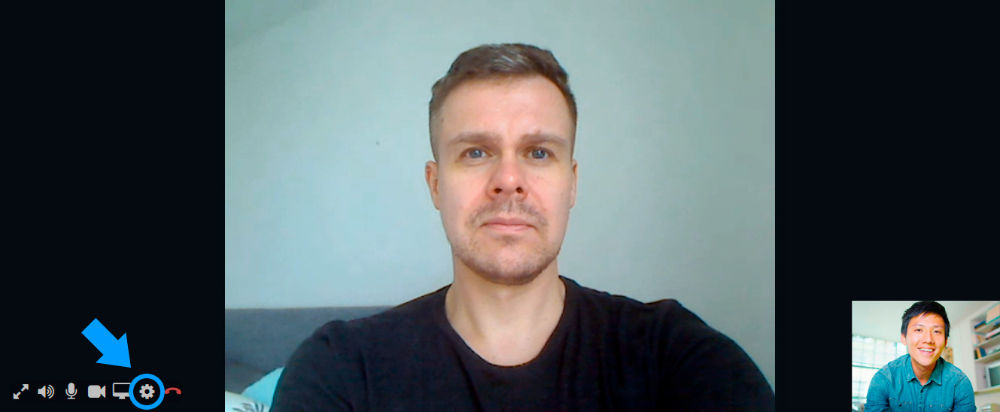

# Videopuhelut

## Yleistä 

Ennen kuin alat järjestää videopuheluita, testaa toimivuus ja yhteensopivuus Ninchatin Videotestityökalulla, joka kertoo, onko laitteisto, selain ja verkkoyhteys kuunnossa videopuheluita varten. [Avaa Videotestityökalu](https://ninchat.com/videotest)

Asiakaskeskusteluissa on mahdollista hyödyntää videopuhelua tilanteissa, joissa tekstin ja kuvaliitteiden lähettäminen ei riitä. Kysy lisää ominaisuudesta.

## Videopuhelunäkymä 

Videopuhelu näkyy tekstikeskustelun yläpuolella. Sekä agentti että asiakas voi halutessaan laajentaa videon koko ruudun kokoiseksi, jolloin tekstikeskustelu näkyy videon oikealla puolella. \(Anna selaimelle lupa näyttää Ninchatin video koko ruudussa.\)

### Videotoiminnot

| Valinta | Toiminta |
| :--- | :--- |
|   | Näytä videokeskustelu koko ruudun kokoisena / pienennä kuva normaaliin ikkunaan. |
|   | Äänet päällä / pois - mykistää keskustelukumppanin äänet |
|   | Mikrofoni päällä / pois - mykistää oman mikrofonisi, jolloin vastapuoli ei kuule sinua. |
|   | Video päällä / pois - Piilottaa oman videokuvasi, jolloin vastapuoli ei näe sinua. |
|   | Ruudunjako päälle / pois - Kameran sijaan jaa näytön, ohjelmaikkunan tai -välilehden sisältö |
|   | Avaa video- ja äänilaiteasetukset |
|   | Lopeta videopuhelu. \(Ei lopeta chat-keskustelua\) |

## Videopuhelun ottaminen

Videopuhelun aloittaminen voidaan sallia joko agentille, asiakkaalle, tai molemmille.

### Videopuhelun aloitus

Videopuhelun voi käynnistää sen jälkeen kun asiakas-keskustelu on aloitettu.

1. Klikkaa videokamera-kuvaketta kommenttikentässä.
2. Jos selain kysyy aloittaessa lupaa käyttää kameraa ja mikrofonia, hyväksy pyyntö.
3. Valitse ensimmäisellä kerralla halutut asetukset.
4. Videopuhelu alkaa, kun asiakas hyväksyy videpuhelupyynnön.

Videopuhelua ei voi aloittaa, mikäli asiakkaan laitteisto, selain tai verkkoyhteys ei tue videopuhelua Yhteensopivuutta voi kokeilla videotestityökalulla, ks. kohta _Ongelmatilanteet._

### Videopuhelun asetukset ensimmäisellä kerralla

Kun käynnistät videopuhelun ensimmäistä kertaa, Ninchat pyytää automaattisesti valitsemaan halutun kameran, mikrofonin ja äänentoistolaitteen. Jatkossa valinta muistetaan.

Asetussivulla valitaan videokamera, mikrofoni ja äänentoistolaite. Näet esikatselukuvan valitusta videolähteestä sekä mikrofonin äänenvoimakkuuden visualisoituna kuvan alla palkissa.

### Asetusten muuttaminen jälkikäteen

Videopuhelun asetuksia voi jälkikäteen muuttaa ratas-ikonin kautta videon ollessa päällä.

## Ruudunjako

Kamerakuvan lisäksi on mahdollista jakaa myös oman ruudun näkymä vastapuolelle. Ruudunjako voi olla apuna, kun asiakkaalle pitää näyttää miten web-sovellus toimii, tai neuvoessa tätä esim. lomakkeen täyttämisessä.

### Ruudunjaon valinta

Ruudunjako voidaan valita sen jälkeen kun olette aloittaneet videopuhelun. Klikkkaa videopuhelun aikana ruudunjako-kuvaketta ja valitse, mitä haluat näytöltäsi jakaa. 

Selaimesta riippuen voit joko jakaa koko ruudun, yksittäisen sovelluksen, kuten web-selaimen tai tietyn selaimen välilehden.

## Videotuki eri selaimilla ja alustoilla

<table>
  <thead>
    <tr>
      <th style="text-align:left">Alusta/k&#xE4;ytt&#xF6;j&#xE4;rjestelm&#xE4;</th>
      <th style="text-align:left">Tuetut selaimet</th>
    </tr>
  </thead>
  <tbody>
    <tr>
      <td style="text-align:left">
        
Windows

        

      </td>
      <td style="text-align:left">Google Chrome, Mozilla Firefox, Microsoft Edge (2020 Chromium-pohjainen
        versio)</td>
    </tr>
    <tr>
      <td style="text-align:left">Mac OS</td>
      <td style="text-align:left">Google Chrome, Mozilla Firefox, Apple Safari</td>
    </tr>
    <tr>
      <td style="text-align:left">Android</td>
      <td style="text-align:left">Google Chrome, Mozilla Firefox, Microsoft Edge</td>
    </tr>
    <tr>
      <td style="text-align:left">iOS</td>
      <td style="text-align:left">Apple Safari</td>
    </tr>
  </tbody>
</table>## Ongelmatilanteet

### Testaa toiminta: [**Videopuhelutesti**](https://ninchat.com/videotest)\*\*\*\*

Voit kokeilla videotestityökalullamme, onko laitteistosi ja verkkoyhteytesi sopiva videopuhelujen käymiseen. Testi kertoo, mikäli jokin osa-alue ei ole kunnossa.

\*\*\*\*[**Ninchat - Videopuhelu-testityökalu**](https://ninchat.com/videotest)\*\*\*\*

### **Ohjeita ongelmatilanteisiin**

**En näe videopuhelun käynnistyskuvaketta \(kamera-ikoni\).**  
  
Varmista, että käytät Google Chrome- tai Mozilla Firefox-selainta. Internet Explorer ei tue videopuheluita. Videopuhelu on käynnistettävissä vain kahdenvälisissä keskusteluissa.

**"Yritän käynnistää videoyhteyden mutta kumpikaan osapuoli ei näe videokuvaa eikä tule ääniyhteyttäkään. Webkamerani toimii koska näyttää oman kuvani. Pääsemme kohtaan 'Kutsutaan videokeskusteluun. Videokeskustelu hyväksytty' mutta sitten ei vain tule yhteyttä."**  
  
Tämän kaltaiseen ongelmaan tavallinen syy on, että jommassa kummassa \(tai kummassakin\) päässä palomuuri tai jokin muu tietoturvaohjelma estää videoyhteyden. Jos olet aiemmin saanut onnistuneesti videoyhteyden samalla koneella, on ongelma todennäköisemmin asiakkaan yhteydessä. 

**"Videoyhteys käynnistyy, katkeaa heti perään, eikä käynnisty uudestaan. Yhteys katkesi ilman virheilmoituksia. Olen tehnyt aiemmin onnistuneita videovastaanottoja."**

Jostain syystä asiakkaan video ei pääse "läpi". Yleensä tällaista ongelmaa ei ole mobiiliverkossa, ellei asiakkaan laitteessa ole jotain tietoturvasovelluksia tai muita jotka estävät yhteyden. Mikäli asiakas käyttää esim. työpaikan langatonta nettiä, jossa on jokin tiukka palomuuri, voi tällainen ongelma syntyä.  
Jos videon kanssa on säätöä kannattaa agentin ladata selainikkuna-uusiksi \(kaiken varalta\).  
Jossain tilanteissa myös palomuuri tai anti-virusohjelma voi estää kameran käytön.

**Ääni kiertää tai kaikuu pahasti.**  
  
Käytä mieluusti kuulokemikrofonia. Käytä lisäksi Chrome-selainta, jossa on paras kaiunpoisto. Voit yrittää vähentää oman mikrofonin volyymiä \(jos olet kuulokkeissa itse\) tai asiakasta voi pyytää laskemaan omaa volyymiä \(jos asiakkaan päässä kiertää eikä asiakkaalla ole kuulokkeita\).  
Ääni voi kiertää, jos kummallakaan osapuolella ei ole kuulokkeita käytössä.  
Jotkut kuulokemikrofonit voivat aiheuttaa äänen kiertämistä. Esim. joissain Bluetooth-kuulokemikrofoneissa oma ääni kuuluu kuulokkeista kun valitsee saman laitteen mikrofoniksi. Joskus selaimen uudelleenkäynnistys voi auttaa.

