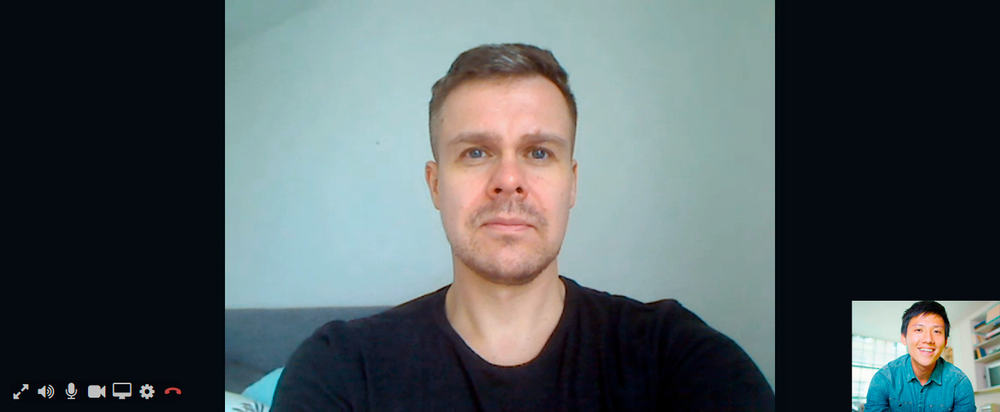
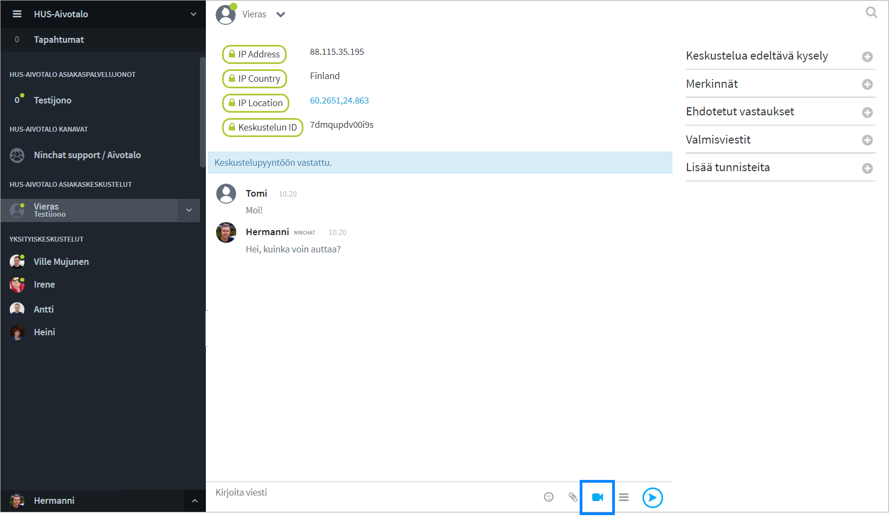

# Videopuhelut

## Yleistä 

Asiakaskeskusteluissa on mahdollista hyödyntää videopuhelua tilanteissa, joissa tekstin ja kuvaliitteiden lähettäminen ei riitä. Kysy lisää ominaisuudesta.

Ennen kuin alat järjestää videopuheluita, testaa toimivuus ja yhteensopivuus Ninchatin Videotestityökalulla, joka kertoo, onko laitteisto, selain ja verkkoyhteys kuunnossa videopuheluita varten. [Avaa Videotestityökalu](https://ninchat.com/videotest)

## Videopuhelunäkymä 

Videopuhelu näkyy tekstikeskustelun yläpuolella. Sekä agentti että asiakas voi halutessaan laajentaa videon koko ruudun kokoiseksi, jolloin tekstikeskustelu näkyy videon oikealla puolella. \(Anna selaimelle lupa näyttää Ninchatin video koko ruudussa.\)

### Videotoiminnot

| Valinta | Toiminta |
| :--- | :--- |
|   | Näytä videokeskustelu koko ruudun kokoisena / pienennä kuva normaaliin ikkunaan. |
|   | Äänet päällä / pois - mykistää keskustelukumppanin äänet |
|   | Mikrofoni päällä / pois - mykistää oman mikrofonisi, jolloin vastapuoli ei kuule sinua. |
|   | Video päällä / pois - Piilottaa oman videokuvasi, jolloin vastapuoli ei näe sinua. |
|   | Ruudunjako päälle / pois - Kameran sijaan jaa näytön, ohjelmaikkunan tai -välilehden sisältö |
|   | Avaa video- ja äänilaiteasetukset |
|   | Lopeta videopuhelu. \(Ei lopeta chat-keskustelua\) |

## Videopuhelun ottaminen

Videopuhelun aloittaminen voidaan sallia joko agentille, asiakkaalle, tai molemmille.  
Varmista, että asiakasjonoosi on kytketty videopuhelu-ominaisuus käyttöön.

### Videopuhelun aloitus

Videopuhelun voi käynnistää sen jälkeen kun tekstimuotoinen asiakas-keskustelu on aloitettu.

1. Klikkaa videokamera-kuvaketta kommenttikentässä.
2. Jos selain kysyy aloittaessa lupaa käyttää kameraa ja mikrofonia, hyväksy pyyntö.
3. Valitse ensimmäisellä kerralla halutut asetukset.
4. Videopuhelu alkaa, kun asiakas hyväksyy videpuhelupyynnön.

Videopuhelua ei voi aloittaa, mikäli asiakkaan laitteisto, selain tai verkkoyhteys ei tue videopuhelua Yhteensopivuutta voi kokeilla videotestityökalulla, ks. kohta _Ongelmatilanteet._

### Videopuhelun asetukset ensimmäisellä kerralla

Jos selain pyytää lupaa käyttää kameraa ja/tai mikrofonia, hyväksy pyyntö.

Kun käynnistät videopuhelun ensimmäistä kertaa, Ninchat pyytää automaattisesti valitsemaan halutun kameran, mikrofonin ja äänentoistolaitteen. Jatkossa valinta muistetaan.

Asetussivulla valitaan videokamera, mikrofoni ja äänentoistolaite. Näet esikatselukuvan valitusta videolähteestä sekä mikrofonin äänenvoimakkuuden visualisoituna kuvan alla palkissa.

### Asetusten muuttaminen jälkikäteen

Videopuhelun asetuksia voi jälkikäteen muuttaa ratas-ikonin kautta videon ollessa päällä.

## Ruudunjako

Kamerakuvan lisäksi on mahdollista jakaa myös oman ruudun näkymä vastapuolelle. Ruudunjako voi olla apuna, kun asiakkaalle pitää näyttää miten web-sovellus toimii, tai neuvoessa tätä esim. lomakkeen täyttämisessä.

### Ruudunjaon valinta

Ruudunjako voidaan valita sen jälkeen kun olette aloittaneet videopuhelun. 

1. Klikkaa ruudunjako-kuvaketta  
2. Valitse haluamasi välilehti: Koko näyttö / Ohjelma-ikkuna / Selain-välilehti \(Koko näyttö on helpoin vaihtoehto, jos olet epävarma\)
3. Klikkaa välilehden alta näkymä jonka haluat jakaa.
4. Tämän jälkeen "Jaa/Share" -nappi aktivoituu, klikkaa sitä
5. Ruudunjako alkaa
6. Lopeta ruuudunjako ja palaa videokameran kuvaan klikkaamalla ruudunjako-kuvaketta uudestaan.

Riippuu selaimesta, voitko jakaa koko ruudun, yksittäisen sovelluksen, kuten web-selaimen tai tietyn selaimen välilehden.

## Videopuhelutuki eri selaimilla ja alustoilla

<table>
  <thead>
    <tr>
      <th style="text-align:left">Alusta/k&#xE4;ytt&#xF6;j&#xE4;rjestelm&#xE4;</th>
      <th style="text-align:left">Tuetut selaimet</th>
    </tr>
  </thead>
  <tbody>
    <tr>
      <td style="text-align:left">Windows</td>
      <td style="text-align:left">Google Chrome
         Mozilla Firefox
         Microsoft Edge (2020 Chromium-pohjainen versio)</td>
    </tr>
    <tr>
      <td style="text-align:left">
        
Mac OS

        
(Apple-tietokoneet)

      </td>
      <td style="text-align:left">Google Chrome
         Mozilla Firefox
         Apple Safari</td>
    </tr>
    <tr>
      <td style="text-align:left">Android</td>
      <td style="text-align:left">Google Chrome
         Mozilla Firefox
         Microsoft Edge</td>
    </tr>
    <tr>
      <td style="text-align:left">iOS (iPhone &amp; iPad)</td>
      <td style="text-align:left">Apple Safari</td>
    </tr>
  </tbody>
</table>## Ongelmatilanteet

### Videopuhelutesti

Ennen kuin aloitat videopuheluiden pitämisen, kokeile videotestityökalullamme, onko laitteistosi ja verkkoyhteytesi sopiva videopuhelujen käymiseen. Testi kertoo, mikäli jokin osa-alue ei ole kunnossa.

#### [**Ninchat videopuhelu-testityökalu**](https://ninchat.com/videotest)\*\*\*\*

### **Ohjeita ongelmatilanteisiin**


Internet Explorer -selain ei tue videopuheluita. Käytä Chromea tai Firefoxia.


#### **En näe videopuhelun käynnistyskuvaketta \(kamera-ikoni\).**

> Yleensä syynä on Internet Explorer -selaimen \(IE\) käyttö. Varmista, että käytät Google Chrome- tai Mozilla Firefox-selainta. IE ei tue videopuheluita.   
> Huom! Jos avaat Ninchat-linkin esim. sähköpostista, se voi avautua vakiona IE-selaimeen. Kopioi linkki ja liitä se Chrome-selaimeen.

> Videopuhelu on käynnistettävissä vain kahdenvälisissä keskusteluissa, eli videokamera-ikoni ei näy ryhmäkeskusteluissa.
>
> Lisäksi on varmistettava, että asiakasjonossasi on asetettu videopuhelut käyttöön.

#### **"Videoyhteys käynnistyy, katkeaa heti perään, eikä käynnisty uudestaan. Yhteys katkesi ilman virheilmoituksia.**  **Chat-viestit asiakas kutienkin edelleen näkee. Olen tehnyt aiemmin onnistuneita videovastaanottoja."**

> Videoyhteys muodostuu suoraan agentin ja asiakkaan välille, eli jos yhteys katkeaa voi ongelma olla jomman kumman pään verkon kuormittuneisuudessa.   
> Tilannetta voi parantaa seuraavasti kotona: a\) yhdistä kannettava tietokone verkkopiuhalla wifi-reitittimeen tai b\) jos yhteys muodostuu kännykän hotspotin kautta niin aseta kännykkä ikkunan lähelle tai c\) ole samassa huoneessa wifi-reitittimen kanssa.

> Lisäksi mobiilisovellus voi mennä "nukkumaan" jolloin yhteys katkeaa.

> Jostain syystä asiakkaan video ei pääse "läpi". Yleensä tällaista ongelmaa ei ole mobiiliverkossa, ellei asiakkaan laitteessa ole jotain tietoturvasovelluksia tai muita jotka estävät yhteyden. Mikäli asiakas käyttää esim. työpaikan langatonta nettiä, jossa on jokin tiukka palomuuri, voi tällainen ongelma syntyä.
>
> Jos videon kanssa on ongelmia, kannattaa agentin ladata oma web-selain-ikkuna uusiksi \(päivitä/refresh/F5/ympyränuoli selaimen osoiterivillä\).
>
> Jossain tilanteissa myös palomuuri tai viruksentorjunta-ohjelma voi estää kameran käytön.

####  "**Camera or microphone use prevented: Although permission for device is granted, an error occured at the system, browser or web page which prevented access to the device."**

> Virheilmoitus johtuu yleensä siitä, että jokin toinen ohjelma \(kuten Skype\) varaa kameran tai mikrofonin. Voit kokeilla sulkea muut ohjelmat ja käynnistää sen jälkeen selaimen uudelleen.  
> Myös jokin tietoturvaohjelma saattaa estää kameran tai mikrofonin käytön.
>
> Lisäksi kannattaa kokeilla mennä videopuhelun aikana videoasetuksiinja tarkistaa mitä kameraa tai mikrofonia yritetään käyttää.
>
> Jotkin USB-laitteet kuten Jabra saattavat vaatia USB-portin vaihdon.

#### **"Lupaa kameran tai mikrofonin käyttöön ei saatu: Olet mahdollisesti estänyt selaimelta kameran tai mikrofonin käytön, tai laitteessasi on estetty kameran tai mikrofonin käyttö yleisesti."** 

> Selaimelle tulee antaa lupa kameran ja mikrofonin käyttöön. Ensimmäisellä kerralla selain kysyy automaattisesti luvan sallimisesta. Myöhemmin luvan voi antaa osoiterivin lukko-kuvaketta klikkaamalla.

#### **"Yritän käynnistää videoyhteyden mutta kumpikaan osapuoli ei näe videokuvaa eikä tule ääniyhteyttäkään. Webkamerani toimii koska näyttää oman kuvani. Pääsemme kohtaan 'Kutsutaan videokeskusteluun. Videokeskustelu hyväksytty' mutta sitten ei vain tule yhteyttä."**

> Tämän kaltaiseen ongelmaan tavallinen syy on, että jommassa kummassa \(tai kummassakin\) päässä palomuuri tai jokin muu tietoturvaohjelma estää videoyhteyden. Jos olet aiemmin saanut onnistuneesti videoyhteyden samalla koneella, on ongelma todennäköisemmin asiakkaan yhteydessä.

#### **Ääni kiertää tai kaikuu.** 

> Chrome-selaimessa on paras kaiunpoisto, joten käytä mieluusti sitä. 
>
> Käytä mieluusti kuulokemikrofonia. Ääni voi kiertää, jos kummallakaan osapuolella ei ole kuulokkeita käytössä.

> Voit yrittää vähentää oman mikrofonin volyymiä \(jos olet kuulokkeissa itse\) tai asiakasta voi pyytää laskemaan omaa volyymiä \(jos asiakkaan päässä kiertää, eikä asiakkaalla ole kuulokkeita\).
>
> Tietyt kuulokemikrofonit voivat silti aiheuttaa äänen kiertämistä, esimerkiksi joissain Bluetooth-kuulokemikrofoneissa oma ääni kuuluu kuulokkeista kun valitsee saman laitteen mikrofoniksi ja kaiuttimiksi, tässä tilanteessa voi kokeilla vaihtaa mikrofoniksi oman kannettavan tietokoneen mikrofonin.
>
> Joskus selaimen uudelleenkäynnistys voi auttaa.

