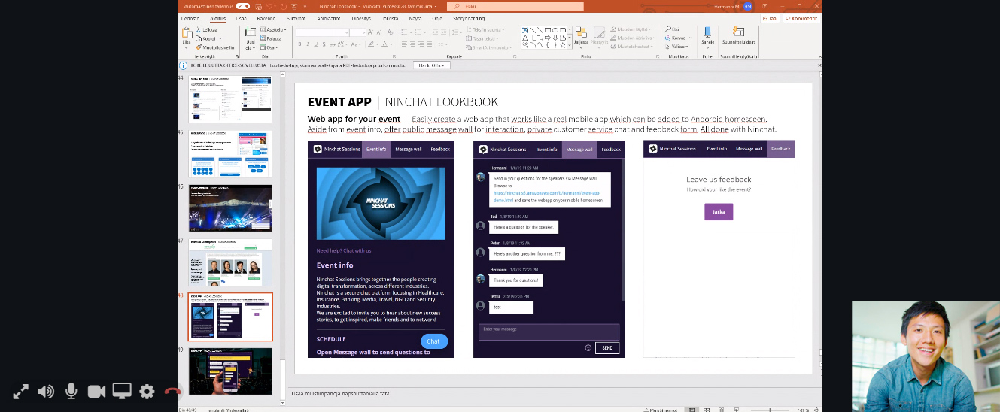

# Videopuhelut

## Yleistä 

Asiakaskeskusteluissa on mahdollista hyödyntää videopuhelua tilanteissa, joissa tekstin ja kuvaliitteiden lähettäminen ei riitä. Kysy lisää ominaisuudesta.

## Videpuhelunäkymä 

Videopuhelu näkyy tekstikeskustelun yläpuolella. Sekä agentti että asiakas voi halutessaan laajentaa videon koko ruudun kokoiseksi, jolloin tekstikeskustelu näkyy videon oikealla puolella. \(Anna selaimelle lupa näyttää Ninchatin video koko ruudussa.\)

### Videotoiminnot

| Valinta | Toiminta |
| :--- | :--- |
|   | Näytä videokeskustelu koko ruudun kokoisena / pienennä kuva normaaliin ikkunaan. |
|   | Äänet päällä / pois - mykistää keskustelukumppanin äänet |
|   | Mikrofoni päällä / pois - mykistää oman mikrofonisi, jolloin vastapuoli ei kuule sinua. |
|   | Video päällä / pois - Piilottaa oman videokuvasi, jolloin vastapuoli ei näe sinua. |
|   | Ruudunjako päälle / pois - Kameran sijaan jaa näytön, ohjelmaikkunan tai -välilehden sisältö |
|   | Avaa video- ja äänilaiteasetukset |
|   | Lopeta videopuhelu. \(Ei lopeta chat-keskustelua\) |

## Videopuhelun ottaminen

Jonon asetusten mukaan videopuhelun voi aloittaa agentti, asiakas, molemmat, tai ei kumpikaan.

### Videpuhelun aloitus

1. Aloittaaksesi videopuhelun, klikkaa kommenttikentän vieressä videokamera-kuvaketta.
2. Mikäli asiakkaan selain tukee videopuhelua, hänelle näytetään videopuhelupyyntö, jonka hän hyväksyy tai hylkää.

Mikäli asiakkaan laitteisto, selain tai verkkoyhteys ei tue videopuhelua, sitä ei voi aloittaa. Yhteensopivuutta voi kokeilla videotestityökalulla, ks. kohta _Ongelmatilanteet._

Kun selain kysyy aloittaessa lupaa käyttää kameraa ja mikrofonia, anna Ninchatille lupa siihen.

### Videoasetukset

Kun aloitat videopuhelun ensimmäistä kertaa, Ninchat pyytää automaattisesti valitsemaan halutun kameran, mikrofonin ja äänentoistolaitteen. Jatkossa valinta muistetaan.

Mikäli haluat myöhemmin vaihtaa laitteita, pääset asetuksiin klikkaamalla Asetukset-kuvaketta videopuhelun aikana.

Asetussivulla valitaan videokamera, mikrofoni ja äänentoistolaite. Näet esikatselukuvan valitusta videolähteestä sekä mikrofonin äänenvoimakkuuden visualisoituna kuvan alla palkissa.

### Ruudunjako

Kamerakuvan lisäksi on mahdollista jakaa myös oman ruudun näkymä vastapuolelle. Ruudunjako voi olla apuna, kun asiakkaalle pitää näyttää miten web-sovellus toimii, tai neuvoessa tätä esim. lomakkeen täyttämisessä.

Ruudunjako voidaan valita sen jälkeen kun olette aloittaneet videopuhelun. Klikkkaa videopuhelun aikana ruudunjako-kuvaketta ja valitse, mitä haluat näytöltäsi jakaa. Selaimesta riippuen voit joko jakaa koko ruudun, yksittäisen sovelluksen kuten web-selaimen näkymän.

## Videotuki eri selaimilla ja alustoilla

<table>
  <thead>
    <tr>
      <th style="text-align:left">Alusta/k&#xE4;ytt&#xF6;j&#xE4;rjestelm&#xE4;</th>
      <th style="text-align:left">Tuetut selaimet</th>
    </tr>
  </thead>
  <tbody>
    <tr>
      <td style="text-align:left">
        
Windows

        

      </td>
      <td style="text-align:left">Google Chrome, Mozilla Firefox
         (Microsoft Edgell&#xE4; toimintaa ei taata)</td>
    </tr>
    <tr>
      <td style="text-align:left">Mac OS</td>
      <td style="text-align:left">Google Chrome, Mozilla Firefox, Apple Safari</td>
    </tr>
    <tr>
      <td style="text-align:left">Android</td>
      <td style="text-align:left">Google Chrome, Mozilla Firefox</td>
    </tr>
    <tr>
      <td style="text-align:left">iOS</td>
      <td style="text-align:left">Apple Safari</td>
    </tr>
  </tbody>
</table>## Ongelmatilanteet

### Videopuhelutesti

Voit kokeilla videotestityökalullamme, onko laitteistosi ja verkkoyhteytesi sopiva videopuhelujen käymiseen. Testi kertoo, mikäli jokin osa-alue ei ole kunnossa.

\*\*\*\*[**Ninchat - Videopuhelutesti**](https://ninchat.com/videotest)\*\*\*\*

