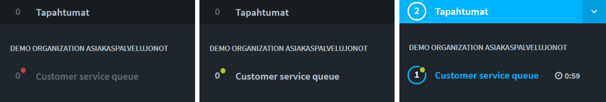

# Getting started - Agents

## Starting as new agent

Here are brief instructions how you can get started as a new agent. See more specific instructions from info page behind the links. These instructions are for new agents whose company or community already has an organization in Ninchat.

## Creating an account

### 1. Join Ninchat via invitation link sent to you.

You have received an invitation link via email. Use Chrome and Firefox browsers only.

Open the invitation link by clicking the _Accept invitation_ -button in your email message.

After opening the link click on the _Accept invite_ -button.

More info on page _Ninchat invitation_:


[ninchat-invitation.md](../user-account/ninchat-invitation.md)


### 2. Create an account

Once you have accepted the invitation create your own Ninchat account (if you already have one, sign in).

Enter required information:

* Name: your name
* Email: your email address (pay attention to capitalization)
* Password: create a safe password for your account

Click on _Create account_ to proceed.

More info on page _Create new account_:


[create-account.md](../user-account/create-account.md)


### 3. Permission to show notifications

When you sign in to Ninchat the browser asks to give ninchat.com a permission to show notifications. Allow notifications. Now you will receive notifications of new messages etc.

.png>)

### 4. Verify your account

You still need to verify your account. In your email you will receive a message that contains a link you need to click on to verify your account.

Use the verification link only once.

Sign in to Ninchat in [http://ninchat.com/app](http://ninchat.com/app)

## User settings 

### 1. User profile 

Click on the arrow next to your name in bottom left corner. From the opening menu choose _Asetukset ja profiili/Settings and profile_.

Add your name to _Lempinimi/Screen name_ and your real full name to _Koko nimi/Real name_.\
Download a profile picture (jpg or png -format).\
Picture and your realm name helps your colleagues to recognize you in the team channel.

Save the changes you've made by clicking _Tallenna/Save_.

### 2. Notification settings

In options move to the tab _Ilmoitukset/Notifications_.&#x20;

Ninchat can notify about events and messages in three ways: sound, desktop notification and email message. In addition, these notifications can always be seen in the _Tapahtumat/Events_ -section in Ninchat's sidebar.

Whether you have not given permission for browser notifications (desktop notifications), you may do so by clicking the _Salli/Enable_ -button.

.png>)

In the notification settings the most useful notifications has been set as default. You can add or remove specific notifications i.e. email.

Mark the part _Näytä ilmoitukset vaikka olisit paikalla/Show notifications even if present_ and you'll receive the set notifications even when you have Ninchat active on your screen.

More info on page _User settings and profile:_


[user-settings-and-profile.md](../user-account/user-settings-and-profile.md)


## Team channel

After the invitation you can see your internal team channel where you can talk in group about the chat and other subjects. In addition, you have possibly been invited to separate technical support channel where Ninchat staff and your own advisors help with chat-related issues.&#x20;

In the team channel you can ask your main user to add you as customer queues' handler (or i.e. moderator of public group chat).

From the team channel's memberlist you can also start 1-1 private conversations with your team mates. Read more on following sites:


[team-channels](../team-channels/)



[private-conversations.md](../team-channels/private-conversations.md)



[user-interface.md](../general-tips/user-interface.md)


## Customer queues and chats

Once you have been added as handler of customer queues, your queues can be seen in the left sidebar where you can pick customers.

If you have received _operator rights in your organization_ you can open and close queues, change settings and view statistics. How rights are given depends entirely on your community.&#x20;

.png>)

### Customer chat view 

.png>)

| 1) Sidebar                                                                                                                                                   | 2) Chat view                                                                                                                                                       | 3) Chat-sidebar                                                                                |
| ------------------------------------------------------------------------------------------------------------------------------------------------------------ | ------------------------------------------------------------------------------------------------------------------------------------------------------------------ | ---------------------------------------------------------------------------------------------- |
| <ol><li>Organization</li><li>Customer queues</li><li>Team and support channels</li><li>Customer chat</li><li>Private conversations with team mates</li></ol> | <ol><li>Information about the customer</li><li>Conversation</li><li>Text area, emojis, attachments, video chat, showing/hiding the sidebar</li></ol>

 | <ol><li>Memos</li><li>Ready answers</li><li>Tags (merkit) to categorize chats</li></ol>

 |

Read more about customer conversations:


[picking-customer-from-queue.md](../customer-service-queues-and-conversations/picking-customer-from-queue.md)



[having-a-customer-audience.md](../customer-service-queues-and-conversations/having-a-customer-audience.md)



[opening-and-closing-queue.md](../customer-service-queues-and-conversations/opening-and-closing-queue.md)



[ending-audience.md](../customer-service-queues-and-conversations/ending-audience.md)



[customer-service-queues-and-conversations](../customer-service-queues-and-conversations/)


### Video calls

In customer conversations it is possible to use video calls when sending text and images is not enough.&#x20;

Before you start using video chats test the functionality and compatibility with Ninchat's Video test tool which will tell you if your equipment, browser and internet connection work in order to have video calls. [Open Video test tool](https://ninchat.com/videotest)\
Read more about video calls:


[video-calls.md](../customer-service-queues-and-conversations/video-calls.md)


## Customer group chats

If you organize open group chats, that are embed in your website, that specific channel needs a moderator. Group channel's operator users can give moderator rights to agents.&#x20;

Read more:


[public-group-discussions](../public-group-discussions/)



[moderating-channel.md](../public-group-discussions/moderating-channel.md)


## Tips 

### Canned messages

From the user settings you can add canned messages that speed up and ease your work when answering to customers. Read more on page _User settings _section _Canned messages_.


[user-settings-and-profile.md](../user-account/user-settings-and-profile.md)


### Highlights

Every time someone mentions your name in chat you get a notification. You may add more words and terms to highlighted words so you'll receive a notification whenever one of these are mentioned i.e. "sale", "lunch", "problem". Read more on page _User settings_ section _Highlights_.


[user-settings-and-profile.md](../user-account/user-settings-and-profile.md)


### Shortcuts and bookmarks to Ninchat

To ease the opening of Ninchat add it in your bookmarks in your web browser by clicking the star icon in your url bar. When you add a bookmark while on your team channel it will always open that channel as default.

You can add Ninchat shortcut to your desktop or the bottom taskbar in your Windows. Read more:


[shortcuts-to-ninchat.md](../general-tips/shortcuts-to-ninchat.md)


### Other tips


[forgotten-password.md](../general-tips/forgotten-password.md)



[problems-signing-in.md](../general-tips/problems-signing-in.md)



[interface-problems.md](../general-tips/interface-problems.md)

