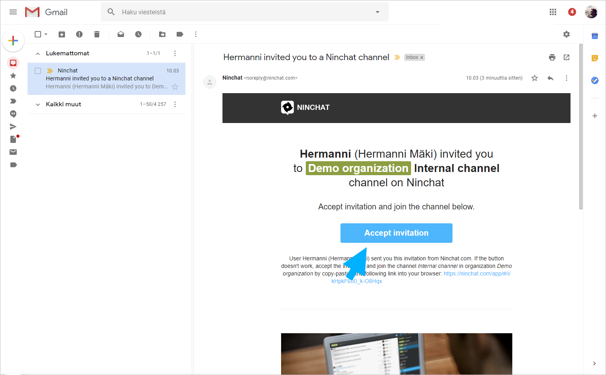
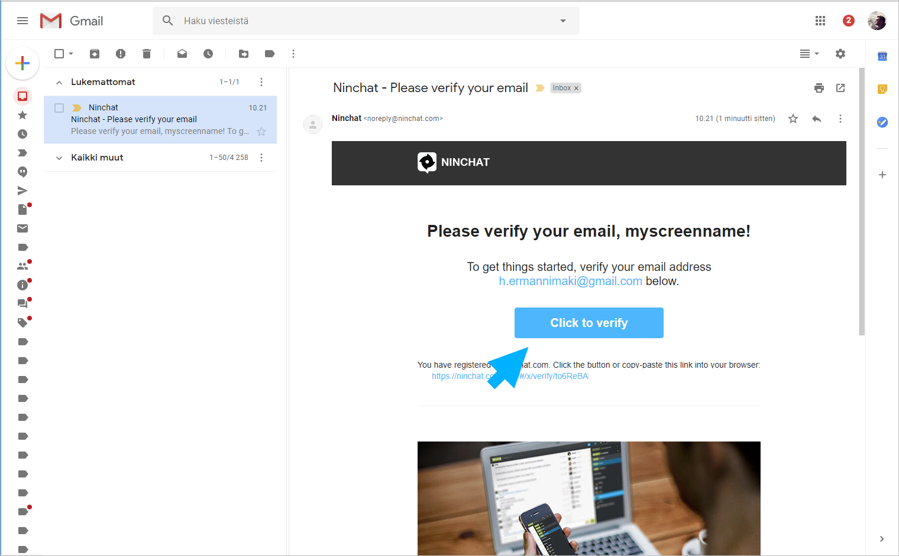
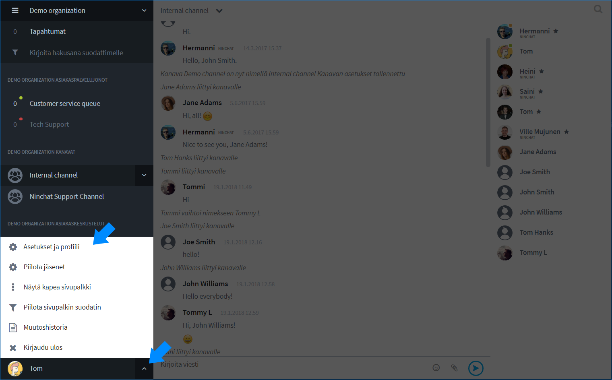
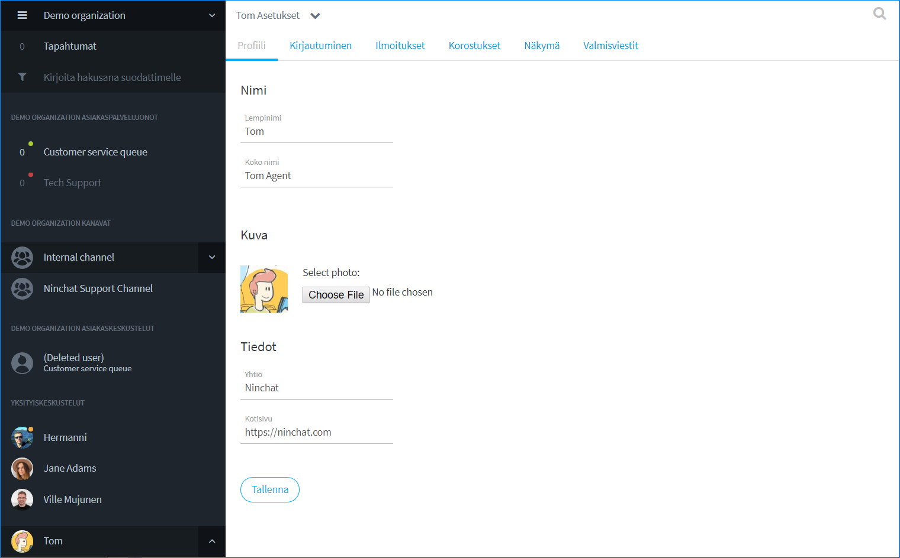
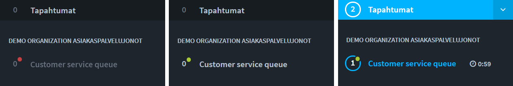
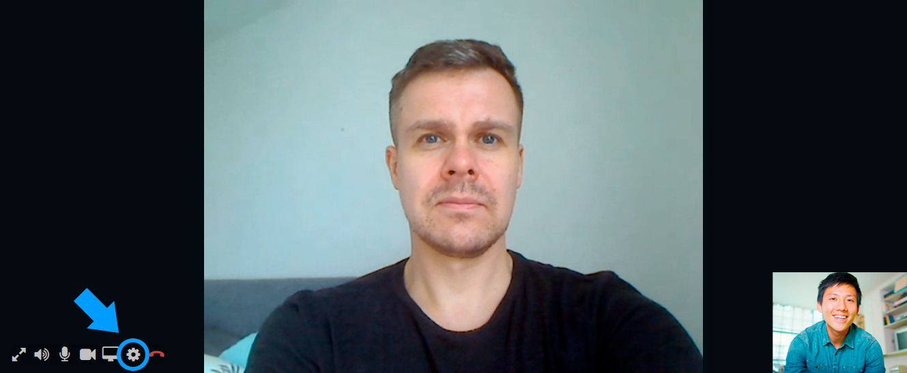

# Näin pääset alkuun - asiakasneuvojat

## Uuden agentin aloittaminen

Tässä lyhyesti ohjeet miten pääset uutena agenttina alkuun. Katso tarkemmat ohjeet linkkien takaa opastesivuilta. Nämä ohjeet ovat uusille agenteille, joiden yrityksellä tai yhteisöllä on jo olemassa Ninchat-organisaatio.

## Tunnuksen luonti

### 1. Liity Ninchatiin saamallasi kutsulinkillä.

Olet saanut kutsulinkin sähköpostitse. Käytä Chrome- tai Firefox-selainta.

Avaa kutsulinkki klikkaamalla sähköpostissa _Accept invitation_ -nappia.

Linkin avaamalla sivulla, klikkaa näkymässä Accept invite.

Lisätietoa sivulla _Ninchat-kutsun hyväksyminen_:



### 2. Luo itsellesi tili

Kun olet hyväksynyt kutsun, luo itsellesi Ninchat-tunnus. \(Jos sinulla on jo tunnus, kirjaudu sisään.\)

Anna tunnusta varten tiedot: 

* Name: nimesi
* Email: sähköpostiosoitteesi \(huomio isot ja pienet kirjaimet\)
* Password: keksi turvallinen salasana tunnuksellesi

Klikkaa _Kirjaudu_ päästäksesi eteenpäin.

Lisätietoa sivulla _Käyttäjätilin luonti_:



### 3. Ilmoitusten näyttölupa

Kun kirjaudut Ninchatiin, selain pyytää sinun antamaan ninchat.com-sivustolle luvan näyttää ilmoituksia. Hyväksy lupapyyntö. Näin saat jatkossa ilmoituksen uusista viesteistä yms.

### 4. Vahvista tunnuksesi

Sinun tulee vielä vahvistaa tunnuksesi. Saat antamaasi sähköpostiosoitteeseen viestin, jossa olevaa linkkiä klikkaamalla voit vahvistaa \(verify\) käyttäjätunnuksesi.

Käytä vahvistuslinkkiä vain kerran.

Kirjaudu Ninchatiin osoitteessa [http://ninchat.com/app](http://ninchat.com/app)

## Käyttäjäasetukset 

### 1. Käyttäjäprofiili 

Klikkaa vasemmassa alanurkassa nimesi vieressä olevaa väkäs-kuvaketta. Valitse avautuvasta valikosta _Asetukset ja profiili / Settings and profile_.

Lisää kutsumanimesi kohtaan _Lempinimi / Screen name_ ja oikea koko nimesi kohtaan _Koko nimi / Real name_.  
Lataa itsellesi profiilikuva \(jpg tai png -tiedosto\).  
Kuva ja oikea nimi helpottava tiimikavereita tunnistamaan sinut tiimikanavilla.

Tallenna tekemäsi muutokset klikkaamalla _Tallenna / Save_.

### 2. Ilmoitusasetukset

Siirry asetuksissa _Ilmoitukset/Notifications_ -välilehdelle. 

Ninchat voi ilmoittaa tapahtumista ja viesteistä kolmella tavalla: äänelle, työpöytäilmoituksella ja sähköpostiviestillä. Tämän lisäksi ilmoitukset näkyvät aina Tapahtumat-laatikossa Ninchatin sivupalkissa.

Mikäli et ole antanut lupaa selainilmoituksille \(\(työpöytäilmoitukset\), salli ilmoitukset klikkaamalla _Salli/Enable_ -nappia.

Ilmoitusasetuksissa on vakiona otettu käyttöönhyödyllisimmät ilmoitukset. Lisää tai poista halutut ilmoitukset esim. sähköpostiisi.

Merkkaa myös kohta _Näytä ilmoitukset vaikka olisit paikalla_ niin saat asettamasi ilmoitukset silloinkin kun Ninchat on ruudulla aktiivisena.

Lisätietoa _Käyttäjäasetukset_-sivulla:



## Tiimikanava

Kutsun myötä sinulle näkyy sisäinen tiimikanavanne, jossa voitte keskustella ryhmässä chattiin tai muuhun liittyvistä asioista. Lisäksi sinut on mahdollisesti kutsuttu erikseen tekniselle tukikanavalle, jolla Ninchatin henkilöstö ja omat neuvojanne antavat tukea chattiin liittyvissä asioissa.

Tiimikanavalla voit pyytää pääkäyttäjältänne, että hän lisää sinut asiakasjonojen käsittelijäksi \(tai esim. julkisen ryhmäkeskustelun moderaattoriksi\).

Tiimikanavan jäsenlistan kautta voit myös aloittaa kahdenvälisiä yksityiskeskusteluja tiimikavereiden kanssa. Lue lisää seuraavilla sivuilla:







## Asiakasjonot ja -keskustelut

Kun sinut on lisätty asiakasjonojen käsittelijäksi, omat jonosi näkyvät vasemmalla sivupalkissa, josta voit poimia asiakkaita.

Mikäli olet saanut _organisaation operaattori_ -oikeudet, voit myös avata ja sulkea jonon, sekä muuttaa sen asetuksia ja katsoa tilastoja. Se miten oikeuksia jaetaan ja määritellään, riippuu omasta yhteisöstäsi. 

### Asiakaskeskustelunäkymä 

<table>
  <thead>
    <tr>
      <th style="text-align:left">1) Sidebar</th>
      <th style="text-align:left">2) Keskustelun&#xE4;kym&#xE4;</th>
      <th style="text-align:left">3) Chat-sivupalkki</th>
    </tr>
  </thead>
  <tbody>
    <tr>
      <td style="text-align:left">
        <ol>
          <li>Organisaatio</li>
          <li>Asiakasjonot</li>
          <li>Tiimi- ja tukikanavat</li>
          <li>Asiakaskeskustelut</li>
          <li>Yksityiskeskustelut tiimil&#xE4;isten kanssa</li>
        </ol>
      </td>
      <td style="text-align:left">
        <ol>
          <li>Tietoja asiakkaasta</li>
          <li>Keskustelu</li>
          <li>Tekstikentt&#xE4;, hymi&#xF6;t, liitetiedostot, videokeskustelu, sivupalkin
            n&#xE4;ytt&#xF6;/piilotus</li>
        </ol>
        

        

      </td>
      <td style="text-align:left">
        <ol>
          <li>Muistiinpanot</li>
          <li>Valmisvastaukset</li>
          <li>Tagit (merkit) keskustelun luokitteluun</li>
        </ol>
        

      </td>
    </tr>
  </tbody>
</table>Lue lisää asiakaskeskusteluita:











### Videopuhelut

Asiakaskeskusteluissa on mahdollista hyödyntää videopuhelua tilanteissa, joissa tekstin ja kuvaliitteiden lähettäminen ei riitä. 

Ennen kuin alat järjestää videopuheluita, testaa toimivuus ja yhteensopivuus Ninchatin Videotestityökalulla, joka kertoo, onko laitteisto, selain ja verkkoyhteys kuunnossa videopuheluita varten. [Avaa Videotestityökalu](https://ninchat.com/videotest)  
Lue lisää videopuheluista:



## Asiakas-ryhmäkeskustelut

Mikäli järjestätte avoimia ryhmäkeskusteluja, jotka ovat upotettu omalle sivustollenne, tarvitsee kyseinen kanava keskustelulle moderaattorin. Ryhmäkanavan operaattorikäyttäjät voivat jakaa moderointioikeuksia agenteille. 

Lue lisää:





## Vinkkejä 

### Valmisviestit

Voit lisätä käyttäjäasetuksissa valmisviestejä, joilla nopeutat ja helpotat omaa työtäsi vastatessasi asiakkaille. Lue lisää _Käyttäjäsetukset_-sivun _Valmisviestit_-osiossa.



### Huomiosanat eli korostukset

Saat ilmoituksen aina kun joku mainitsee nimesi keskustelussa. Voit lisätä haluamiasi sanoja ja termejä korostettaviin sanoihin, jolloin saat ilmoituksen kun joku näistä mainitaan, esim. "myynti", "lounas", "ongelma", ... Lue lisää _Käyttäjäsetukset_-sivun _Korostukset_-osiossa.



### Oikotiet ja kirjanmerkit Ninchatiin

Helpottaaksesi Ninchatin avaamasti, lisää Ninchat web-selaimesi kirjanmerkkeihin klikkaamalla tähti-ikonia osoiterivillä. Kun lisäät kirjanmerkin ollessasi tiimikanavallasi, avaa kirjanmerkki aina vakiona tuon kanavan.

Voit lisätä Ninchat-pikakuvakkeen myös työpöydällesi tai Windowsin alareunan tehtäväpalkkiin. Lue lisää:



### Muuta







