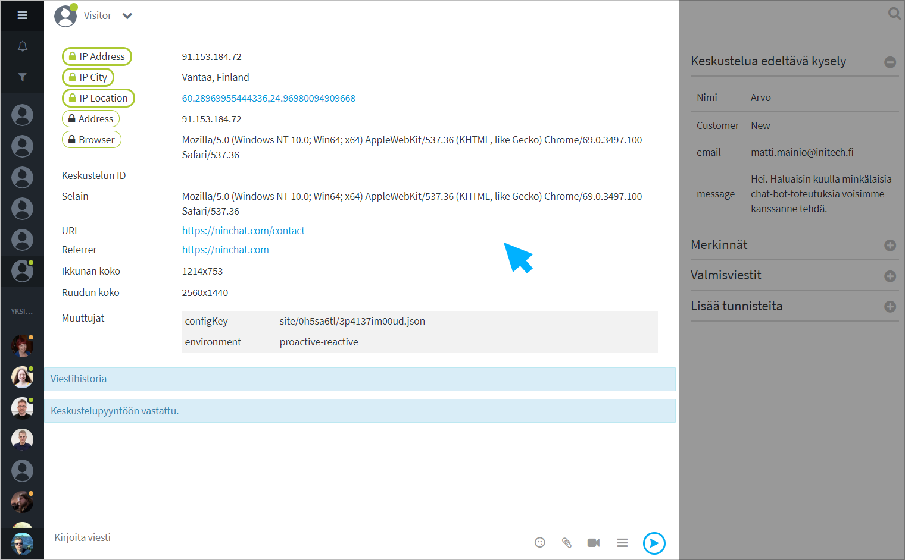
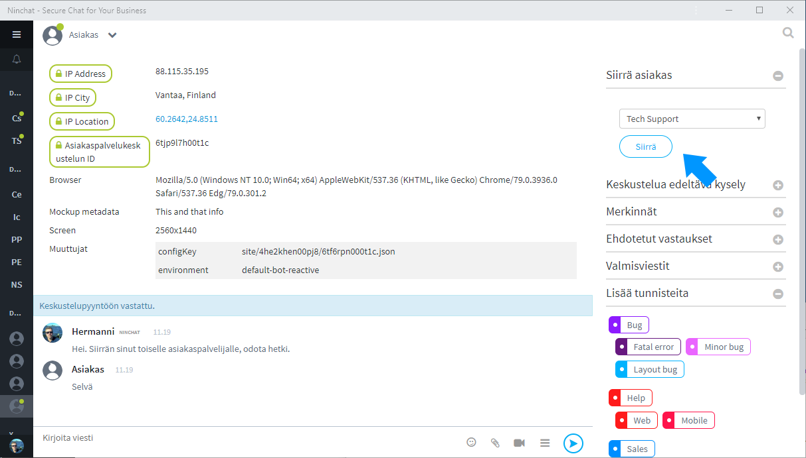

# Customer service queues and conversations

## Queue bar and Queue event log <a id="asiakasjonopalkki-ja-nakyma"></a>


Customer care queues appear in the left Sidebar. Clicking a queue bar  will open the queue view, which can be used to pick incoming customers from the queue and view activity log. The queue activity log shows different events of the queue i.e. when the queue was opened and closed, and who picked customers \(accepted audience\).

Clicking the arrow icon next to a queue name in the Sidebar will open a drop-down menu that allows you to pick customers without having to go to the queue view. You can also use the drop-down menu to manually close the queue.

In the sidebar, next to queue's name is a timer, which tells you how long \(the first\) customer has waited in the queue. If queueing time has been more than one hour, ∞ -symbol \(infinity\) is shown instead of time.




## Picking customers from queue


Notifications of customers in a queue are displayed in the queue bar as well as in the Activity bar. The Activity bar notifies you of new events by turning blue, and you will see it even when you have another organization view.


A customer can be picked from either the Sidebar or the larger queue view. Below are the instructions for both options.

### A\) Pick a customer via the Queue Activity log 

1. In the Sidebar, click the name of the queue \("Customer service queue" in the picture\) rather than the arrow next to it. 
2. In the Queue Activity log, click the button "Pick person from queue".
3. The customer conversation begins.


### B\) Pick a customer via queue dropdown menu

1. Click the arrow icon next to the queue name in the Sidebar \("Customer service queue" in the picture\).
2. Select "Pick person from queue" from the drop-down menu that opens.
3. The customer conversation begins.


### **Queue menu functions**

* Open Queue activity log _\(click queue name\)_
* Pick person from queue
* Queue settings _\(requires organization operator rights\)_
* Queue statistics _\(requires organization operator rights\)_
* Open/Close queue



## Customer conversation view


<table>
  <thead>
    <tr>
      <th style="text-align:left">1) Sidebar</th>
      <th style="text-align:left">2) Conversation section</th>
      <th style="text-align:left">3) Chat features</th>
    </tr>
  </thead>
  <tbody>
    <tr>
      <td style="text-align:left">
        <ol>
          <li>Organization</li>
          <li>Customer care queues</li>
          <li>Team and support channels</li>
          <li>Customer care conversations</li>
          <li>Private conversations with team members</li>
        </ol>
      </td>
      <td style="text-align:left">
        <ol>
          <li>About the customer</li>
          <li>Conversation</li>
          <li>Text field, emojis, attachments, video chat, hide/show the chat features</li>
        </ol>
        <p></p>
        <p></p>
      </td>
      <td style="text-align:left">
        <ol>
          <li>Notes</li>
          <li>Caned messages</li>
          <li>Tags to clasify a conversation</li>
        </ol>
        <p></p>
      </td>
    </tr>
  </tbody>
</table>## Customer conversation

Once you have picked a customer from a queue, a conversation with the customer begins.

1. The customer will see a message "Conversation started", but it is a good idea to send the customer a greeting or similar message immediately.
2. Above the conversation, you will see technical information about the customer, such as the browser he/she is using, the page where the chat was started, and other information if you have enabled it.
3. If the chat has a pre questionnaire, you will see the choices and answers the customer has made on the right of the conversation section. This information can help you better advise the customer.

## Pictures and files

The agent can send pictures and files to the customer, and vice versa if allowed in the settings.

There is no limit to the size or format of files to upload.

## Customer metadata 

Various metadata can be passed from the customer to expedite and facilitate the work of the agent. The data which may be communicated are:

* Encrypted from contract partner server \(secure metadata\);
* From the web page at the beginning of the chat and in real time during the chat;
* Ninchat pre and post questionnaire responses;
* Collected metadata such as the contents of the shopping cart.

At the beginning of the conversation, you can look into the basic information about the customer, which is useful e.g. for problem solving. It is possible to see the customer's browser information and screen size, chat landing page and referral page, as well as IP address and location information.




Ask Ninchat staff for more information about uploading metadata.


### Strongly encrypted metadata \(secure metadata\)

It is possible for the customer service provider to encrypt the information of the user logged on to the contractor's site from the contractor's server. Later, the conversation with the information can be transmitted back to the contract partner's CRM system and linked to the right user based on the information.

Contact us for more information, or read from our API documents: 

* [API - https://ninchat.com/api ](https://ninchat.com/api%20)
* [Master keys & secure metadata - https://github.com/ninchat/ninchat-api/blob/v2/master.md](https://github.com/ninchat/ninchat-api/blob/v2/master.md)

### Pre and post questionnaire

The information from the pre questionnaire is shown on the right of the conversation section as "Pre audience questionnaire". This will make the customer service quicker and easier.

The pre questionnaire can also ask for the customer's name and message, which will also be included in the conversation.

The answers to the post questionnaire after the discussion will also appear in the same place as "Post audience questionnaire" after the customer has closed the chat.


### Live metadata

It is possible to provide real-time information of customer's activities on the site, to a customer service agent for easier guidance. For example, when a customer completes a form, the information can be reported directly to the customer service agent, or when the customer changes pages during the conversation.


### Collected metadata

Live metadata can also be provided to a customer service agent on an aggregate basis. For example, the contents of the shopping cart and shipping information can be encrypted all at once, so that they are displayed altogether in a cohesive view.


## Video calls

Video call can be used in customer conversations when text messages and attachments are not enough. Read more in _Video calls_ section. Ask us more about the feature.



## Canned messages

Canned messages speed up and facilitate the work of customer service agents. To deal with frequently asked questions, the answers can be selected directly from the list.

In addition, if the questions require correct or specific answers, such as legal or therapeutic matters, it may be helpful to use canned messages.

### Create and edit canned messages

Canned messages are personal, and can be created and edited in your own user settings. See detailed instructions in the link:



### Use a canned message

#### **Customer chat features**

Canned messages appear as a list in the chat features on the right of the conversation section. Click to select a message and it will appear in the text field. Edit the text as needed or send it right away.

#### **Keyboard**

Canned messages can also be accessed by using your keyboard to type in the text field. Canned messages also work from the keyboard in team channels and private conversations.

By typing the slash \[/\] and the keyword of a canned message you want to use and pressing the \[Spacebar\] key, the canned message will appear in the text field.

Example: You have set up a canned message: open \(keyword\): We are open on weekdays from 9 am to 5 pm \(canned message\).

| Keyword | Canned message  |
| :--- | :--- |
| open | We are open on weekdays from 9 am to 5 pm. |

```text
/open[Spacebar] --> We are open on weekdays from 9 am to 5 pm.
```

## Transfer customer <a id="asiakkaan-siirtaminen"></a>

Once a conversation started, the customer can be transferred to another queue so that another agent can pick up the conversation. For example, the first responding nurse can refer the customer to a doctor's queue if needed.

Transfer queues can be enabled in the queue settings. Once a queue is allowed for transfer, the transfer customer option is displayed on the  top of the chat features.



## Tags

Customer service agents can tag customer conversations with tags according to the topic or nature of the conversations, for example, "sales", "customership", "technical problem", etc. Adding tags makes it easier to record and later review the conversations.

Conversations can also be tagged automatically e.g. based on questionnaire answers. So it is possible the conversation has added tags right in the beginning.

Used tags are defined by your organization operator.

### Tag a conversation

An agent can add a tag by choosing from the list of tags in the chat features. Added tags appear and are stored in the metadata in the beginning of the conversation.


### Create and edit tags

Tags are organization specific and can be created and edited by your organization operators. To create and edit tags, see page _Customize tags_:




## Notes

Notes is an advanced option that allows you to create notes and entries about a customer conversation. Notes made by a customer service representative are stored in the conversation history. Notes can also be used to export data to the customer's own information system. 

Notes can added via customer conversation sidebar \(if notes are enabled\). Saved notes are added into metadata in the beginning of conversation.


## Opening and closing a queue

The queue can be opened and closed manually, or automatically by scheduling. An open queue is marked with a green circle in the Sidebar and queue view, while a closed queue is markded with a red circle.

### Open queue

Click the arrow icon next to the queue name and select "Open queue" from the menu.   
Customers can now join the queue.


### Close queue

Click the arrow icon next to the queue name and select "Close queue" from the menu.   
After that, customers cannot start a chat. Customers in the queue at the time of closing will remain in the queue until they are picked or they decide to close the chat/window.


### Schedule a customer care queue

Read more about opening and closing a queue automatically by scheduling:



## Managing customer queue agents

Instructions on how to add and manage queue members are described in the _Organization_ section:



