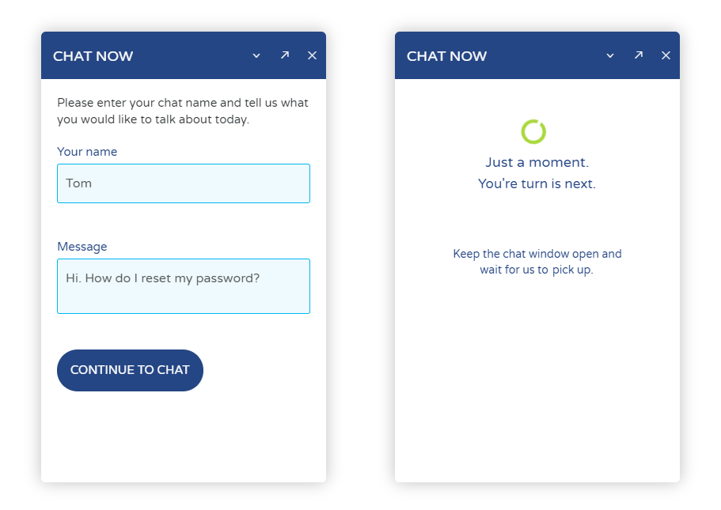
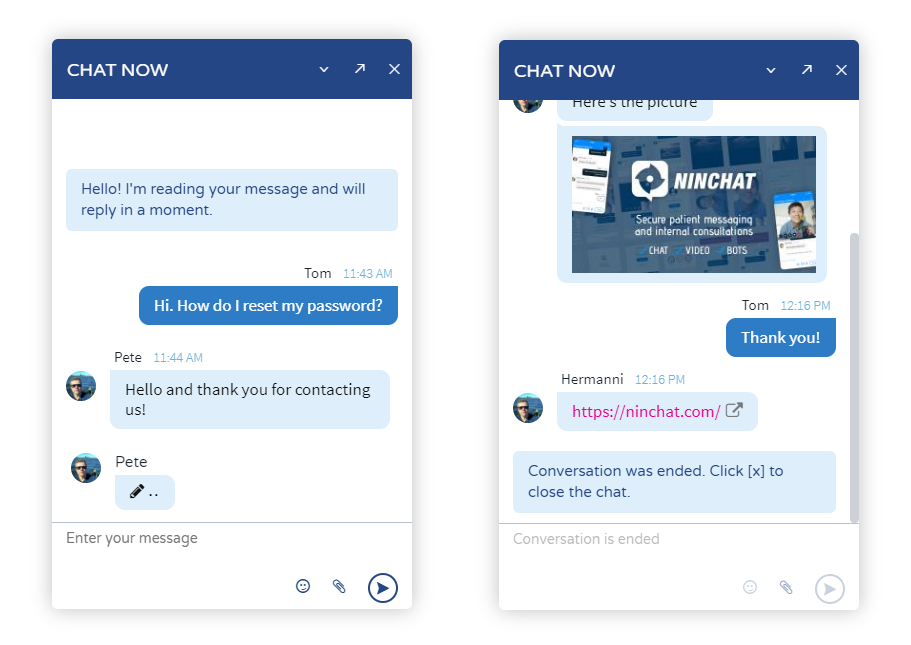
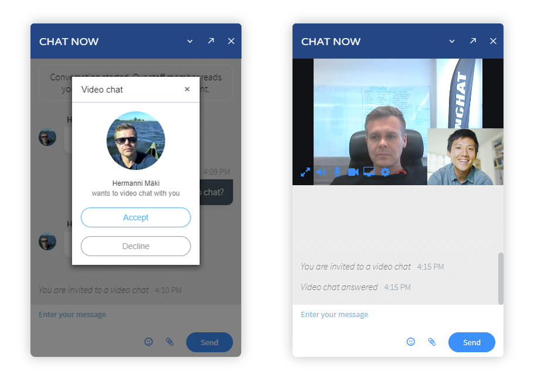

# Customer chat interface

This page describes customer chat activities and prospects of the customer chat interface. Here is an example of a chat implementation view. All the views and functions can be customized in your brand's look and feel.

Ask more and request a demo at: [http://ninchat.com/demo](http://ninchat.com/demo)

## Chat starting view 

.png>)

### Minimized view

Chat will normally appear in a minimized view such as bar or box in the lower right corner of the screen. Above the bar, it is possible to display a text box where you can communicate more about your service.

### Pop-up window

When the pop-up chat window opens, your customers will see a home screen that allows them to start a chat. On the home screen, you can also tell more about your service, opening hours, and other related information.

Other elements like images, links, and tables are also possible on the home screen.

Instead of starting with the home screen, customers can also be directed to pre questionnaire, queue, or chat bot.

The chat window can be minimized, enlarged, closed, or opened in a new window using the optional buttons in the title bar.

## Pre questionnaire and queue

### Pre questionnaire

Before going to a queue, your customers can be screened with a pre questionnaire. You can ask for name/nickname and other concerned questions, or use it to match the customer needs and display instructions or selections for the right customer service queue.

### Queue view 

After selecting continue to chat, the customer goes to the queue view. The queue view shows the customer's queue number, whether his/her queue is behind other customers. As an agent picks up the customer from the queue, a conversation view opens.

## Conversation view

The queue view changes to the conversation view itself after an agent picks the queue. In addition to text messages, links and attachments can be used in the conversation. Sending attachments can be allowed or prevented in the queue settings.

### Video chat

Apart from text messages and pictures, you can chat with the customer via video. In addition to the video camera, you can also share your screen. Video and screen sharing do not require any additional software but ususally compatible with newer browsers.

### Customer service rating and feedback survey

.png>)

At the end of the conversation, the client may be presented with a customer service rating view. Using smiley icons is a quick way for the customer to rate the service and for you to gain valuable feedback.

In addition to the emoticons, a post questionnaire can be used as a feedback survey to gather more specific information from the customer. Feedback is stored in statistics alongside the chat history.

### Chat closed

.png>)

When your customer service chat is closed, the chat can be hidden or shown in a view written that it is currently closed. You can place a contact form in this view, tell about the service and opening hours, and provide related links.

You can also help the customers on general issues by providing supports with Ninchat query tool or chat bot.
