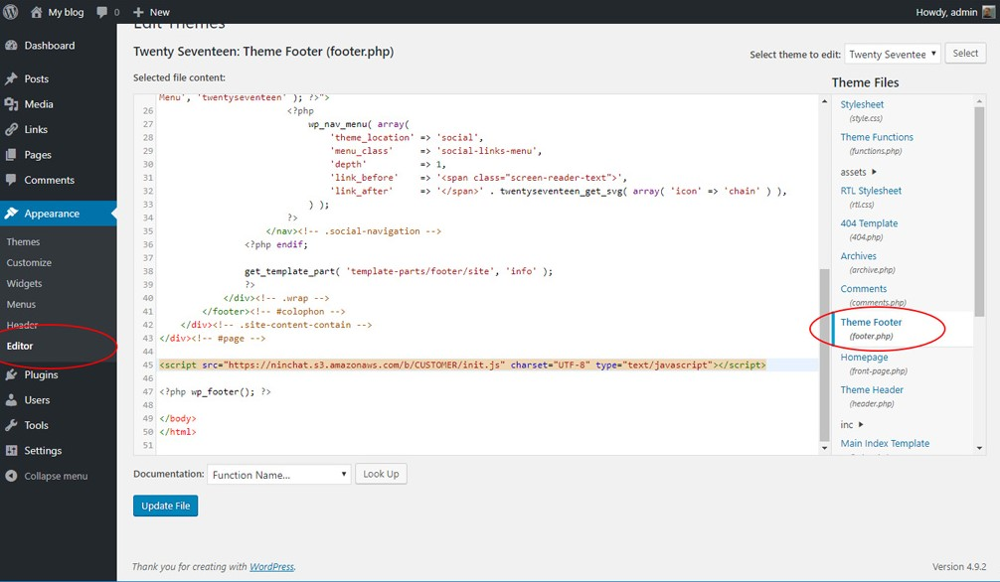

# Embedding chat on website

You can place a customer service chat on a website, mobile site and application, blog, or Facebook page.

## Chat embed code

For embedding, you need a so-called embed code that you will get from Ninchat staff when the chat is ready. We will customize and prepare the chat as you wish, all you have to do is to place the embed code on your desired site.

The embed code is a one-line Javascript tag, example below \(we will provide you with your own code\):

```markup
<script src="http://ninchat.com/[customer]/ninchat-init.js" charset="UTF-8"></script>
```

### Place the embed code

We recommend placing the script tag at the end of the body element of the web page. Example:

```markup
        ...
        <script src="http://ninchat.com/[customer]/ninchat-init.js" charset="UTF-8"></script>
    </body>
</html>
```

The embed code should be placed on each page where the chat is expected to function. In practice, it is a good idea to place the script tag in the header or footer section of your site that goes with each page.

### Add Ninchat to Wordpress

You can add the Ninchat embed code to a Wordpress site by editing the site's HTML source code.

1. In the Site Manager view, go to the "Appearance" section.
2. Click "Editor" to open the edit view.
3. Browse and click the "Theme Files" list e.g. "Theme Footer \(footer.php\)" page.
4. Paste the Ninchat embed code where you want it \(preferably near the end of the body element, and inside it\).



