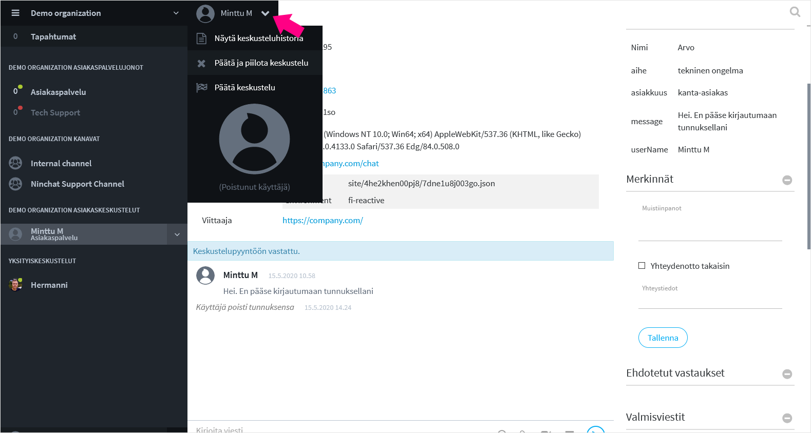

# Ending audience

Customer audience is ended either by agent or customer. The customer can close the chat and the agent is notified the audience has ended, or vice versa. After one party has ended the conversation, the other can't write new messages anymore.

The agent can end audiences either from top menubar or from the Sidebar.

### Ending audience via menubar

Klikkaa käyttäjän nimeä ylävalikossa. Valitse sulkemistapa:

* _End and hide conversation_
  * Audience ends and is also hidden from you. You can no longer add tags or notes to the conversation. 
* _End conversation_
  * Audience ends and new messages can't be sent. Audience still stays open and visible in the Sidebar. You can add tags and notes to the conversation until you close it \(End and hide\), within six hours. You can close the conversation later from the sidebar. It will later dispay as "Deleted user".

Even when customer ends the conversation, agent is better to close the conversation in the end.

### Ending audience via Sidebar

Close the conversation by clicking cret icon next to audience name in the Sidebar. This way the conversation will also be closed right away and you can no longer add tags or notes to the conversation.

## 

