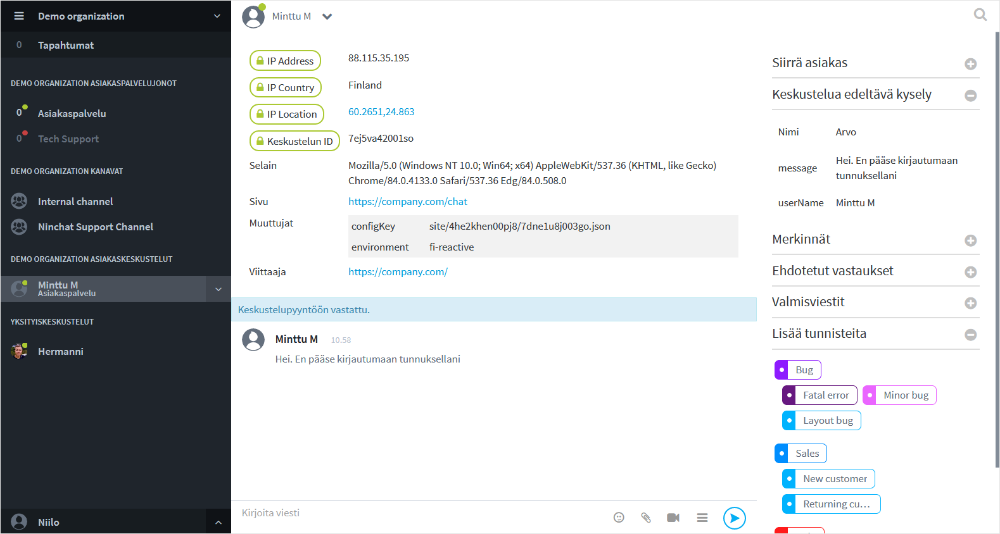

# Having a customer audience

## Start of a conversation

Once you have picked a customer from a queue, a conversation with the customer begins.

The customer will see a message "Conversation started". This message is not shown to the agent. It's still a good idea to send the customer a greeting or similar message immediately.

Above the conversation, you will see technical information about the customer, such as the browser he/she is using, the page where the chat was started, and other information if you have enabled it.

If the chat has a pre-audience questionnaire, you will see the choices and answers the customer has made on the right of the conversation section. This information can help you better advise the customer.

If the pre-audience questionnaire includes entering a username and/or a message, they are also shown in the conversation.



## Entering a message

Type your message in the command line \("Enter your message"\). Send it by clicking \[ENTER\] key or the  Send-icon.

If you need to add line breaks the your messages, you can do by clicking simultaneously \[SHIFT\]+\[ENTER\]  keys. The command line will automatically adjust to longer messages.

## Video calls

Video call can be used in customer conversations when text messages and attachments are not enough. Read more in _Video calls_ section



## Pictures and files

The agent can send pictures and files to the customer, and vice versa if allowed in the settings.

There is no limit to the size or format of files to upload.


## Customer metadata 

Various metadata can be passed from the customer to expedite and facilitate the work of the agent. The data which may be communicated are:

* Encrypted from contract partner server \(secure metadata\);
* From the web page at the beginning of the chat and in real time during the chat;
* Ninchat pre and post questionnaire responses;
* Collected metadata such as the contents of the shopping cart.

At the beginning of the conversation, you can look into the basic information about the customer, which is useful e.g. for problem solving. It is possible to see the customer's browser information and screen size, chat landing page and referral page, as well as IP address and location information.



Ask Ninchat staff for more information about uploading metadata.


### Strongly encrypted metadata \(secure metadata\)

Secure metadata can used to pass e.g. customer's identification information.

It is possible for the customer service provider to encrypt the information of the user logged on to the contractor's site from the contractor's server. Later, the conversation with the information can be transmitted back to the contract partner's CRM system and linked to the right user based on the information.

Contact us for more information, or read from our API documents: 

* [API - https://ninchat.com/api ](https://ninchat.com/api%20)
* [Master keys & secure metadata - https://github.com/ninchat/ninchat-api/blob/v2/master.md](https://github.com/ninchat/ninchat-api/blob/v2/master.md)

### Live metadata

It is possible to provide real-time information of customer's activities on the site, to a customer service agent for easier guidance. For example, when a customer completes a form, the information can be reported directly to the customer service agent, or when the customer changes pages during the conversation.


### Folded metadata

Live metadata can also be provided to a customer service agent aggregated. 

For example, the contents of the shopping cart and shipping information can be shown \(also encrypted\) all at once, so that they are displayed folded in the conversation sidebar.


## Questionnaire answers

The information from the pre questionnaire is shown on the right of the conversation section as "Pre audience questionnaire". This will make the customer service quicker and easier.

The pre questionnaire can also ask for the customer's name and message, which will also be included in the conversation.

If the pre-audience questionnaire includes entering a username and/or a message, they are also shown in the conversation, in addition to questionnaire answers box.

The answers to the post questionnaire after the discussion will also appear in the metadata section after the customer has closed the chat.


## Canned messages

Canned messages speed up and facilitate the work of customer service agents. To deal with frequently asked questions, the answers can be selected directly from the list.

In addition, if the questions require correct or specific answers, such as legal or therapeutic matters, it may be helpful to use canned messages.

### Create and edit canned messages

Canned messages are personal, and can be created and edited in your own user settings. See detailed instructions in the link:



### Use a canned message

#### **Customer chat features**

Canned messages appear as a list in the chat features on the right of the conversation section. Click to select a message and it will appear in the text field. Edit the text as needed or send it right away.

#### **Keyboard**

Canned messages can also be accessed by using your keyboard to type in the text field. Canned messages also work from the keyboard in team channels and private conversations.

By typing the slash \[/\] and the keyword of a canned message you want to use and pressing the \[Spacebar\] key, the canned message will appear in the text field.

Example: You have set up a canned message: open \(keyword\): We are open on weekdays from 9 am to 5 pm \(canned message\).

| Keyword | Canned message  |
| :--- | :--- |
| open | We are open on weekdays from 9 am to 5 pm. |

```text
/open[Spacebar] --> We are open on weekdays from 9 am to 5 pm.
```

## Tags

Customer service agents can tag customer conversations with tags according to the topic or nature of the conversations, for example, "sales", "customership", "technical problem", etc. Adding tags makes it easier to record and later review the conversations.

Conversations can also be tagged automatically e.g. based on questionnaire answers. So it is possible the conversation has added tags right in the beginning.

Used tags are defined by your organization operator.

### Tag a conversation

An agent can add a tag by choosing from the list of tags in the chat features. Added tags appear and are stored in the metadata in the beginning of the conversation.


### Create and edit tags

Tags are organization specific and can be created and edited by your organization operators. To create and edit tags, see page _Customize tags_:



## Notes

Notes is an advanced option that allows you to create notes and entries about a customer conversation. Notes made by a customer service representative are stored in the conversation history. Notes can also be used to export data to the customer's own information system. 

Notes can added via customer conversation sidebar \(if notes are enabled\). Saved notes are added into metadata in the beginning of conversation.


## 

