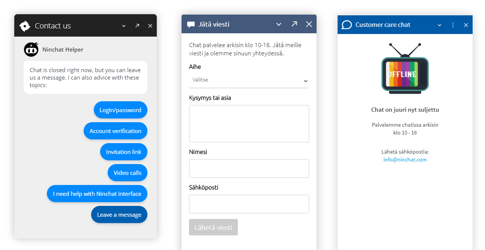
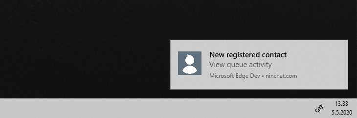
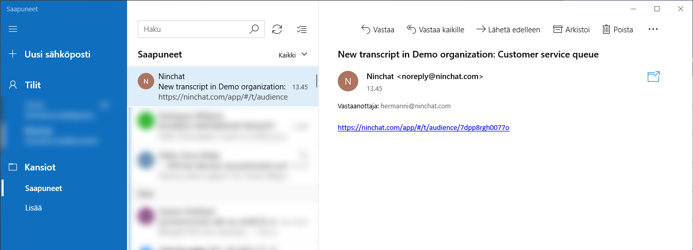
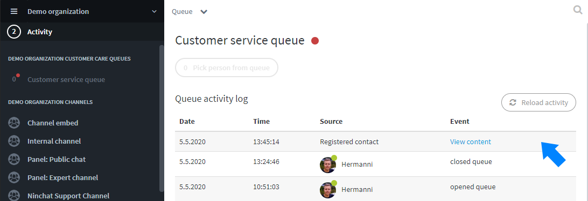
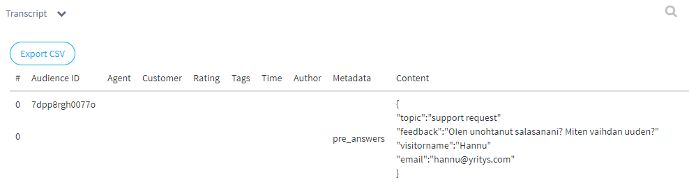

# Offline contacts

## Common about offline situations

When customer queue is closed, you can handle offline situation in various ways:

* Offline message which tells opening hours and additional contact info
* Contact form, so customer can leave you a message
* Let chatbot or Nincht Lightbot help visitor in common issues. Also Lightbot can pick a message like a contact form.

## Contact form

### Notification settings

Agents who want to receive and handle offline contacts, need to enable notifications about _Registered contacts_ in their _user settings_.  
Set notifications for online use \(sound and desktop\). If you want to receive email notifications about contacts, tick email also on.



### Notifications about registered contacts

Example case: Customer fills and send the following contact request in the chat window, while customer queue is closed.

Online agent receives a notification in Ninchat and on the desktop. The notification can be also subscribed to email.

### Reading registered contact

When you click the notification, or the link in email, it takes you to the queue activity log. Click _View content_ link to see the registered contact contents.

Registered contact contents open up. 

Registered contacts can be also found via queue statistics, in _Questionnaire answers._



