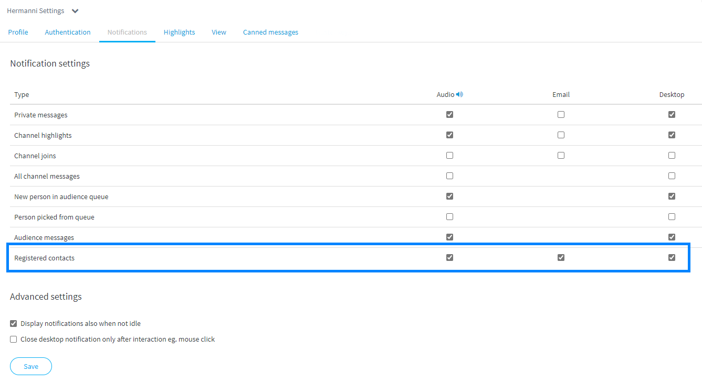

# Registered contacts

## Contact form

You can show a contact form in the chat window, so visitors can leave you a message e.g. if the customer queue is closed. Registered contacts are saved in queue statistics and can be also seen in _Queue activity log_.

### Notification settings

Agents who want to receive and handle registered contacts, need to enable notifications about _Registered contacts_ in their _user settings_.  
Set notifications for online use \(sound and desktop\). If you want to receive email notifications about contacts, tick email also on.



### Notifications about registered contacts

Example case: Customer fills and send the following contact request in the chat window, while customer queue is closed.

Online agent receives a notification in Ninchat and on the desktop. The notification can be also subscribed to email. Open the contact message by clicking the link in the email.

Registered contacts are read in Ninchat instead of email for security; emails are not secure.

### Reading registered contact

When you click the notification, or the link in email, it takes you to the queue activity log. Click _View content_ link to see the registered contact contents.

You can also write a comment and tell what the status on the matter is, or who is handling it. 

Registered contact contents open up. 

Registered contacts can be also found via queue statistics, in _Questionnaire answers._



## General info about offline situations

When customer queue is closed, you can handle offline situation in various ways:

* Offline message which tells opening hours and additional contact info
* Contact form, so customer can leave you a message
* Let chatbot or Nincht Lightbot help visitor in common issues. Also Lightbot can pick a message like a contact form.

