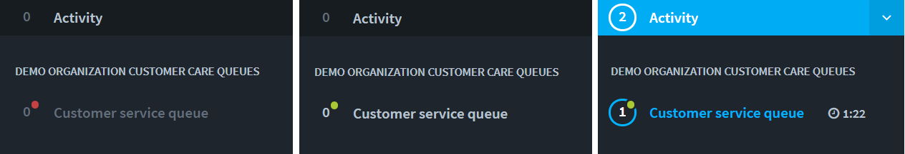
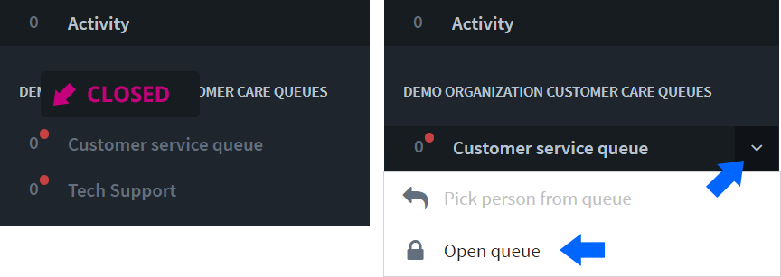

# Opening and closing queue

## Opening and closing a queue

The queue can be opened and closed manually, or automatically by scheduling. An open queue is marked with a green circle in the Sidebar and queue view, while a closed queue is marked with a red circle.

## Customer queue states 

Customer queue is shown in Sidebar with

* Red dot - Queue is closed
* Green dot - Queue is open
* Blue notice colours - There are customers in queue

### Queueing time

When there are customers in queue, you can see a timer next to the queue name telling how long \(the first\) queueing customer has been waiting.

If queueing time has prolonged for more than one hour, the ∞ infinity symbol is shown instead of time.

## Opening a queue

Click the arrow icon next to the queue name and select "Open queue" from the menu.   
Customers can now join the queue.

## Closing a queue

Click the arrow icon next to the queue name and select "Close queue" from the menu.   
After that, customers cannot start a chat. Customers in the queue at the time of closing will remain in the queue until they are picked or they decide to close the chat/window.

## Schedule a customer care queue

Read more about opening and closing a queue automatically by scheduling:



