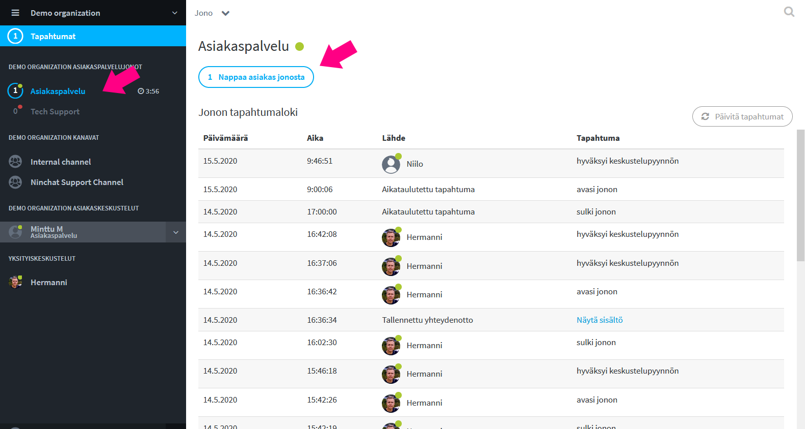
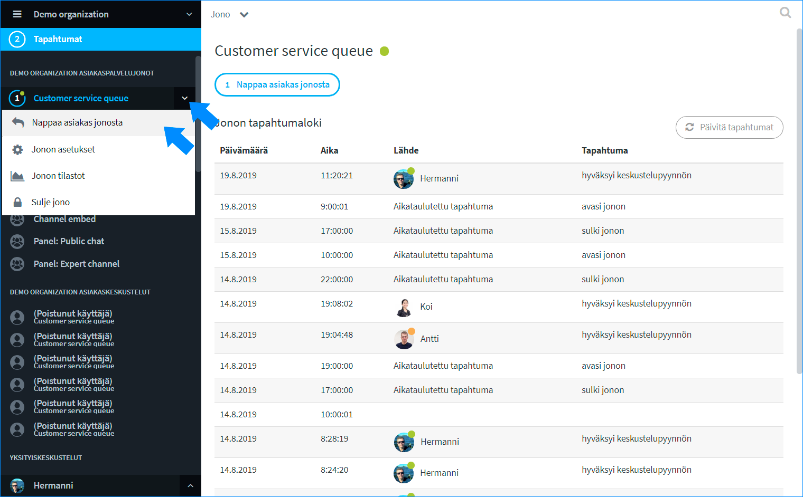

# Picking customer from queue

## Notification about a new customer

If you have allowed notifications in your use settings, you will be notified about customer queue events:

* Activity bar and Queue bar: Blue notice colour
* Sound notification \("Blip!"\)
* Desktop notification \(Pop-up box in the screen corner\)
* \(Email notification\)

Customer can be picked either from from Sidebar or from Queue page. Instructions for both below.


Notifications of customers in a queue are displayed in the queue bar as well as in the Activity bar. The Activity bar notifies you of new events by turning blue, and you will see it even when you have another organization view.


## Picking a customer from queue

### Pick customer via Queue page

1. In the Sidebar, click the name of the queue  rather than the arrow next to it. 
2. On the Queue page, click the button "_Pick person from queue_".
3. The customer conversation begins.

### Pick customer via queue dropdown menu

Clicking the arrow icon next to a queue name in the Sidebar will open a drop-down menu that allows you to pick customers without having to go to the queue view. You can also use the drop-down menu to manually close the queue.

1. Click the arrow icon next to the queue name in the Sidebar \("Customer service queue" in the picture\).
2. Select "_Pick person from queue_" from the drop-down menu that opens.
3. The customer conversation begins.

