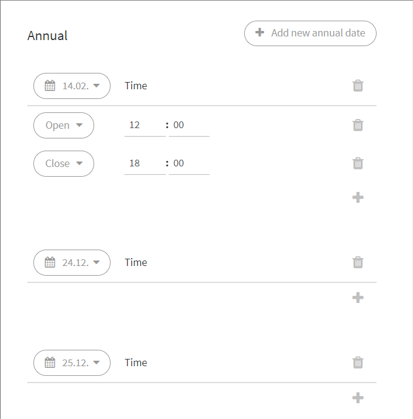
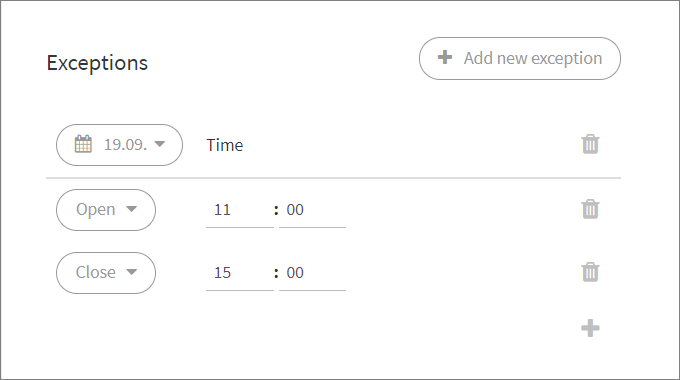

# Queue schedule

## Overview

You can schedule a queue to open and close automatically, so agents do not have to manually change the queue state. You can also add exceptions that occur annually or just once.

### Schedule on/off 

The function "Enable schedule" allows you to quickly turn the queue schedule on or off.

If you keep the chat closed, for example during summer holidays or Christmas holidays, it may be easier to set the schedule off instead of creating exceptions. When the agents return from holidays, the schedule can be quickly switched back on.

Remember to set a desired closed message for holidays and preferably in advance.


Note! Schedule operates based on current time. Thus, your customer queue will not open/close if the scheduled time is set ahead of the current time.  
You can always open/close a queue manually from the Sidebar queue menu.


## Create a schedule

Create a recurring weekly schedule for your customer care queue. To get started, click anywhere under the day of the week that you want to create or edit opening and closing times.

Remember to always save your changes.

### Recurring weekly schedule

Below is the Wednesday schedule edit view. You can create multiple opening and closing times for each day:

* Click the plus \(+\) icon to add an action. Select either it is an opening or closing time and then select the time.
* For example, in the image below, on Wednesday the chat opens at 10:00 \(10 am\) and closes at 17:00 \(5 pm\) and then opens again at 19:00 \(7 pm\) and closes at 22:00 \(10 pm\).
* Click the left arrow or calendar icon to return to the weekly schedule view.

### Create annual exceptions e.g. for holidays:

* Click the "Add new annual date" button.
* An annual exception requires both opening and closing times.
* If you do not want the chat to open at all on a particular day, choose the date without adding opening or closing times.
* E.g. the image below shows a recurring schedule for Valentine's Day \(February 14th\) that the chat opens at 12:00 \(12 pm\) and closes at 18:00 \(6 pm\) every year. Also, on Christmas Eve \(December 24th\) and Christmas Day \(December 25th\) the chat is completely closed yearly.

### Create one-time exceptions:

* Click the "Add new exception" button.
* Creating a one-time exception will override the schedules and annual exceptions. This exception occurs only once on a given day without repeating annually.
* You can add a date without opening and closing times which will keep the chat closed for the whole day.
* The example in the image below shows that on September 19, 2019, the chat exceptionally opens at 11:00 \(11 am\) and closes at 15:00 \(3 pm\).


Make sure to save your changes.


