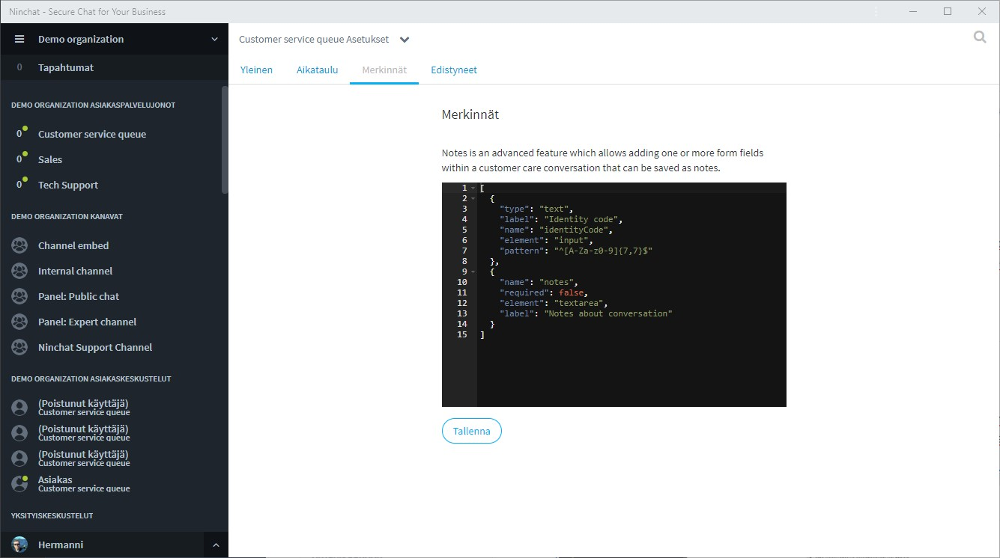
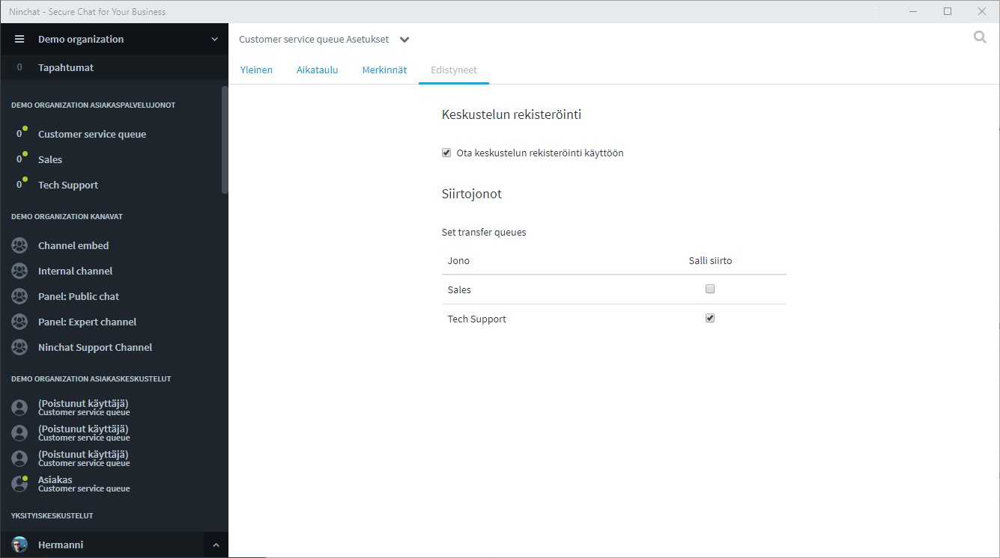

# Queue settings

Click the arrow icon next to the queue name and select "Queue settings".  
\(This requires organization operator rights.\)

## General

In the Queue settings, "General" tab, you can edit the following:

* Name of the queue;
* Metadata, such as IP address and location, whether it is automatically added to the beginning of the conversation. For additional metadata information, please contact Ninchat staff.
* Secure metadata, whether it is required to be present \(for more information, see the section "Customer care queues and conversations"\).

Make sure to save any changes.

### Support for attachments and video calls

If you would like to be able to upload attachments or use video calls and screen sharing during customer conversation picked from a queue, please contact Ninchat staff.

## Schedule

See instructions for queue scheduling in the following page:



## Notes

Notes is an advanced feature which allows adding one or more form fields within a customer care conversation that can be saved as notes. Notes made by customer service representatives are also stored in chat history.

Contact Ninchat staff for more information.

## Transfer queues

In the Queue settings, "Advanced" tab, it is possible to set transfer queues which will allow transferring a customer conversation to another queue and thereby another professional. Check the box for allowable queues. Contact Ninchat staff for more information.

## Queue statistics



## Manage queue and queue members



