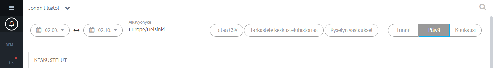
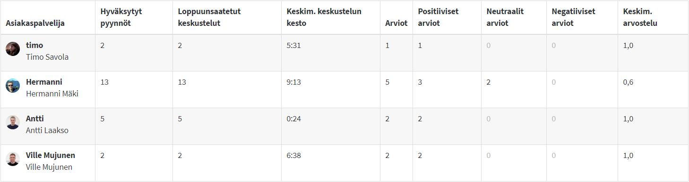
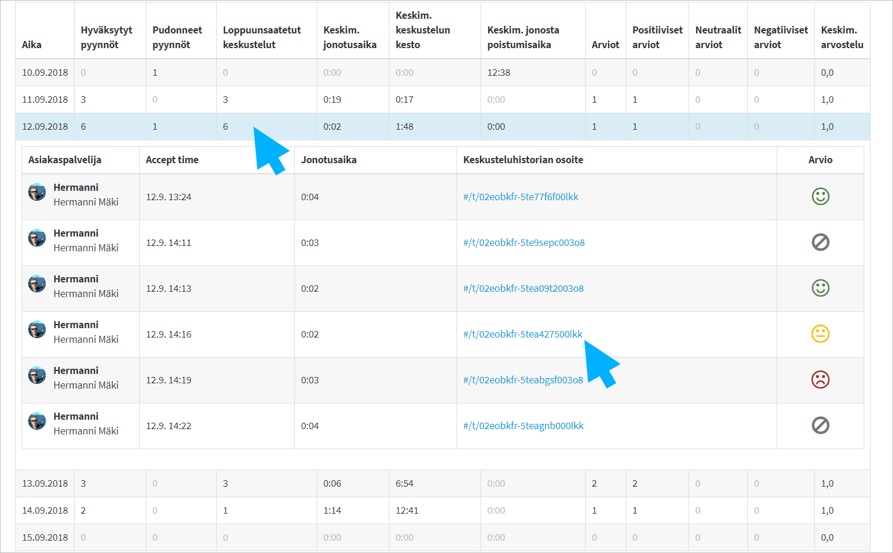
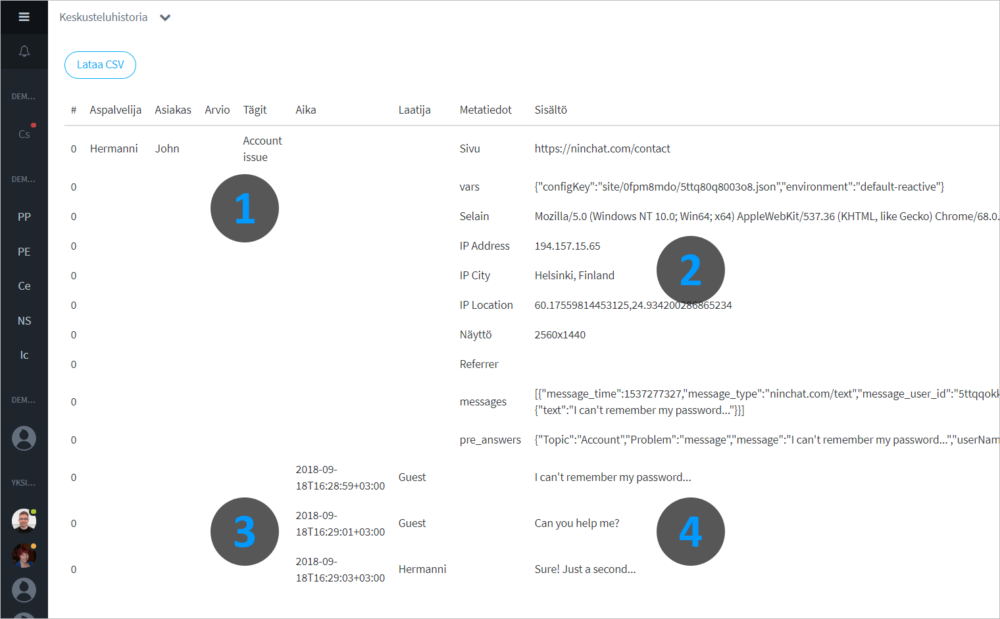

# Queue statistics

## Statics view

Go to queue statistics by clicking the arrow icon next to the queue name in the Sidebar and selecting _Queue statistics_. \(Requires organization operator rights.\)  
You can access statistics also from Organization settings, on _Queues_ tab.

In statistics you can view chat histories, tags, user satisfaction, questionnaire responses, and metadata. Statistics run almost in real time, updated within an hour or so. Customer agents are able to add tags for six hours after conversation has ended, and statistics will update during this time period.

Statistics data and chat history can be downloaded and saved as a CSV file manually, or they can be exported automatically to a customer's CRM system \(ask Ninchat staff for more details\).

To exit the queue statistics, click "Queue statistics" in the top of the view and select "Close".

The statistics page consists of:

* Selections for time span and inspection intervals, chat history and questionnaire selections
* Charts
* Tag specific statistic
* Agent statistics
* Daily statistics and chat history

### Selections

| Time period | Examine and Export | Review interval |
| :--- | :--- | :--- |
| Select wanted examination period for the statistics. \(Select the desired time zone.\) | Download the statistics as a CSV file. View chat history. View questionnaire responses. | Choose how statistics are sort to review the statistics in: Hourly / Daily / Monthly. |

## Charts

The charts give you a quick overview of events. You can view:

* Number of conversations.
* Number of accepted and dropped requests.
* Number of registered questionnaire answers
* Average times of conversation, queueing, and exit tolerance.
* Customer ratings and amounts.

A customer's arrival in the queue is called a request:

* Accepted request: Customer is picked from queue by an agent.
* Dropped request: Customer is not picked from queue.

## Tag specific statistics 

You can view statistics by annotation \(tags\). This will help you review what kind of things or services are popular and take time from customer service, as well as what kind of topics the ratings are given by customers.

## Customer service specific statistics

You will see a personal overview of each customer service agent, in the selected time period. The average rating ranges from 0.0 to 1.0.

## Daily statistics

The daily statistics show you the conversation logs daily in the selected time period.  
  
Click the date row to see more details of that day. Click a transcript url to read the conversation.


A negative feedback can make you feel uncomfortable, however, it is often valuable. By reading the discussion that caused the negative feedback, you can easily track down the problem.


##  Chat history

Chat history view

1. Tags added by the agent to the chat.
2. Session and client information, metadata, and initial query.
3. Message sent times.
4. Content of the conversation.

Chat history also includes customer rating and questionnaire answers if these are in use.

## Questionnaire answers

Questionnaire answers \(pre-audience and post-audience\) can be viewed separately by clicking the link in selection bar after choosing wanted time period.

Answers are sorted to pre-audience questionnaires and post-audience questionnaires. You can also filter the responses to registered answers \(Questionnaire responses that don't lead to conversations, such as offline contact requests or automated questionnaire bot responses\).

## How to examine statistics

### Monthly statistics

Do you wish to examine monthly aggregated statics? Here's how to do it:

1. Select one or more months as examination time period
2. Select _monthly_ review interval 

You can now see an overview of the month\(s\) in the charts. You can see which tags where used the most during the month\(s\) and how many audiences the agents had.

You can also see an aggregation of the audiences: amount and average lengths and ratings. Expand the month's audiences \(click to month row\), you can examine all the conversations of the month and can easily view e.g. the conversations which received a negative rating.   
It's a quick and easy way to find problems in your service, and intervene and deal with them.

### Daily statistics

Do you wish to examine daily statics on hourly basis? Here's how to do it:

1. Select one day as examination period \(E.g. 15.9. - 15.9.\)
2. Select _hourly_ review interval

You can view the chart on hourly basis and swiftly find out at what times are traffic-heavy, when visitors haven't been answered, and when they have left contact requests. Easily solve problem hours and utilze the information improve your service.

In addition to daily stats and agent specific stats you can view the audiences sorted by the hour: amounts, lengths and ratings. Based on bar chart info, expand an hour to list conversations from that time and find out which audiences received negative ratings and find out the issue.

