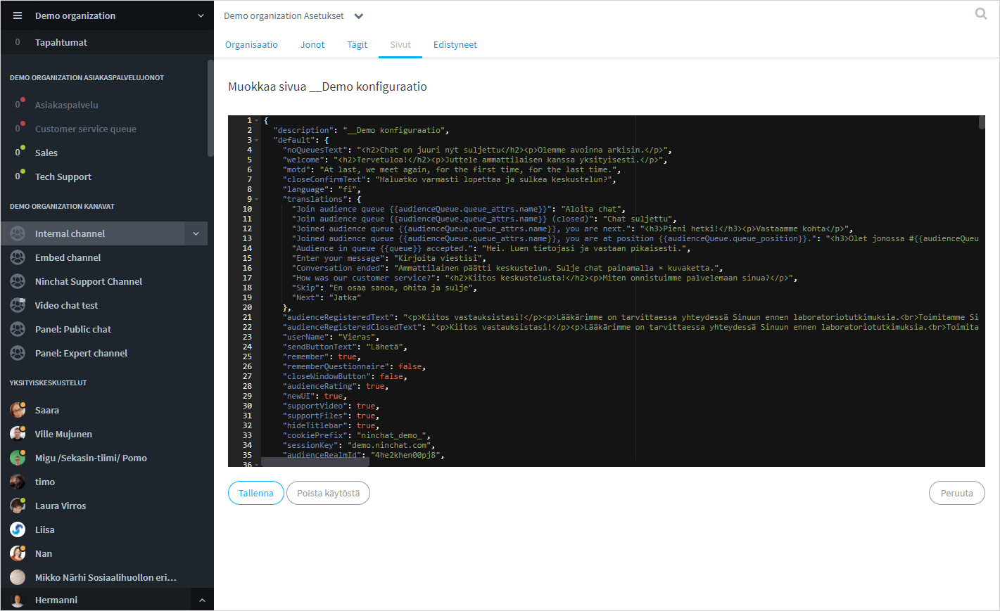
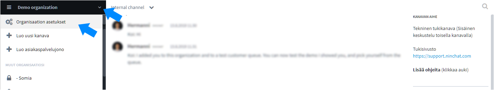
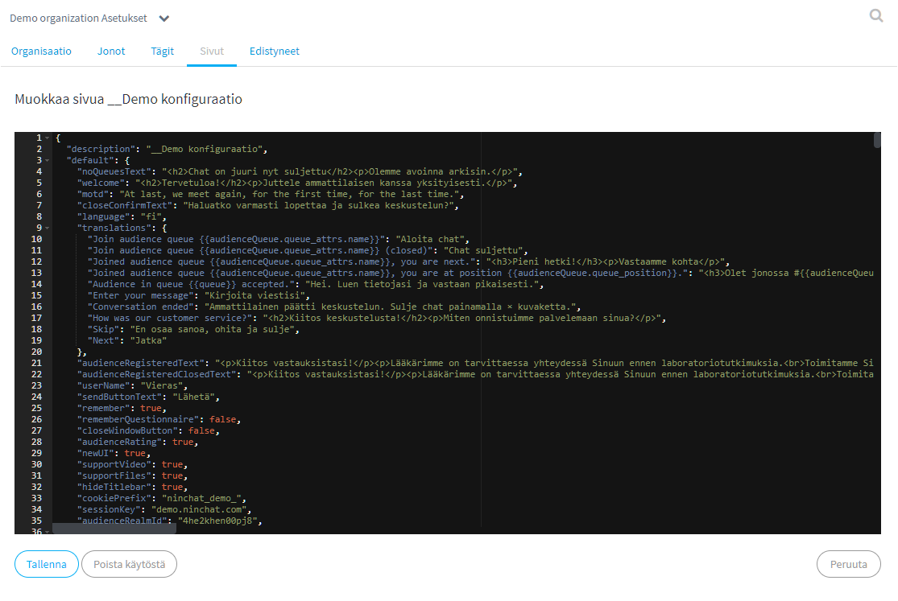

# Site configurations

## Overview <a href="#yleista" id="yleista"></a>

The Organization settings, _Sites_ tab, is where the settings, texts, translations, and styles, for the customer service chats and public group chats, are defined. To access the configuration, go to your organization settings and select the _Sites_ tab.


Site configuration is an advanced user feature. Ask Ninchat staff to help or make changes for you if you find it difficult.




## Edit chat texts

### Opening Site conifugurations

#### Go to organization settings



#### Select Sites tab

Click the pencil icon on the right to open the configuration.


### Site editor

In the edit view, you will see editable texts and translations (along with otherchat settings). You can edit green plain language texts as you like. HTML elements such as _\<p>\</p>_ (paragraph) and _\<br>_ (line break) may appear in the texts. Do not edit blue keyword phrases on the left!

In multilingual implementation, different languages have their own text elements.



### Common texts to edit

The most common texts to edit are the ones in start view: **"welcome" (online)** end **"noQueueText" (offline)**. Below you can see other editable texts.

| **Element**               | **Description**                                                              |
| ------------------------- | ---------------------------------------------------------------------------- |
| welcome                   | Content at the top of the chat initial view.                                 |
| motd                      | Content at the bottom of the chat initial view                               |
| noQueuesText              | <p>Content when chat is closed. <br>(Unless e.g. contact form is in use)</p> |
| inQueueText               | Queuing view text.                                                           |
| userName                  | Customer's username in the conversation.                                     |
| translations              | Common text definitions, i.e. translated into the language used.             |
| preAudienceQuestionnaire  | Initial chat request. (Or offline contact form)                              |
| postAudienceQuestionnaire | End chat request.                                                            |

#### Yleisiä käytettyjä HTML-elementtejä

| **HTML tag**                                                                        | chat settings,                                                                                    |
| ----------------------------------------------------------------------------------- | ------------------------------------------------------------------------------------------------- |
| \<br>                                                                               | Line break                                                                                        |
| \<p>text\</p>                                                                       | Paragraph                                                                                         |
| \<h2>text\</h2>                                                                     | Title ( h1, h2, h3, h4 )                                                                          |
|  \<a href="https://address.com" target="\_blank" title="description">Link text\</a> | Hyperlink. A link is given and URL address, a target, title description, and a visible link text. |

Example: a Paragraph with text, line break and a link

```markup
<p>Here you'll find support docs<br><a href="https://address.com" target="_blank" title="Open Support site">Support site</a></p>
```

### Saving


Remember to save the changes


When you click to save settings, the editor checks that the configuration structure is correct. If you've made an error, you won't be allowed to save changes until the errors are fixed.

After saving you can close organization settings.

## Disabling chat <a href="#chatin-ottaminen-pois-kaeytosta" id="chatin-ottaminen-pois-kaeytosta"></a>

You can disable the customer service chat completely by disabling the site configuration. In the edit view, click the "Disable" button. The configuration will then appear in the list with the status - Disabled. You can enable the chat again by clicking the "Enable" button in the edit view.


Do not disable configurations if you're unsure what you are doing.

