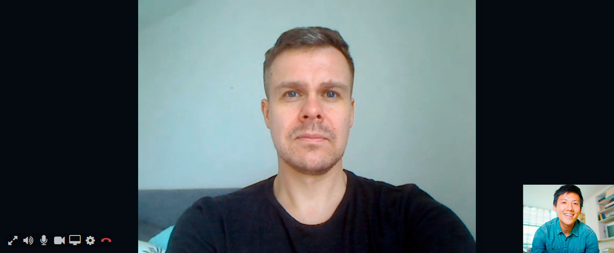
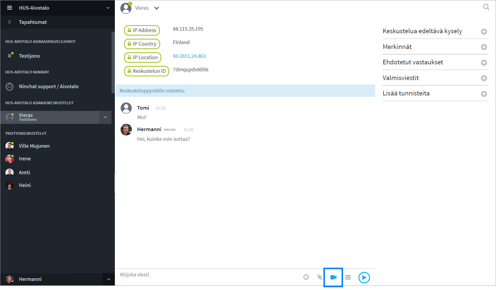
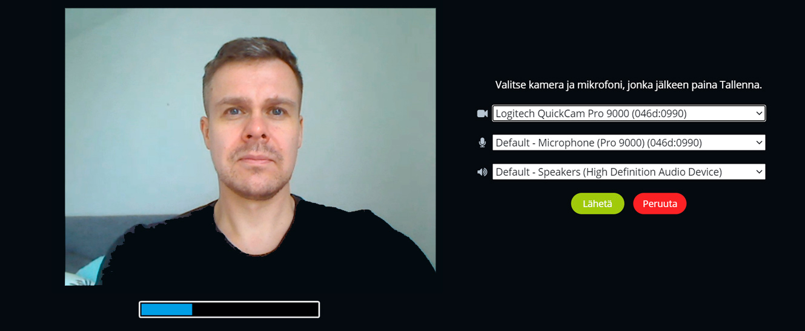
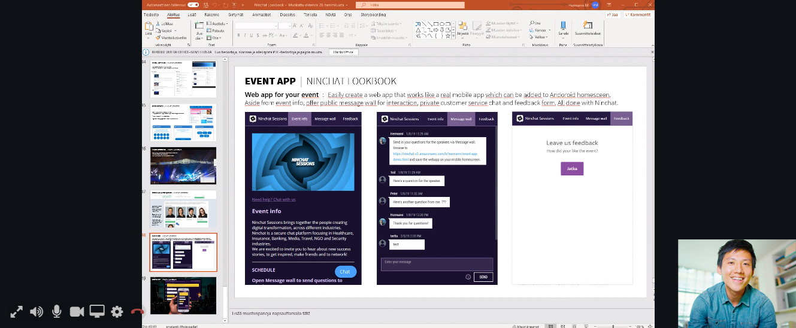

# Video calls

## General 

Video call can be used in customer conversations when text messages and attachments are not enough.&#x20;

The feature must be enabled for your customer queue by Ninchat admin. Ask us more.

Before you start taking video calls, test your equipment (camera & audio devices, web browser, connection) compatibility and functionality with Ninchat Video Call Test Tool. [Open Video Call Test tool](https://ninchat.com/videotest)

## Video call view 

Once started, video call appears above the conversation. Both the agent and the customer can later expand the video call to full screen, with the conversation displayed on the right side instead. (Allow your browser to view Ninchat video call in full screen.)

### Video funcation

| Symbol                                         | Function                                                                              |
| ---------------------------------------------- | ------------------------------------------------------------------------------------- |
|        | 
Expand video call to full screen/

Minimize video call to normal window.
  |
|    | Audio on/off - Mute the sound from the other side of the conversation.                |
|      | Microphone on/off - Disable your microphone so that the other person cannot hear you. |
|   | Video on/off - Disable your camera so that the other person cannot see you.           |
|   | Screen sharing on/off - Instead of camera, share your screen, program window or tab.  |
|      | Open video settings                                                                   |
|        | End the video call. (This does not end the chat.)                                     |

## Having video calls

Before having video calls, please test compatibility with our Video test tool. The tool reports whether your hardware, web browser and connection is adequate for video calls. [Open video testing tool](https://ninchat.com/videotest)

Initiating a video call can be allowed for the agent, the customer, or both.\
Make sure video call features has been turned on for your customer queue.

### Starting a video call

You can initiate a video call after you have started a customer audience.

1. Click the video camera icon next to the comment field.
2. If web browser asks for permission to use video camera and microphone, give permission.
3. On the first time, select video and audio devices of your choosing.
4. Video call starts, when customer accepts video call request.

Video call cannot be started if customer's hardware, web browser or connection is not up to par. Compatibility can be tested with Ninchat Video test tool, see part _Problems regarding video calls_.

### Video call settings on the first time

When you start a video call for the first time, Ninchat automatically requests you to select correct video camera, microphone, and sound system equipment. The selections are remembered after this.

In video settings, you can select video preferred camera, microphone and sound system equipment. You see a preview picture from the video source, and microphone input level visualized in the bar below the picture.

### Changing settings afterwards

Later, if you want to change devices, you can do it in Video settings. Access settings by clicking settings icon during a video call.

## Screen sharing

In addition to video call, it is also possible to share the view of your screen with the opposite party. Screen sharing can be helpful, for example when showing a client how a web application works, or instructing someone to fill in a form.

### Start screen sharing

Screen sharing can be selected after you have started a video call.&#x20;

1. Click screen sharing icon&#x20;
2. Select tab based on what you want to show: Full screen / Application window / Certain browser tab\
   (Full screen is the easiest choice, if you don't know what to select.)
3. Under the selected tab, click a view you want to share
4. Afer this, "Share" button activates. Click it.
5. Screen sharing starts.
6. End screen sharing and continue with webcam video by clicking screen sharing icon again.

Depending on your browser, you can either share your entire screen, or a single application such as a web browser view, or certain web browser tab.

.jpg>)

### Video call support in different browsers 

| Platform/Operating system            | Supported browsers                                                                      |
| ------------------------------------ | --------------------------------------------------------------------------------------- |
| Windows                              | 
Google Chrome Mozilla Firefox Microsoft Edge (2020 Chromium-based version)
 |
| 
Mac OS

(Apple desktops)
 | 
Google Chrome Mozilla Firefox Apple Safari
                                 |
| Android                              | 
Google Chrome Mozilla Firefox
                                                 |
| iOS (iPhone & iPad)                  | Apple Safari                                                                            |

## Problems regarding video calls

### Video call test

You can try our Video call test tool to check whether your hardware, web browser and connection is adequate for video calls. Test tool reports if something is wrong.

#### ****[**Ninchat - Video test tool**](https://ninchat.com/videotest)

### **Instructions for problems**


Internet Explorer does not support video calls. Please use Chrome or Firefox browsers.


**I cannot see video call start button (video camera icon).**

> Usually the reason is you are using Internet Explorer web-browser (IE). Make sure you are using Google Chrome or Mozilla Firefox browser. IE does not support video calls.\
> Note! If you open Ninchat from e.g. a link in email, it might open up in Internet Explorer by default. Copy-paste the link into Chrome.

> Video call can be started only in 1-on-1 conversations. Video cam icon will not show up in team channels.&#x20;
>
> Additionally make sure video calls are enabled in your customer queue.

#### **"Video call starts but cuts out immediately, and will not restart. Connection cut off without errors or warnings. We can still use text chat. I have had video calls successfully before."**

> Video connection is established straight between agent and customer, so if connection is lost , the problem might be with network connection quality or load on either end.\
> The situation can be improved at home as follows: a) connect the laptop to the wifi router with a cable, or b) if the connection is made via a mobile hotspot, place the mobile phone near a window, or c) be in the same room as the wifi router.

> Mobile app can also go to "sleep" after which the connection cuts off.

> For some reason video connection doesn't "get through". Usually this doesn't happen with mobile network, unless there is some privacy/security application in customer's device or other apps that block connection. This can also occur if they are using workplace network with a strict firewall.

> If you encounter a problem with a video call, refresh page for good measure (arrow circle icon next to address bar / F5 key).

> A firewall or anti-virus program can block webcam usage in some cases.

#### &#x20;"**Camera or microphone use prevented: Although permission for device is granted, an error occurred at the system, browser or web page which prevented access to the device."**

> This error message is often caused by another messaging program (like Skype) reserving webcam or microphone. Try to close other programs/apps and restart your web browser after that.\
> A security application might also disable webcam or microphone.
>
> Open video settings during a video call clicking icon and check which camera and microphone device is used.

> Some USB devices like Jabra may require changing USB port.

#### **"Camera or microphone use prevented: You may have denied usage of webcam or microphone from the web browser, or y**our device has prevented using the camera or microphone overall**."**&#x20;

> One must allow webcam and microphone in your web browser for every site. During first video call browser automatically asks for permission. If you have denied the permission, you can later allow it by clicking lock icon in the browser address bar.

#### **"In video call neither party can see other's image or hear sound. My webcam works as I can see my own image. Ninchat tells '**Video chat answered' **but there is no connection."**

> In this kind of situation the reason is often that in either end (or both) there is a firewall or security application blocking the video connection. If you have successfully had video calls earlier, the problem lies most likely in customer's connection.

**Voice echoes during video call**

> Google Chrome browser has the best available echo cancellation. Preferably use this browser.
>
> Preferably use a headset. The sound can echo if neither party has headphones on.

> Try to lower your microphone volume. You can also ask the customer to  lower their microphone volume if they have echoing problem and they can't use a headset.
>
> Some headsets with microphone can cause sound echoing. For instance some with Bluetooth headsets you hear you own voice when you select the same device as both microphone and speaker. In this case you can try and set the computer's own mic as microphone device, in video call settings.
>
> Restarting web browser may also help.

#### Error message: "Video chat declined, they are busy" when trying to start a video call. 

> This error message is displayed if the recipient is already in a video call, or they have an earlier video call invite open and un-accepted. Ask recipient to close video call view, and invite them again to a video call.
