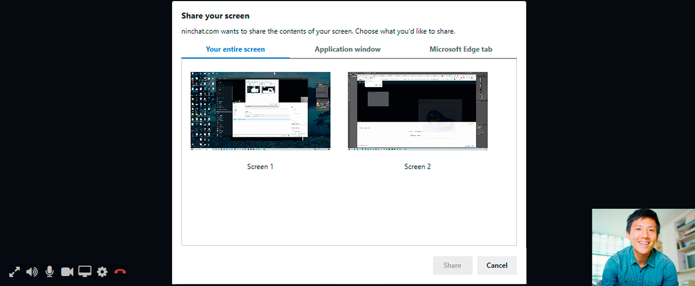

# Video calls

## General 

Video call can be used in customer conversations when text messages and attachments are not enough. Ask more about the feature.

## Video call view 

Once started, video call appears above the conversation. Both the agent and the customer can later expand the video call to full screen, with the conversation displayed on the right side instead. \(Allow your browser to view Ninchat video call in full screen.\)

### Video funcation

<table>
  <thead>
    <tr>
      <th style="text-align:left">Symbol</th>
      <th style="text-align:left">Function</th>
    </tr>
  </thead>
  <tbody>
    <tr>
      <td style="text-align:left">
        
      </td>
      <td style="text-align:left">
        
Expand video call to full screen/

        
Minimize video call to normal window.

      </td>
    </tr>
    <tr>
      <td style="text-align:left">
        
      </td>
      <td style="text-align:left">Audio on/off - Mute the sound from the other side of the conversation.</td>
    </tr>
    <tr>
      <td style="text-align:left">
        
      </td>
      <td style="text-align:left">Microphone on/off - Disable your microphone so that the other person cannot
        hear you.</td>
    </tr>
    <tr>
      <td style="text-align:left">
        
      </td>
      <td style="text-align:left">Video on/off - Disable your camera so that the other person cannot see
        you.</td>
    </tr>
    <tr>
      <td style="text-align:left">
        
      </td>
      <td style="text-align:left">Screen sharing on/off - Instead of camera, share your screen, program
        window or tab.</td>
    </tr>
    <tr>
      <td style="text-align:left">
        
      </td>
      <td style="text-align:left">Open video settings</td>
    </tr>
    <tr>
      <td style="text-align:left">
        
      </td>
      <td style="text-align:left">End the video call. (This does not end the chat.)</td>
    </tr>
  </tbody>
</table>## Having video calls

Before having video calls, please test compatibility with our Video test tool. The tool reports whether your hardware, web browser and connection is adequate for video calls. [Open video testing tool](https://ninchat.com/videotest)

Initiating a video call can be allowed for the agent, the customer, or both.

### Starting a video call

You can initiate a video call after you have started a customer audience.

1. Click the video camera icon next to the comment field.
2. If web browser asks for permission to use video camera and microphone, give permission.
3. On the first time, select video and audio devices of your choosing.
4. Video call starts, when customer accepts video call request.

Video call cannot be started if customer's hardware, web browser or connection is not up to par. Compatibility can be tested with Ninchat Video test tool, see part _Problems regarding video calls_.

### Video call settings on the first time

When you start a video call for the first time, Ninchat automatically requests you to select correct video camera, microphone, and sound system equipment. The selections are remembered after this.

In video settings, you can select video preferred camera, microphone and sound system equipment. You see a preview picture from the video source, and microphone input level visualized in the bar below the picture.

### Changing settings afterwards

Later, if you want to change devices, you can do it in Video settings. Access settings by clicking settings icon during a video call.

## Screen sharing

In addition to video call, it is also possible to share the view of your screen with the opposite party. Screen sharing can be helpful, for example when showing a client how a web application works, or instructing someone to fill in a form.

### Start screen sharing

Screen sharing can be selected after you have started a video call. During the video call, click the screen sharing icon and choose what you want to share from your screen. 

Depending on your browser, you can either share your entire screen, or a single application such as a web browser view, or certain web browser tab.

### Video call support in different browsers 

<table>
  <thead>
    <tr>
      <th style="text-align:left">Platform/Operating system</th>
      <th style="text-align:left">Supported browsers</th>
    </tr>
  </thead>
  <tbody>
    <tr>
      <td style="text-align:left">
        
Windows

        

      </td>
      <td style="text-align:left">Google Chrome, Mozilla Firefox, Microsoft Edge (2020 Chromium-based version)</td>
    </tr>
    <tr>
      <td style="text-align:left">Mac OS</td>
      <td style="text-align:left">Google Chrome, Mozilla Firefox, Apple Safari</td>
    </tr>
    <tr>
      <td style="text-align:left">Android</td>
      <td style="text-align:left">Google Chrome, Mozilla Firefox</td>
    </tr>
    <tr>
      <td style="text-align:left">iOS</td>
      <td style="text-align:left">Apple Safari</td>
    </tr>
  </tbody>
</table>## Problems regarding video calls

### Video call test

You can try our Video call test tool to check whether your hardware, web browser and connection is adequate for video calls. Test tool reports if something is wrong.

\*\*\*\*[**Ninchat - Video test tool**](https://ninchat.com/videotest)

