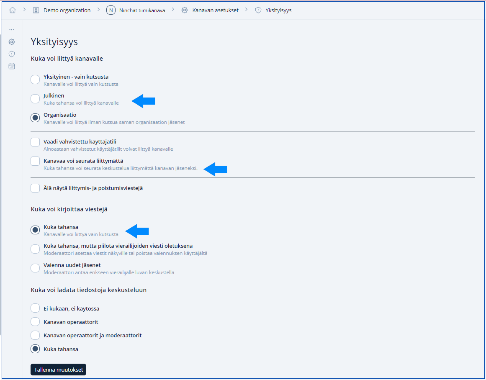

# TARKISTA Ryhmäkeskustelun järjestäminen

## Ennen chatin alkamista

### Asiantuntijoiden ja vastaajien kutsuminen chattiin

* **Varmista**, että olet haluamallasi ryhmächat-kanavalla Ninchatissa.&#x20;
* **Klikkaa** kanavan oikeassa yläreunassa olevaa pistevalikkoa. Löydät sen kanavan jäsenten vierestä. **Valitse** "Kutsu väkeä kanalle / Invite people to channel". Näkymään avautuu ikkuna, josta pääset kutsumaan henkilön joko valitsemalla hänen nimensä listalta tai kirjoittamalla hänen sähköpostiosoitteensa "Lisää kutsuttavat / Add invitees" -kohtaan ja **paina** "Lähetä kutsu / Send invitation" -nappia. **Muista** antaa henkilölle tarvittaessa myös organisaatio-oikeudetruksaamalla kohta "Oikeudet / Privileges". Voit myös **kutsua** henkilön linkillä kopioimalla sen "Kopioi linkki / Copy link" -painikkeesta, ja lähettämällä sen vastaanottajalle haluamassasi kanavassa.
* Jos et näe tekstiä "Kutsu väkeä kanalle", sinulta puuttuu kanavan operaattorioikeudet.

<figure><figcaption>
Näin lähetät kutsun kanavalle.
</figcaption></figure>

Lue lisää alla olevasta linkistä:


[kayttajan-lisaaminen-kanavalle.md](../user-interface/tiimikanavat/kayttajan-lisaaminen-kanavalle.md)


### Kanavan operaattori- ja moderaattorioikeudet

Kanavan operaattorit ja moderaattorit ylläpitävät keskustelukanavaa. Lisäksi näillä oikeuksilla varustetut jäsenet voidaan erottaa näkyvästi julkisessa keskustelussa.

Kanavan operaattorioikeudet voit pitää päällä itselläsi/työntekijöillä - niiden avulla saa kutsuttua uusia ihmisiä ja annettua moderaattori- ja operaattorioikeuksia.

| Jäsenlistan merkintä                                                                    | Merkitys                                                                                                                                    |
| --------------------------------------------------------------------------------------- | ------------------------------------------------------------------------------------------------------------------------------------------- |
|  Tähti, umpinainen   | 
Kanavan operaattorikäyttäjä:

voi hallita kanavan asetuksia ja kutsua jäseniä

(eri oikeus kuin organisaation operaattori)
 |
|  Tähti, reunustettu | 
Kanavan moderaattorikäyttäjä:

voi moderoida viestejä ja poistaa jäseniä
                                                        |

#### Kanavan operaattorioikeudet päälle

Klikkaa haluamasi henkilön nimeä kanavan nimilistassa ja valitse valikosta _"Give operator rights / Anna operaattorioikeudet"_.\
Kanavan moderointioikeudet laitetaan päälle asiantuntijoille ym vierailijoille sekä heille jotka moderoivat keskustelua.

#### Moderointioikeudet päälle

Klikkaa haluamasi henkilön nimeä kanavan nimilistassa ja valitse valikosta _"Give moderator rights / Anna moderaattorioikeudet"_.

### Moderaattorin käyttäjäasetukset 

**Tärkeää!** Moderaattorien piilottamat viestit on hyödyllistä laittaa näkymään moderaattorille itselleen, jolloin sitä voi tarpeen vaatiessa yhä muokata. Tee näin:

1. Mene käyttäjäasetuksiin (klikkaa keskustelulistalla käyttäjänimeäsi ja valitse "Asetukset ja profiili / Settings and profile".
2. Valitse asetuksissa "Käyttöliittymä / User interface" -kohta
3. Ruksaa laatikko "Näytä piilotetut viestit / Show hidden messages" -kohdassa, siten, että täppä on On -asennossa
4. Tallenna

<figure><figcaption>
Piilotettujen viestien näkyminen moderaattorille.
</figcaption></figure>

## Ryhmächatin avaaminen

* Varmista, että olet haluamallasi ryhmächat-kanavalla Ninchatissa
* Avaa valikko kanavan nimen perässä olevasta väkäskuvakkeesta ja valitse "Kanavan asetukset / Channel settings". Valitse vielä kohta "Yksityisyys / Privacy".
* Tee kaksi muutosta:&#x20;
  * "Kuka voi liittyä kanavalle / Who can join channel" -kohdasta valitse "Julkinen / Public". Tämä tarkoittaa, että kuka tahansa voi liittyä kanavalle. Sen alla valitse vielä "Kanavaa voi seurata liittymättä / Channel is followable".
  * "Kuka voi kirjoittaa viestejä / Who can write messages" -kohdasta valitse "Kuka tahansa / Channel members"&#x20;
* Klikkaa sivun alareunasta "Tallenna muutokset / Save changes"&#x20;

<figure><figcaption>
Tee nämä muutokset, kun avaat ryhmächatin.
</figcaption></figure>

## Keskustelijoiden näkyminen kanavalla 

Vieraat eivät näy kanavan jäsenlistassa ennen kuin he osallistuvat keskusteluun, eli kirjoittavat ensimmäisen viestin ja antavat itselleen samalla nimen/nimimerkin.\
Näin tapahtuu mikäli kanavan <mark style="color:green;">Kuka voi liittyä kanavalle</mark> -asetus on <mark style="color:green;">Julkinen</mark>.

<mark style="color:orange;">Mikäli haluatte, että hiljaiset seuraajatkin näkyvät jäsenlistassa heti keskusteluun tultuaan, asettakaa Kenelle viestit näkyvät -kohtaan Kanavan jäsenille</mark>_<mark style="color:orange;">, historia</mark>_ <mark style="color:orange;"></mark><mark style="color:orange;">näytetään</mark> <mark style="color:orange;"></mark>_<mark style="color:orange;">\[pvm ja aika]</mark>_<mark style="color:orange;">. Tällöin vieraat näkyvät heti nimettöminä jäsenlistassa ja saavat nimen kun ovat kirjoittaneet ensimmäisen kommentin.</mark>

| Kenelle viestit näkyvät -asetus                                                                        |                                                                                                        |
| ------------------------------------------------------------------------------------------------------ | ------------------------------------------------------------------------------------------------------ |
| <mark style="color:orange;">Kaikki voivat seurata keskustelua anonyymisti \[pvm ja aika] alkaen</mark> | Vieraat näkyvät jäsenlistalla vasta kun ovat kirjoittaneet ensimmäisen kommentin                       |
| <mark style="color:orange;">Kanavan jäsenille, historia näytetään \[pvm ja aika]</mark>                | Vieraat näkyvät jäsenlistalla heti tultuaan nimettöminä, ja nimen kanssa ensimmäisen kommentin jälkeen |

## Ryhmächatin sulkeminen 

Voit sulkea keskustelun klikkaamalla asetuksissa "Kanava on suljettu / Channel is closed". Tämän jälkeen uusien viestien kirjoittaminen on estetty ja kirjoituskentässä näkyy asetettu Kanava suljettu -viesti. Muuta viestiä halutessasi kanavan asetuksissa.


[kanavan-asetukset.md](../user-interface/tiimikanavat/kanavan-asetukset.md)


#### Kanava suljettu-viestin näkyminen 

<mark style="color:orange;">Offline-viestin näkymiseksi kaikille, kanavan</mark> <mark style="color:orange;"></mark>_<mark style="color:orange;">Kenelle viestit näkyvät</mark>_ <mark style="color:orange;"></mark><mark style="color:orange;">-asetus tulee olla:</mark> <mark style="color:orange;"></mark>_<mark style="color:orange;">"Kaikki voivat seurata keskustelua anonyymisti, \[pvm/klo] alkaen"</mark>_<mark style="color:orange;">.</mark>\ <mark style="color:orange;">Huomioi viestihistorian näkyminen ja piilottaminen, ks. seuraava kohta.</mark>

## <mark style="color:orange;">TULOSSA Viestihistorian piilottaminen</mark>

<mark style="color:orange;">Jos haluat piilottaa käydyn keskustelun ryhmäkeskustelutuokion jälkeen uusilta vierailijoilta, toimi seuraavasti: (Noudata ohjeita tarkasti</mark> :wink:<mark style="color:orange;">)</mark>

1. <mark style="color:orange;">Varmista, että olet haluamallasi ryhmächat-kanavalla Ninchatissa ja avaa kanavan asetukset(klikkaa kanavan nimeä ja valitse "Kanavan asetukset / Channel settings".</mark>
2. <mark style="color:orange;">Kohdassa "Kenelle viestit näkyvät / Who can read messages", valitse "Kanavan jäsenille, historia näytetään kanavalle liittymisestä alkaen (Channel members, history available since join only)".</mark>
3. <mark style="color:orange;">Tallenna</mark>
4. <mark style="color:orange;">Uudelleen kohdassa "Kenelle viestit näkyvät / Who can read messages", vaihda valinta kohtaan "Kaikki voivat seurata keskustelua anonyymisti (Everybody may follow anonymously)".</mark>
5. Tallenna
6. Sulje asetukset

Kanavan keskusteluhistoriaa ei näytetä vieraille, jotka tulevat sivulle tämän jälkeen.

<figure><figcaption></figcaption></figure>

## Kanavaikkunan piilottaminen web-sivulta

On mahdollista piilottaa upotettu kanava web-sivulta kanavan ollessa suljettu. Kysy lisää Ninchatin henkilöstöltä.
