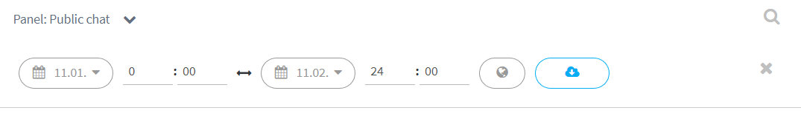

# COMING SOON Saving conversation history

You can save a group discussion to your computer in CSV format, which can be opened, for example, in Excel.

The CSV file contains the participants' screen names. If the subject is sensitive or the participants could be identified from their screen names, we recommend replacing the names with fully anonymous names using Excel's Find and Replace feature, for example "Participant 1", "Participant 2", and so on.

## Downloading conversation history

* Make sure you are in the desired group discussion channel in Ninchat.
* Open the menu from the channel name in the top-left corner and select "Download message history".
* Set the start and end date and time for the conversation history.
* Click the cloud icon on the blue background to save the conversation history to your computer.

