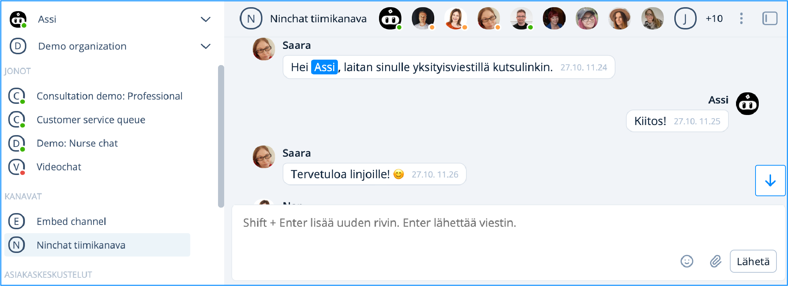

# User settings and profile

## Configuring user settings

Go to **Settings and profile** by clicking the checkmark icon next to your name at the top left. From the menu that opens, select **Settings and profile / Asetukset ja profiili**.

<figure><figcaption></figcaption></figure>

## Settings and profile:

Short links to this pages content:

* [#user-profile](kayttajaasetukset.md#user-profile "mention")
* [#kirjautumisvalinnat](kayttajaasetukset.md#kirjautumisvalinnat "mention")
* [#notifications](kayttajaasetukset.md#notifications "mention")
* [#interface-and-display-options](kayttajaasetukset.md#interface-and-display-options "mention")
* [#language-and-region](kayttajaasetukset.md#language-and-region "mention")
* [#canned-messages](kayttajaasetukset.md#canned-messages "mention")


The Ninchat interface is automatically displayed in the language set for your web browser. You can change this in Settings under [#language-and-region](kayttajaasetukset.md#language-and-region "mention").


## User profile

Complete the basic information under **User profile** so that, for example, your colleagues can easily identify you.

* Add a profile picture (JPG or PNG file).
  * A picture makes it easier for team members to identify one another.
* Enter your preferred display name in the **Screen name** field.
* Enter your real name in the **Full name** field.
  * This information is not shown to customers, for example, in customer service conversations.
  * Your full name is useful in support situations, as it helps us identify you more easily.&#x20;
* Save your changes by clicking **Save changes**.

<figure><figcaption></figcaption></figure>

## Account & password 

Set your sign-in identity and password. You can also change your account password and, if necessary, add a secondary login email address.

Under **Additional settings**, you can delete your user account if needed.

<figure><figcaption></figcaption></figure>


[tunnuksen-poistaminen.md](tunnuksen-poistaminen.md)


### **Changing your password**

You can change your account password by clicking **Change password**. You will be asked to enter your current password and create a new one. The new password must be at least 12 characters long.

If you have forgotten your password, you can request a password reset link to be sent to your email address from the login screen. Log out to request the password reset link.

<figure><figcaption></figcaption></figure>

<figure><figcaption>
Changing your password.
</figcaption></figure>


[unohtunut-salasana.md](../../user-interface/yleisia-vinkkeja/unohtunut-salasana.md)


### **Adding a new login email address**

Your user account can have multiple email addresses that you can use to log in. Your email address may also change, in which case you may want to add the new one for login as well.

By clicking **Add new email**, you can create a new login email address and password.&#x20;


<mark style="color:$primary;">**Note! Add the new email address before removing the old one.**</mark>


### **Removing a login method**

You can remove a login method by opening the three-dot menu on the email address row and clicking the trash can icon.

**Please note!** If you remove all login methods, you will no longer be able to access your account, and your account will be deleted. Therefore, always keep at least one login email address in your settings.

### **Visibility of your account and email address to others**

By clicking the eye icon on the login email address row, you can choose who can see the email address: hidden from others, members of your organization, or all users.

<figure><figcaption></figcaption></figure>

### **Verifying your user account or identity**

When you create a new account, you will receive a verification link by email. Until you click the link, your account or login identity will appear as unverified. Accounts that remain unverified for too long will be deleted.

If you have lost the verification link, you can request a new one in your user settings. Click **Resend verification** next to the identity (email address). Then open your email and click the verification link. If you cannot find the email, check your spam folder.

The verification link opens a Ninchat view confirming that the account verification was successful. After this, the identity will appear as verified in your user settings.

**Please note!** The verification link can only be clicked once. It will not work on subsequent attempts. Log in to Ninchat through the login page [https://ninchat.com/new](https://ninchat.com/new).

## Notifications

Navigate to **Notifications** in the vertical menu after choosing **Settings and profile**.

Ninchat can notify you about events and messages in three ways: by sound, desktop notification, or email. In addition, notifications are always displayed in the notification field in Ninchat’s left sidebar.

If you have not granted permission for browser notifications (desktop notifications), allow them by ticking the **Desktop** button.

The most useful notifications are enabled by default in the notification settings. Add or disable notifications as needed—for example, notifications sent to your email.

Select **Display notifications only when I'm idle** to receive your selected notifications even when Ninchat is active on your screen.

<figure><figcaption></figcaption></figure>

#### **Advanced settings**

Under **Additional settings**, you can choose whether to show notifications when the Ninchat window is active or only when you are away.

You can also choose whether desktop notifications should disappear only after you acknowledge them.

#### **Highlights**

Under **Highlights**, you can add, for example, your Screen name. Messages directed at you in a channel will then be highlighted, making them easier to notice.

Highlighted words appear with a blue background, and you will always receive a notification when one of them is used.

<figure><figcaption></figcaption></figure>


Rember to save your changes.


### Set notification types

Allow sound and desktop notifications for at least the following notification types (see image above):

* Direct messages
* Channel highlights
* New person in the customer service queue
* Customer service messages

Save the changes.


Please note that the **“New person in the customer service queue”** and **“Person picked from the queue”** options are visible only to agents who have been added to customer service queues.


### Always receive notifications 

If you want to always receive audio and desktop notifications even when Ninchat is active on your screen, under "Advanced settings", un-check the box _"Display notifications only when idle"_ and save. This makes it easier to track any activities.

### Desktop notifications 

Desktop notifications require permission from your web browser in order to be displayed to you.

Allow the browser to display desktop notifications by clicking the "Allow" button. Notification permission is browser and device specific, so make sure to allow permissions on all browsers and devices you are using.

### Windows operating system

Desktop notifications are displayed on the screen one by one. The rest can be found in Action center of Windows 10, until you acknowledge them. It's recommendable to clear unseen notification every once in a while from the [Microsoft Action Center](https://support.microsoft.com/en-gb/help/4026791/windows-how-to-open-action-center).

### **Allowing notifications in the browser**

After allowing notifications in the Ninchat user settings, you can check in your browser that desktop notifications—and access to sound, camera, and microphone—have been enabled by clicking the menu in the address bar while on ninchat.com. Instructions for different browsers are provided below.

**Google Chrome and Microsoft Edge**&#x20;

<figure><figcaption></figcaption></figure>

Check the permissions for the open website by clicking the icon in the address bar.

You can adjust all notification permissions for Ninchat in the Chrome browser settings. Enter the following address in the address bar:

`chrome://settings/content/siteDetails?site=https://ninchat.com`

**Mozilla Firefox**

Check the permissions for the open website by clicking the icon in the address bar.\
You can adjust all notification permissions related to Ninchat in the Firefox browser settings. Enter the following in the address bar:

**`about:preferences#privacy`**

**Microsoft Edge**&#x20;

<figure><figcaption>
Site settings in Microsoft Edge.
</figcaption></figure>

Check the permissions for the open website by clicking the lock icon in the address bar. You can also adjust notification permissions in the Edge browser settings, which you can access through the browser’s menu.

### Trouble shooting  

If you cannot see the Windows desktop notifications, make sure that the Focus assist is turned off. You can check this in the Windows Action center. It opens in the down right corner of your screen.

Make sure that there are no big amount of unchecked notifications in the Action center. You can delete all messages because they may prevent you from seeing new messages.

Also, make sure that the ”Display notifications also when not idle” box is checked.

### Highlights 

In the "Highlights" tab, check the box "Highlight your name" so that you will be notified when someone mentions you in a conversation. You can also set your own highlighting words to get notified whenever they are mentioned.

**How to set highlighting words?**

1. Write the words that you want them to be hightlighted, separate each word with a comma (,).
2. You can extend the variations of a word that starts with the same letters by adding an asterisk (\*) after the word e.g. Fin\*. This means the word Fin is still highlighted even when someone mentions Finland, Finnish, Finn, or Finns.
3. In the "Notifications" tab, you can also enable email notifications for Channel highlights.
4. Save.

<figure><figcaption></figcaption></figure>

**Highlighting words in a conversation**

In the image below, you can see examples of highlighting words in a conversation. A highlighting word appears with a blue background, and you will be notified whenever it is mentioned if you have set the notifications for Channel highlights.

<figure><figcaption></figcaption></figure>

## Interface and display options

You can customize the Ninchat interface to suit your preferences.

**Choose Ninchat’s color theme**\
From the section **User interface**, you can choose between a light or dark color theme.

**Set Chat density**\
In the conversation area, the professional’s messages are displayed on the right and the customer’s messages on the left in speech bubbles. If you prefer, you can switch to a compact conversation layout, where all messages are displayed in a single column on the left, as in the old interface.

**Hide channel join and leave messages**\
Select this option if you do not want to see **“User joined”** or **“User left”** messages in the channel conversation.

**Show hidden messages in the channel**\
If you are a channel moderator in a public group conversation, you can hide messages. Move the slider to the **On** position to display hidden messages.

**Sidebar**\
You can choose whether customer conversations are displayed in the sidebar in the traditional way or grouped under each queue.

Remember to save your changes.

<figure><figcaption></figcaption></figure>

## Language and region

You can choose Finnish or English as the interface language. The automatic selection uses the language set in your browser.

You can choose between a 12-hour and a 24-hour clock.

## Canned messages

Canned messages make customer service work faster and easier. You can answer frequently asked questions by selecting a response directly from the list.

Canned messages can also be useful for matters that require an exact answer, such as legal issues or treatment-related matters.

<figure><figcaption></figcaption></figure>

### **Using Canned messages**

**Text field**\
In a customer conversation, the canned response shortcut is displayed in the lower-left corner of the text field. Click it to view all your saved canned message, grouped by keywords. You can edit the text as needed or send the message as is.&#x20;

**Keyboard**\
You can also use canned responses from the keyboard by using their keywords. Canned messages can be used with the keyboard in team channels and private conversations as well. Type a forward slash **\[ / ]** followed by the canned response keyword in the text field, and press the **\[Space]** key. The relevant canned message will then appear in the text field.

**Example:** You have created the following canned response:

* **Keyword:** open
* **Message:** “We are open on weekdays from 9 a.m. to 5 p.m.”

### **Canned messages settings**

In the settings, you can:

* Create new canned message. You can also copy an existing message as the basis for a new one.
* Edit keywords.
* Edit or delete canned messages.

In the advanced canned response settings, you can:

* Restrict the search to keywords only.
* Display canned messages as a list in the sidebar.

**Creating a new canned message**\
A canned message consists of a message, a keyword used to identify the message, and, optionally, a category. For example:

* **Keyword:**`greeting1`
* **Message:** “Hello. How can I help you?”

1. In the Canned messages view scroll down to the section Supported Languages and choose the languages
2. Underr **Canned message**, click the **Add new** button.
3. A pop-up window opens.

<figure><figcaption></figcaption></figure>

### **Creating a new canned message**

A canned message consists of a message, a keyword used to identify the message, and, optionally, a category. For example:

* **Keyword:**`greeting1`
* **Message:** “Hello. How can I help you?”

1. In the Canned messages view scroll down to the section Supported Languages and choose the languages
2. Underr **Canned message**, click the **Add new** button.
3. A pop-up window opens.

<figure><figcaption>
Adding a new canned message.
</figcaption></figure>

3. Enter the desired keyword using lowercase letters (a–z) and numbers. You can add any text and, if necessary, links in the message field. You can chain keywords to create categories, for example ready-made response/link.
4. Save.

You can find instructions for using canned messages in conversations here:


[asiakasjonot-ja-keskustelut](../../user-interface/asiakasjonot-ja-keskustelut/)


