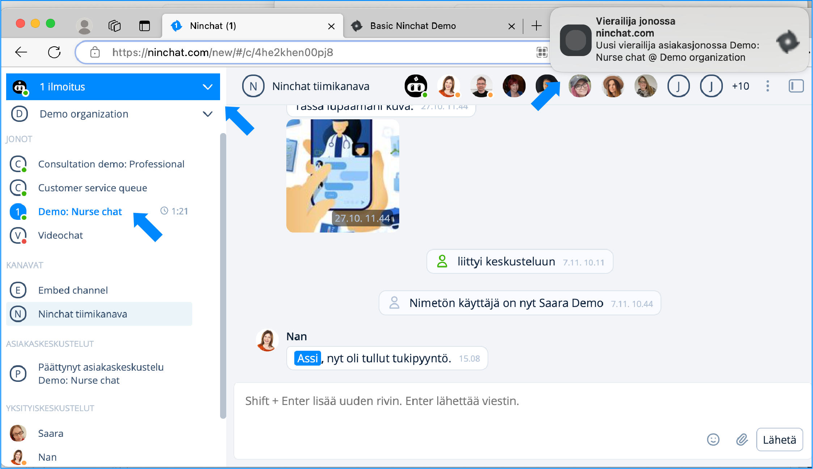

# Picking customers from queue

### **Notifications of customers in queue** 

If you have allowed notifications in your user settings, you will be notified about customer queue events:

* Sound notification ("Blip!")
* Desktop notification (Pop-up box in the screen corner)
* (Email notification)

<figure><figcaption>
Notifications when customers in queue.
</figcaption></figure>

Customers can be picked either from from Sidebar or from Queue activity page. Instructions for both below.


Notifications of customers in a queue are displayed in the queue bar as well as in the Activity bar. The Activity bar notifies you of new events by turning blue, and you will see it even when you have another organization view.


### **Picking customers from a queue**

#### Pick customer via the queue activity view 

1. In the Sidebar, click the name of the queue (note: not from the dropdown arrow menu)
2. In the Queue activity page, click the button "_Pick customer from queue_"
3. The customer conversation begins

<figure><figcaption></figcaption></figure>

#### Pick customer via queue dropdown menu 

Clicking the arrow icon next to a queue name in the Sidebar will open a drop-down menu that allows you to pick customers without having to go to the queue view. You can also use the drop-down menu to manually [open and close the queue](jonon-avaaminen-ja-sulkeminen.md).

1. Click the arrow icon next to the queue name in the Sidebar ("Customer service queue" in the picture).
2. Select "_Pick customer from queue_" from the drop-down menu that opens.
3. The customer conversation begins.

<figure><figcaption></figcaption></figure>

