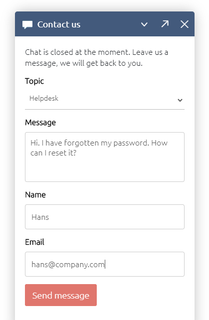
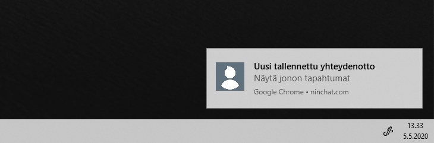
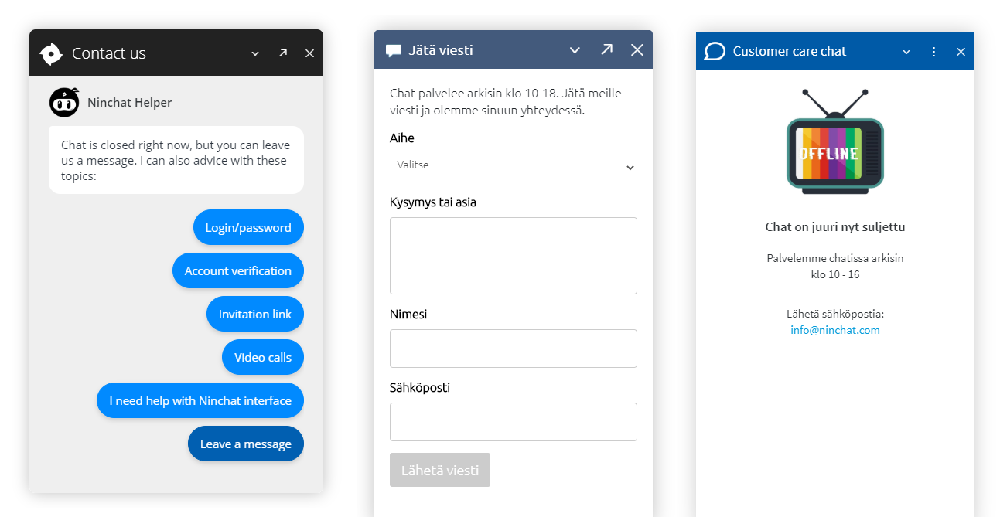

# Registered contacts

## Contact form

You can show a contact form in the chat window, so visitors can leave you a message e.g. if the customer queue is closed. Registered contacts are saved in queue statistics and can be also seen in _Queue activity view_.

### Notification settings

Agents who want to receive and handle registered contacts, need to enable notifications about _Registered contacts_ in their _user settings_. Set notifications for online use (sound and desktop). If you want to receive email notifications about contacts, tick email also on.&#x20;


[user-settings.md](../../organization-member/user-account/user-settings.md)



Remember to save your settings when changing notifications.


<figure><figcaption>
From the user settings navigate to Notifications and choose prefered settings for Registered contacts.
</figcaption></figure>

### **Ticket**

Enable [ticketing](audience-ticketing.md) in the settings to make tickets visible.

### Taking a contact into work

The registered contact appears in the queue through which it was sent. Open it by clicking the queue name, which is highlighted in blue. Click the arrow next to the notification to open it, then click "Take into work". You can also add a comment before taking the task.

You can now see the customer conversation details. A ticket has also been created for the task, and it appears under the queue in the left sidebar.

Mark the ticket as done when you have handled the customer's matter. You can also comment on the ticket at this stage. Remember to click "Comment" to save your comment. The ticket is closed when you mark it as done and is no longer shown under the queue. You can view it after closing in the view that opens by clicking the arrow at the end of the row. This view also shows all ticket comments and who took or released the task.

You can remove the ticket from your tasks and make it available to another specialist by clicking "Remove from my tasks".

### Notification of a new contact

Example: A customer fills in and sends the following message from the chat window.

You receive a notification about a registered contact when you sign in to Ninchat. Depending on your notification settings, it appears as a sound or desktop notification. Email notifications are delivered regardless of whether you are signed in to Ninchat. You can open the message using the link in the email.&#x20;

For security reasons, messages are read in Ninchat instead of by email; email messages are not encrypted.

### Reading a contact message

Clicking the notification opens the customer queue event log. Open the contact message by clicking "Show conversation". Contact messages can also be found in the queue statistics under "Questionnaire answers" by clicking the speech bubble at the end of the message row.

<figure><figcaption>
Jonon tapahtumat listauksessa näet uudet yhteydenotot.
</figcaption></figure>

### Commenting on a contact message

On the event log page, you can add a comment to the contact message to indicate whether the matter has been handled or who is handling it.

You can update the information by adding a new comment. The latest comment is always shown in the queue events.

<figure><figcaption>
Kommentin kirjoittaminen ja tallentaminen Kommentoi -painikkeella.
</figcaption></figure>

## General guidance for offline situations

When the customer queue is closed, you can:

* Show an offline message with opening hours and alternative contact methods.
* Show a contact form where customers can leave a message.
* Use a chatbot or Ninchat's lightweight bot to guide users in common situations. The lightweight bot can also collect a contact message.

