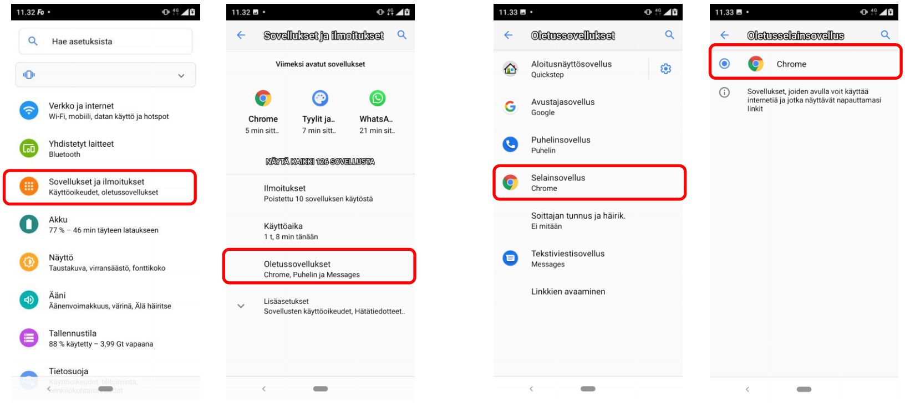

# Mobile devices

## Mobile device settings

### Setting Google Chrome as the default browser on Android&#x20;

We recommend using Ninchat with the Chrome web browser on both computers and Android devices. Some phones, such as Samsung devices, use another browser by default. You can change the default browser in the device settings.

1. Open the device settings. You can usually find them by pulling down the notification menu from the top of the screen. Open the settings by clicking the gear icon.
2. Select Apps and notifications.
3. Select Default apps.
4. Select Browser app and choose Chrome. You can now close the settings.

After this, web links, for example from email, will always open in Chrome.

## Video calls on mobile devices

### Video call support on different browsers and platforms

| Platform/operating system | Supported browsers                                          |
| ------------------------ | --------------------------------------------------------- |
| Android                  | 
Google Chrome Mozilla Firefox Microsoft Edge
 |
| iOS (iPhone & iPad)      | Apple Safari                                              |

**Error message: Video call rejected. Insufficient browser support.**

This usually means that the customer is using an iOS device (iPhone/iPad) with Chrome or Firefox. Due to Apple's restrictions, video meetings on iOS work only in Safari and native applications. On computers, including Macs, video also works in other browsers.&#x20;

It is also possible that the customer is using Internet Explorer (IE) on a Windows device.
