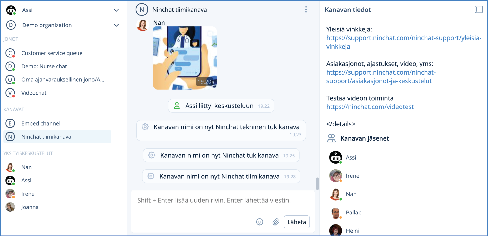
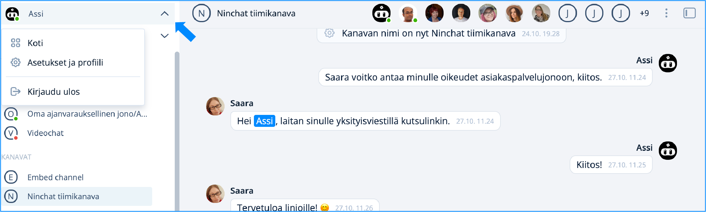
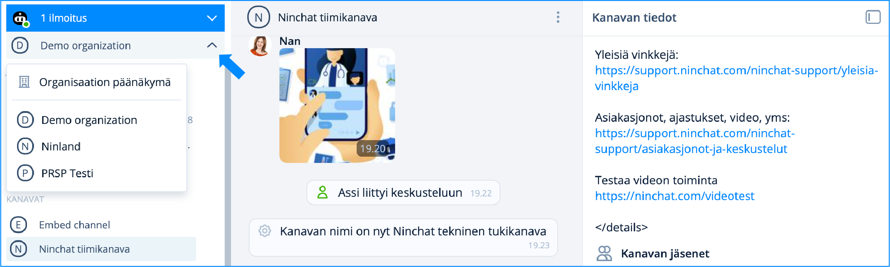
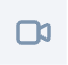

# User Interface Introduction

## **Overview and Channels**

The Ninchat interface follows the language settings of your web browser. You can change the language in the settings (Finnish or English) under _Language and Region_. 

The Ninchat user interface consists of a sidebar, a conversation section, and channel information. 

<figure><figcaption>
Ninchatin näkymä.
</figcaption></figure>

| Sidebar                                                 | Conversation section                     | Channel information       |
| ------------------------------------------------------- | ---------------------------------------- | ------------------------- |
| 
Organization, channels, and conversations

 | 
Conversation and messaging

 | Channel topic and members |


Channel details can be opened and closed using the icon.


<figure><figcaption>
Channel information opened.
</figcaption></figure>

<figure><figcaption>
Channel information closed.
</figcaption></figure>

### **Team channel indicators**

| Members list indicators                                                                            | Meaning                                                                                                                |
| -------------------------------------------------------------------------------------------------- | ---------------------------------------------------------------------------------------------------------------------- |
|  Star, solid              | 
Channel operator user (different from organization operator): can manage channel settings and invite members
 |
|  Star, with border       | 
Channel moderator user: can moderate posts and remove members
                                                |
|  Green indicator  | User is logged in and active                                                                                           |
|  Orange indicator | User is logged in but not active                                                                                       |
|  No indicator     | The user is not present; they will see the messages addressed to them later.                                           |
| .png>) Invite people to channel                               | Invite new people to the channel (Channel operator)                                                                    |

### **Sidebar (discussion list)**

In the sidebar you can see all your customer queues and easily switch between conversations. Notifications about new events and conversations are also displayed here.

<figure><figcaption></figcaption></figure>

<table data-header-hidden><thead><tr><th width="285.75390625">Section</th><th>Function</th></tr></thead><tbody><tr><td>1) User menu</td><td>Transition to the home screen, settings and profile and logout.</td></tr><tr><td>2) Organization</td><td>Organization dashboard, and switching organizations if you belong to more than one.</td></tr><tr><td>3) Queues</td><td>Customer queues from which customers are picked.</td></tr><tr><td>4) Channels</td><td>Internal team channels, public group chats and video channels.</td></tr><tr><td>5) Customer conversations</td><td>Customer conversations picked from queues.</td></tr><tr><td>6) Private conversations</td><td>Internal, private conversations with team members.</td></tr></tbody></table>

## Menus

### **User menu**

<figure><figcaption>
User menu actions.
</figcaption></figure>

By clicking the arrow next to your name, you can open the user menu, where you can:

* Open the home view (**Home**)
* Open user settings (**Settings and Profile**)
* Log out of the service (**Logout**)


You will see the notifications in the user menu.


<figure><figcaption></figcaption></figure>

### **Notifications**

Events such as a new customer in a queue, a private message, or mentions in channels appear as notifications. In the redesigned user interface, notifications are now shown at the top.

You can choose your preferred notification settings in your personal settings under Notifications.

### **Organization menu**

<figure><figcaption>
Organization dropdown menu.
</figcaption></figure>

* Organization dashboard
* Other organizations you belong to

### **Customer queue menu**

<figure><figcaption>
Customer queue actions.
</figcaption></figure>

A customer queue row displays the queues and their status:

* <mark style="color:$success;">Green dot</mark>: the queue is open to customers
* <mark style="color:$danger;">Red dot</mark>: the queue is closed

The row also shows the number of customers in the queue and the queuing time. By clicking the queue name, you can open the Customer Queue view (see below).

From the arrow icon next to the queue name, you can:

* Pick a customer from the queue
* Manually close or open the queue
* Open queue settings (Organization operators)
* Open queue statistics (Organization operators)

### **Message input field** 

In addition to typing messages, the input field allows you to:

* Add emojis 
* Add images and files 
* Start a video conversation (customer conversations) 
* Insert canned messages  
* Send a message using the Send button or the Enter key. Linebreaks can be created usin Shift + Enter key.

During a customer conversation, you can also:

* Insert canned responses
* Write notes
* Add tags

## Channel details and members list

<figure><figcaption>
Next to the three-dot menu you will find the channel details icon.
</figcaption></figure>

In the top bar of the channel, you can see the channel members. The full member list can be opened from the three‑dot menu or the channel details icon. From the list, you can start private conversations with channel members (Dialogues). Channel operators can invite new members and assign user permissions.


[interface-problems.md](../yleisia-vinkkeja/interface-problems.md)


### **Video meeting**

You can start a video conversation by clicking the Video icon in the upper‑right corner of the top bar. After that, you are able begin the video meeting.

<figure><figcaption>
When you click the Join video meeting button, you will start the video call.
</figcaption></figure>


[video-meetings.md](../asiakasjonot-ja-keskustelut/video-meetings.md)


### **Queue activity view**

<figure><figcaption>
Customer queue activity view and event log.
</figcaption></figure>

You can access the queue activity view by clicking the queue name. From this view, you can pick customers from the queue and see the event log, including who picked customers and when the queue was opened or closed.

### **Conversation history**

<figure><figcaption>
Viewing conversation content from the Queue activity view (operators).
</figcaption></figure>

As operator, you can view ongoing customer conversation metadata and questionnaire responses from the customer activity view, as well as observe the conversation in real time. The conversation updates by clicking the Refresh button. Operator permissions are required to view conversations.


[asiakasjonot-ja-keskustelut](../asiakasjonot-ja-keskustelut/)


### **Private conversations (Dialogues)**

A private conversation is started by clicking a person’s avatar. After opening the person’s card, select Start private conversation. Private conversations are listed under Dialogue&#x73;**.**

<figure><figcaption>
Starting a private conversation.
</figcaption></figure>


[private-conversations.md](../tiimikanavat/private-conversations.md)


***


[user-settings.md](../../organization-member/kayttajatili/user-settings.md)



[Organization](../organisaatio/)



[interface-problems.md](../yleisia-vinkkeja/interface-problems.md)

