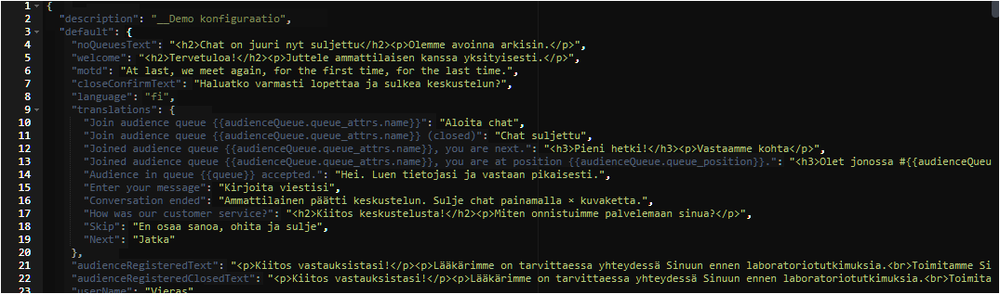

---
metaLinks:
  alternates:
    - >-
      https://app.gitbook.com/s/2uaSodGerm08OIAGW4lA/kayttoliittyma/organisaatio/site-configurations
---

# Site configurations

## General <a href="#yleista" id="yleista"></a>

The Sites view from the Organization dashborad where you define the settings, texts, translations, and styles for customer service chats and public group conversations.

You can access the configurations by going to the organization settings and selecting Sites.


Site configurations are an advanced-user feature. Ask Ninchat staff to make the changes, or request assistance if you find the process difficult.


## Editing chat texts

**Opening the site configurations**

Go to the organization settings.

<div data-with-frame="true"><figure><figcaption><p>Navigate to Sites from the Organization dashboard.</p></figcaption></figure></div>

#### Open the Sites view.

Open the configuration for editing by clicking thepencil icon on the right-hand side

Open the Sites view.

## Site editor

In the configuration editor, you can view the texts and translations, as well as other chat settings. You may freely edit the plain-language texts displayed in green. HTML elements may appear within the text. Do not edit the keyword texts displayed in blue.

In multilingual implementations, each language has its own section and translation texts.


### Commonly edited texts

The most frequently edited texts are the texts on the start view: **“welcome”** (online) and **“noQueuesText”** (offline). Other editable texts are listed below.



<table data-header-hidden><thead><tr><th width="277.8125">Element</th><th>Description</th></tr></thead><tbody><tr><td><strong>Element</strong></td><td><strong>Description</strong></td></tr><tr><td>welcome</td><td>Content at the top of the chat initial view.</td></tr><tr><td>motd</td><td>Content at the bottom of the chat initial view</td></tr><tr><td>noQueuesText</td><td>Content when chat is closed.<br>(Unless e.g. contact form is in use)</td></tr><tr><td>inQueueText</td><td>Queuing view text.</td></tr><tr><td>userName</td><td>Customer's username in the conversation.</td></tr><tr><td>translations</td><td>Common text definitions, i.e. translated into the language used.</td></tr><tr><td>preAudienceQuestionnaire</td><td>Initial chat request. (Or offline contact form)</td></tr><tr><td>postAudienceQuestionnaire</td><td>End chat request.</td></tr><tr><td>window - titlebar - title</td><td>Chat-window header.</td></tr></tbody></table>

#### Commonly used HTML elements <a href="#commonly-used-html-elements" id="commonly-used-html-elements"></a>

| **HTML tag**                                                                    | **Description**                                                                                   |
| ------------------------------------------------------------------------------- | ------------------------------------------------------------------------------------------------- |
| \<br>                                                                           | Line break                                                                                        |
| \<p>text\</p>                                                                   | Paragraph                                                                                         |
| \<h2>Title\</h2>                                                               | Title (h1, h2, h3, h4)                                                                            |
|  \<a href="https://osoite.fi" target="\_blank" title="kuvaus">Linkkiteksti\</a> | Hyperlink. A link is given and URL address, a target, title description, and a visible link text. |

Example: a Paragraph with text, line break and a link

```markup
<p>Find the instructions here:<br><a href="https://example.com" target="_blank" title="Link to instructions">Instructions website</a></p>
```

### &#x20;Saving


Remember to save the changes.


When you click to save settings, the editor checks that the configuration structure is correct. If you've made an error, you won't be allowed to save changes until the errors are fixed.

After saving you can close organization settings.

## Disabling chat <a href="#chatin-ottaminen-pois-kaeytosta" id="chatin-ottaminen-pois-kaeytosta"></a>

You can disable the customer service chat completely by disabling the site configuration. In the edit view, click the "Disable" button. The configuration will then appear in the list with the status - Disabled. You can enable the chat again by clicking the "Enable" button in the edit view.

<div data-with-frame="true"><figure><figcaption></figcaption></figure></div>


Do not delete or disable the configuration unless you are certain of this action.

