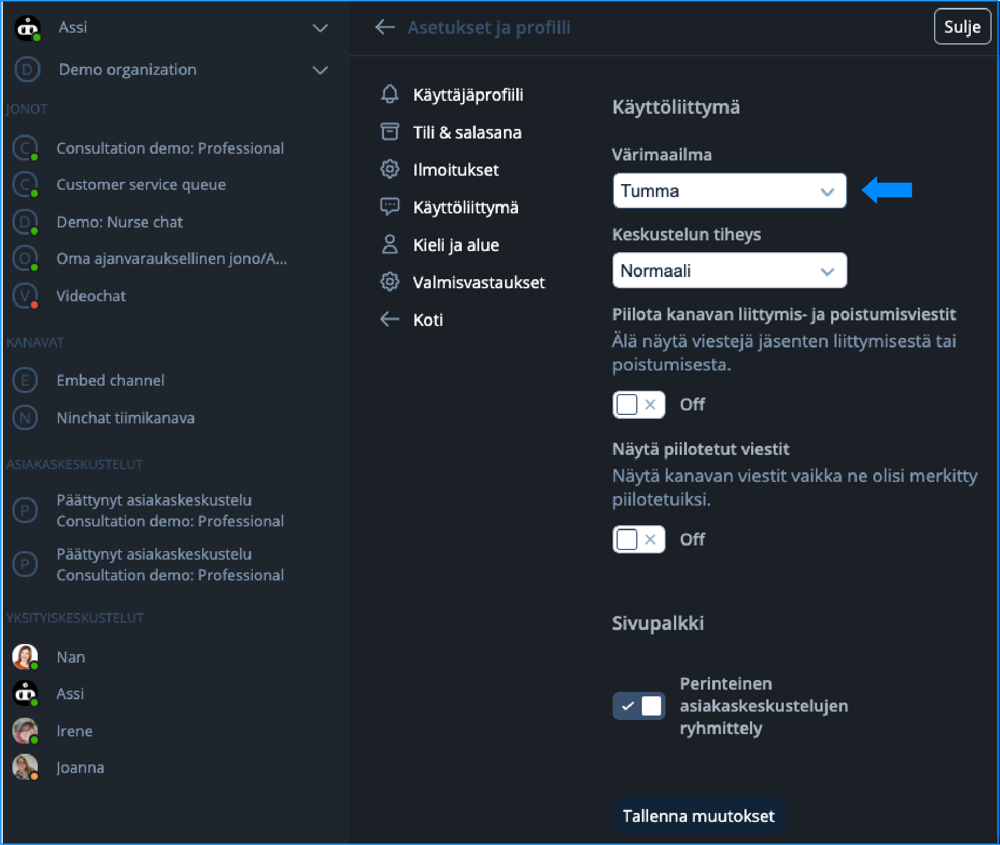
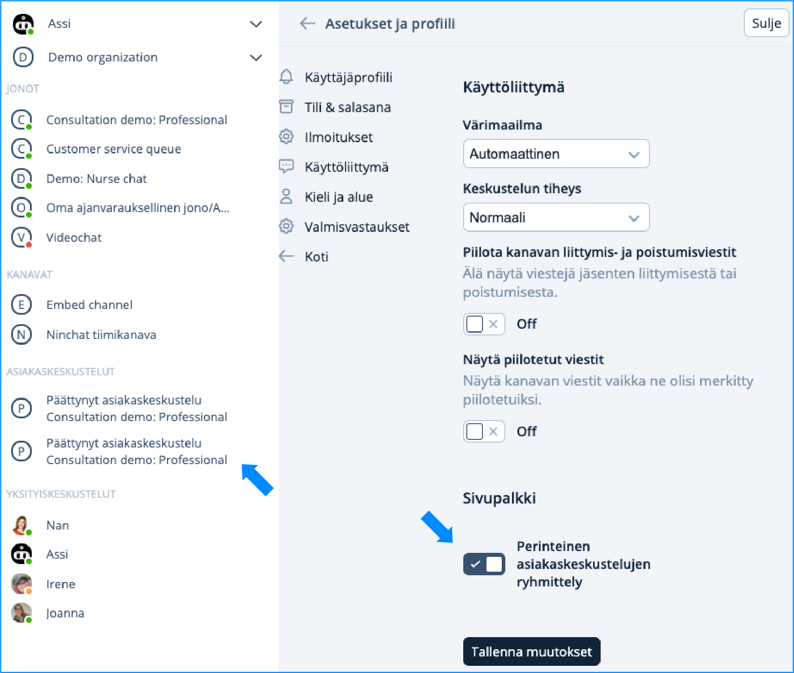

---
metaLinks:
  alternates:
    - >-
      https://app.gitbook.com/s/2uaSodGerm08OIAGW4lA/kayttoliittyma/user-interface-overview/updated-interface-whats-new
---

# Updated User Interface – What Has Changed?

### Color Scheme – Dark Mode Now Available

In the ‘User interface section’ in ‘Settings and profile’, you can now choose between a light or dark color scheme.

<figure><figcaption>
Light color scheme.
</figcaption></figure> <figure><figcaption>
Dark color scheme.
</figcaption></figure>

### Chat Density

In the chat field, professional messages appear on the right and customer messages on the left in speech bubbles. This update makes conversations easier to follow. If you prefer, you can switch to a condensed view, where all messages appear on the left in a more compact format.

### Sidebar Grouping

You can choose to display customer conversations in the sidebar in the traditional classic way, or group them under each queue.

<figure><figcaption>
Traditional conversation grouping.
</figcaption></figure> <figure><figcaption>
Grouping beneath each queue.
</figcaption></figure>

### Hide channel join and leave messages

In the user interface settings, you can choose whether channel join and leave messages are shown.

### Show hidden messages

You can enable or disable this feature by clicking the toggle.

### Language and region

Ninchat uses the browser’s language selection by default. In the settings you can now choose automatic, Finnish, or English. You can also change the time format from 24-hour to 12-hour, in the time display format menu below the language selection.


Remember to save your changes!


### User menu new location

You can now find your user menu at the top of Ninchat’s sidebar. The new user menu, which opens from the arrow icon, allows you to access the home view, user settings, and log out of Ninchat. You will also see notifications in the menu.

<figure><figcaption>
User menu.
</figcaption></figure>

### Organization main menu

When you navigate to the organization’s main view, you will see the functions in the icon menu in the vertical sidebar. You can also open the menu from the three‑dot menu.

<figure><figcaption>
Organization main menu
</figcaption></figure>

### Events menu update

In Ninchat’s renewed user interface, the Events menu no longer exists. It has been replaced by **Notifications** available in the user menu.

<figure><figcaption>
Notifications in the user menu.
</figcaption></figure>

### Conversation section

A **Send** button has been added for sending messages.\
The **Video** button can now be found on the right side of the chat view’s top bar.

During a chat, you can now use **canned messages** (). You can also enable the traditional list view for your own quick replies from your profile settings under **Shared canned messages**. After enabling this, your quick replies will appear in the right‑hand sidebar, which can be opened using the  icon. Notes and tag views are opened from the message input fields tab menu.

<figure><figcaption>
The conversation section functionalities.
</figcaption></figure>

### Deleting messages

If needed, you can delete private messages you have written and messages posted to team channels. Hover your cursor over your message to reveal the three‑dot menu.

<figure><figcaption></figcaption></figure>

### Video meeting view

The usability of the view has been clarified, and you can easily find the same functionalities as during a text chat.

<figure><figcaption></figcaption></figure>

### Ending a conversation

When you end a conversation using the **End conversation** button in the top bar, you can choose either **End** or **End and close**.

* Selecting **End** keeps the conversation visible for you, and you can still add tags and notes within six (6) hours.
* Selecting **End and close** ends the conversation and hides it from your view. After this, you can no longer add tags or notes.

<figure><figcaption></figcaption></figure>

### Organization shared canned messages

Quick replies can now also be created at the organization level and defined per queue in the queue settings. By navigating to the organization’s main view and selecting **Canned messages** from the vertical menu, you can access a view for where to manage shared canned messages. Professionals must enable the use of shared canned messages from their own settings under Canned messages.

<figure><figcaption>
Manage the organization's shared canned messages from the organization settings.
</figcaption></figure>

During the chat, Ninchat’s search function lets you search canned messages using both keywords and partial words directly from the text. By typing a forward slash (/) followed by a word or part of a word in the message field during a chat, the search function will find all quick replies containing that word.

If you enable **Classic list view** in your settings, you can open the **Audience info** view on the right side during a conversation. With this setting enabled, **your personal canned messages** are shown as a traditional list.

<figure><figcaption>
From your profile settings in the Canned messages section.
</figcaption></figure>


Organization‑level quick replies can be found via the message input icon or through quick search (/).


<figure><figcaption>
You can find all canned messages from the conversation section, and your personal canned messages separately from the Audience info element.
</figcaption></figure>


[organization-canned-messages.md](../organization/organization-canned-messages.md)


### **Queues Groups**

By bundling several queues to a group, all chats belonging to a queue bundle are directed into a single queue under one name. This functionality removes the need for professionals to choose from which queue they pick up a customer.

<figure><figcaption></figcaption></figure>


[queue-groups.md](../organization/queue-groups.md)

