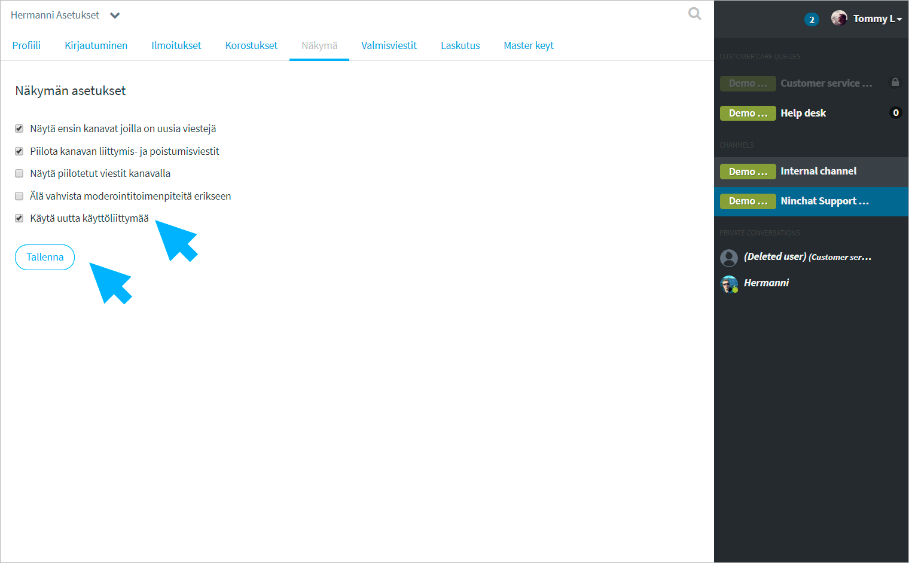

# Problems with interface

## Channel member list not shown

It is possible to show or hide the channel member list on the right, in your user interface. If the member list does not appear, you can restore it by opening your user account menu from the arrow icon next to your username at the bottom of the Sidebar. Then select "Show members".

## Chat features \(canned messages, tags\) disappear

You can show or hide the chat features \(notes, canned messages, tags, etc.\) on the right of the conversation section by clicking the-hamburger icon next to the message entering field. The icon is only visible during customer chat.

## Interface broken? 

Do you see the following view after logging in - the Sidebar on the right?

You have an accidentally outdated interface that is no longer working properly and is being disabled. Go to your personal settings with the following link: [https://ninchat.com/app/?lang=fi\#/x/settings/view](https://ninchat.com/app/?lang=fi#/x/settings/view)

In the "View" tab, select "Use new interface" and save. The view should now be corrected.

## 

